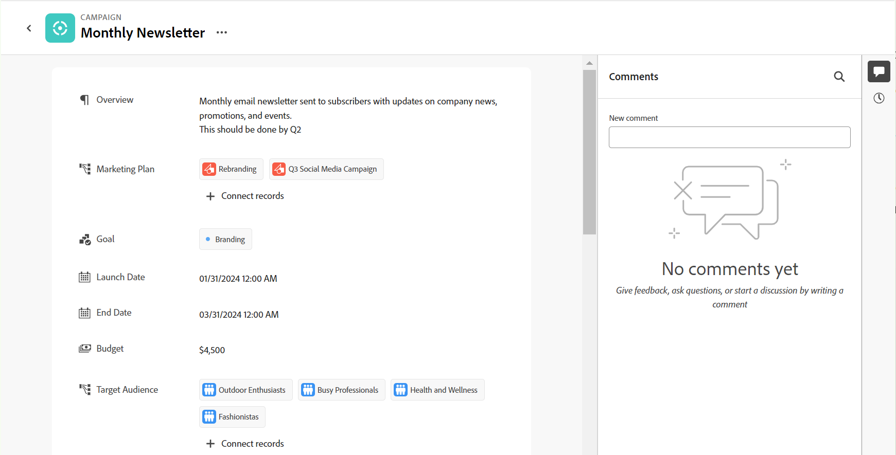

<!--update the metadata with real information when making this avilable in TOC and in the left nav-->

# Manage the record page

{{maestro-important-intro}}

You can edit manage the layout of the record box and page in Adobe Workfront Planning. You can display the record box in a record view. 

The record box is a smaller view of the record page that displays in the view of a record type. 

When you change the layout of a record box and page, the box and page changes for all records of the same type. 

You must create record types and records before you can start editing record pages. 

For information, see the following articles: 

* [Create record types](../architecture/create-record-types.md)

* [Create records](/help/quicksilver/maestro/records/create-records.md)

## Access requirements

You must have the following access to perform the steps in this article: 

<table style="table-layout:auto">
 <col>
 </col>
 <col>
 </col>
 <tbody>
    <tr>
<tr>
<td>
   
 Product
 </td>
   <td>
   
 Adobe Workfront
 </td>
  </tr>  
 <td role="rowheader">
Adobe Workfront agreement
</td>
   <td>

Your organization must be enrolled in the Adobe Workfront Planning beta program. Contact your account representative to inquire about this new offering. 

   </td>
  </tr>
  <tr>
   <td role="rowheader">
Adobe Workfront plan
</td>
   <td>

Any

   </td>
  </tr>
  <tr>
   <td role="rowheader">
Adobe Workfront license*
</td>
   <td>
   
New: Light or higher

   Or
   
Current: Work or higher
 
  </td>
  </tr>
  
  <tr>
   <td role="rowheader">
Access level configurations
</td>
   <td> 
There are no access controls for Adobe Workfront Planning
  
</td>
  </tr>
<tr>
   <td role="rowheader">
Permissions
</td>
   <td> 
Manage or higher permissions to a workspace</a> 
  
   
System Administrators have permissions to all workspaces, including the ones they did not create

</td>
  </tr>
<tr>
   <td role="rowheader">
Layout template
</td>
   <td> 
Your Workfront or group administrator must add the Planning area in your layout template. For information, see <a href="../access/access-overview.md">Access overview</a>. 
  
</td>
  </tr>

 </tbody>
</table>

*For more information, see [Access requirements in Workfront documentation](/help/quicksilver/administration-and-setup/add-users/access-levels-and-object-permissions/access-level-requirements-in-documentation.md). 

## Considerations about editing record pages

* Rearranging fields in the record box or page rearranges the fields for all the records of that type and for all users accessing those records. 
* Adding a cover image to a record is not part of the overall layout of the record box or page. You can add unique cover images to each record. For information, see [Add a cover image to a record](/help/quicksilver/maestro/records/add-a-cover-image-to-a-record.md).

## Rearrange fields in the record box or page

{{step1-to-maestro}}

The workspace that you access last opens. 

1. (Optional) Click the downward-pointing arrow to the right of the workspace name to select the workspace whose records you want to update. 
1. Click a record type card. 

    The record type page opens. 

1. From a view of any type, click the name of a record 

    Or 
    
    From the table table view, click the **Open details** icon  to the left of a record name. 
    
    The record's box opens in the view.

     

    >[!TIP]
    >
    >You can view the **Open details** icon to the left of the Name field of a record in a table view only when the Name field is a primary field. 

1. (Optional) Click the **Open in new tab** icon  <!--check the icon; they are changing it--> in the upper-right corner of the record box to open the record's page in a new tab. 

    The record page opens. 

    

1. In the record box or page, click the grab icon  to the left of a field name, then drag and drop it in a desired spot. 

    The new position of the field is updated in both the box and the page of all records of the same type for all users viewing the records. 

    All changes to the layout of the record box or page save automatically. 

