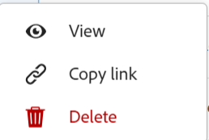

<!--update the metadata with real information when making this available in TOC and in the left nav-->
<!--should this move to the Access folder when we have sharing for ALL the objects???-->

# Share records

{{maestro-important-intro}}

To collaborate with other users, you can share records with others. 

You can share a Maestro record in the following ways: 

* Copy the link of the Details page of a record from your browser when the page is open. 

* Copy a link to the record's Details page when viewing records in the record type's table view.   

* You can share all records in a workspace with other users by sharing the workspace. For more information, see [Share a workspace](/help/quicksilver/maestro/access/share-workspaces.md).

This article describes how you can copy a link to a record's Details page from the table view of a record type. 

## Access requirements

You must have the following access to perform the steps in this article: 

<table style="table-layout:auto">
 <col>
 </col>
 <col>
 </col>
 <tbody>
    <tr>
<tr>
<td>
   
 Product
 </td>
   <td>
   
 Adobe Workfront
 </td>
  </tr>  
 <td role="rowheader">
Adobe Workfront agreement
</td>
   <td>

Your organization must be enrolled in the Adobe Maestro closed beta program. Contact your account representative to inquire about this new offering. 

   </td>
  </tr>
  <tr>
   <td role="rowheader">
Adobe Workfront plan
</td>
   <td>

Any

   </td>
  </tr>
  <tr>
   <td role="rowheader">
Adobe Workfront license
</td>
   <td>
   
Any
 
  </td>
  </tr>
  
  <tr>
   <td role="rowheader">
Access level configuration
</td>
   <td> 
There are no access level controls for Maestro
  
</td>
  </tr>
<tr>
   <td role="rowheader">
Permissions
</td>
   <td> 
View or higher permissions to a workspace to share a record using a link 

   
Manage permissions to a workspace to share records while sharing the workspace the record belongs to 

   
System Administrators have permissions to all workspaces, including the ones they did not create

</td>
  </tr>
<tr>
   <td role="rowheader">
Layout template
</td>
   <td> 
Your Workfront or group administrator must add the Maestro area in your layout template. For information, see <a href="../access/access-overview.md">Access overview</a>. 
  
</td>
  </tr>

 </tbody>
</table>

<!--Maybe enable this at GA - but Maestro is not supposed to have Access controls in the Workfront Access Level: 
>[!NOTE]
>
>If you don't have access, ask your Workfront administrator if they set additional restrictions in your access level. For information on how a Workfront administrator can change your access level, see [Create or modify custom access levels](../administration-and-setup/add-users/configure-and-grant-access/create-modify-access-levels.md). -->

<!-- Notes to add for the table: for the "Workfront plans" row: the above is only for closed beta; when going to GA - activate the following plans:    

Current plan: Prime and Ultimate

Legacy plan: Enterprise
-->

<!-- Notes for the table: for the "Workfront access" row: 
For more information, see <a href="../../administration-and-setup/add-users/access-levels-and-object-permissions/wf-licenses.md" class="MCXref xref">Adobe Workfront licenses overview</a>.
--> 

## Share record links from the record type table view

{#step1-to-maestro}

   The workspace that you accessed last opens. 
1. Click a record type card. 

    The record type page opens. 
1. (Conditional) From the **View** drop-down menu in the upper-right corner of the table, select a table view. This should be the default view, unless you viewed the record type in the timeline view when you accessed it last. 

    The records associated with the selected record type display in the table view. 
1. Right-click a record row

    Or 

    Hover over a record's name, click the **More** menu , then click **Copy link**.

    

    The link is copied to your clipboard. 

1. Paste the link into an email, or chat window, to share with other users. When users receive the link, it opens the Details page of the record. 

    >[!TIP]
    >
    >The fields of the record in the Details page are the same fields available in the Table view of the record. 

    <!--add there when it will be available: if they have access to this record-->

## Share all records in a workspace by sharing the workspace

You can share all records in a workspace when you share the workspace with others. For more information, see [Share a workspace](/help/quicksilver/maestro/access/share-workspaces.md). 
