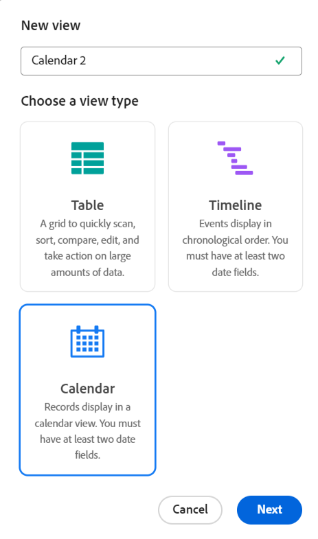

# Manage record views

<!--update the metadata with real information when making this available in TOC and in the left nav-->

>[!IMPORTANT]
>
>The information in this article refers to Adobe Maestro which is a new offering from Adobe Workfront. 
>
>Currently, Adobe Maestro is part of a beta program which is open to a limited number of customers. You must be a Workfront customer to use Maestro capabilities.
>
>Contact your account representative for more information about joining the beta program for Maestro.
>
>For information, see [Adobe Maestro overview](../maestro-overview.md).

After selecting a record type in Adobe Maestro, you can display all the records of that type in the following views: 

* Table
    
    For more information, see [Manage the table view](../views/manage-the-table-view.md). 
* Timeline

    For more information, see [Manage the timeline view](../views/manage-the-timeline-view.md). 

## Access requirements

You must have the following access to perform the steps in this article: 

<table style="table-layout:auto">
 <col>
 </col>
 <col>
 </col>
 <tbody>
    <tr>
<tr>
<td>
   
 Adobe product
 </td>
   <td>
   
 Adobe Workfront
 </td>
  </tr>  
 <td role="rowheader">
Adobe Workfront agreement
</td>
   <td>

Your organization must be enrolled in the Adobe Maestro closed beta program. Contact your account representative to inquire about this new offering. 

   </td>
  </tr>
  <tr>
   <td role="rowheader">
Adobe Workfront plan
</td>
   <td>

Any

   </td>
  </tr>
  <tr>
   <td role="rowheader">
Adobe Workfront license
</td>
   <td>
   
Any
 
  </td>
  </tr>
  
  <tr>
   <td role="rowheader">Access level</td>
   <td> 
Any
  
</td>
  </tr>

<tr>
   <td role="rowheader">Layout template</td>
   <td> 
Your system administrator must add the Maestro area in your layout template. For information, see <a href="../access/grant-access.md">Grant access to Adobe Maestro</a>. 
  
</td>
  </tr>
 </tbody>
</table>

<!--Maybe enable this at GA - but Maestro is not supposed to have Access controls in the Workfront Access Level: 
>[!NOTE]
>
>If you don't have access, ask your Workfront administrator if they set additional restrictions in your access level. For information on how a Workfront administrator can change your access level, see [Create or modify custom access levels](../administration-and-setup/add-users/configure-and-grant-access/create-modify-access-levels.md). -->

<!-- Notes to add for the table: for the "Workfront plans" row: the above is only for closed beta; when going to GA - activate the following plans:    

Current plan: Prime and Ultimate

Legacy plan: Enterprise
-->

<!-- Notes for the table: for the "Workfront access" row: 
For more information, see <a href="../../administration-and-setup/add-users/access-levels-and-object-permissions/wf-licenses.md" class="MCXref xref">Adobe Workfront licenses overview</a>.
--> 

## Considerations when working with Maestro views

* Views in Maestro are record type-specific. You cannot apply the same view to two different record types. 
* Views that you create are visible to everyone who accesses the Maestro area. <!-- edit this when we have permissions and the views will be shared only to be visible by others-->
<!-- this is not yet possible: * You can share views with others if you want them to also apply them to the same record types.-->
* Building views for operational record types is identical to building views for taxonomy record types. 
* When you modify or delete a view, it is modified and deleted for all users who can access the Maestro area. 
* The following elements are unique to each view in Maestro:

    * Filter
    * Grouping
    * Sort
    
    <!-- some of these are not available in all of the views - edit above-->

    For example, when creating a filter in a table view, the filter results are visible only in the view selected and not from all the views listed in the View drop-down menu. 

    >[!NOTE]
    >
    > Because Maestro is currently in a beta state, some view elements might not be available to both views.

This article describes the following information about Maestro views:

* [Create and edit a view](#create-or-edit-record-views) 
* [Delete a view](#delete-views)
<!--* [Duplicate a view](#duplicate-views)-->
<!--* [Add a view as a favorite](#add-a-view-as-a-favorite) - not possible yet-->
<!--* [Share a view](#share-views) - not possible yet-->

## Similarities and differences between the table and timeline views

The following table shows the similarities and differences between the table and timeline views in Maestro: 

<!--some of these are NOT available right now; if you make this public, comment out the ones not there-->

| Feature                                                               | Table view | Timeline view |
|-----------------------------------------------------------------------|------------|---------------|
| Display records in a list or table                                    | ✓          |              | 
| Display all fields as columns in the table, by default |     ✓       |              |
| Hide or show fields (or columns)       | ✓          |               |
| Edit field values for each record                           | ✓          |               |
| Add records as new rows in the view                                               | ✓          |               |
| Add fields as new columns in the view                                               | ✓          |               |
| Copy rows from an external list and paste them in a table             | ✓          |               |
| Display records in a timeline                                            |            | ✓             |
| Filter records                                       | ✓          | ✓             |
| Group records                                      |           | ✓             |
| Sort records                                       | ✓          |              |
| Color-code records                     |           | ✓              |
| Color-code groupings                     |           | ✓              |
| Search records                     |  ✓         | ✓              |

<!--| Sort groupings                                                        | ✓          | ✓             |-->
 <!--| Display a limited number of fields as columns, by default                      | ✓          |               |-->

## Create or edit views {#create-or-edit-views}

1. Click the **Main Menu** icon  in the upper-right corner, or the **Main Menu** icon  in the upper-left corner, if available, then click **Maestro** . 
    The workspace you last accessed opens by default. For information about creating workspaces, see [Create workspaces](../architecture/create-workspaces.md).
1. Click a record type card. For information about creating a record type, see [Create record types](../architecture/create-record-types.md). 

    By default, all the records of the selected type display in the table view. 

1. Click the **View** drop-down menu, and select either an existing **Table view**  or click **Create view > Table** to create a table view

    Or
    
    Select an existing **Timeline view**  view or click **Create view > Timeline** to create a timeline view.

    

    >[!NOTE]
    >
    >    To create a timeline view, the record type you build the view for must have at least two date fields. Otherwise, the Timeline option is dimmed.

1. (Optional) Update the name of the view, then click **Create** to save it. 
    
    By default, Maestro names the view "Table < number >" or "Timeline < number >". The number is an automatically generated increment. 

1. (Optional) To rename a view after it is created, click the view drop-down menu, then click the **More** menu  > **Rename** to update the view name. <!--ensure there is not another saving step here?!-->
1. (Optional) To manage a view, see the following articles for more information: 

    * [Manage the table view](../views/manage-the-table-view.md)
    * [Manage the timeline view](../views/manage-the-timeline-view.md)

<!--# Add a view as a favorite - this is not possible yet-->

<!-- ## Share views - not possible yet-->

## Delete views

1. From the **Main Menu**  in the upper-right corner of the screen, <!--or the **Main Menu**  in the upper-left corner of the screen, if available,--> click **Maestro** .

    The workspace you last accessed opens by default. For information about creating workspaces, see [Create workspaces](../architecture/create-workspaces.md).
1. Click a record type card. 

    For information about creating a record type, see [Create record types](../architecture/create-record-types.md). 

    By default, all the records of the selected type display in the table view. 

1. Click the view drop-down menu, hover over one of the views in the list, then click the **More** menu  > **Delete**. 
1. Click **Delete** to confirm. <!--ensure there is not another saving step here?!-->
    
    The view is deleted for all users who can access the Maestro area and it cannot be recovered. 

<!--not possible yet - August 30, 2023: 

## Duplicate views

If you want to keep multiple versions of a view and make slight changes between the version, you can duplicate a view. Duplicating a view creates identical copies of an existing view. 

1. From the **Main Menu**, click **Maestro**. 
    The workspace you last accessed opens by default. For information about creating workspaces, see [Create workspaces](../architecture/create-workspaces.md).
1. Click a record type. For information about creating a record type, see [Create record types](../architecture/create-record-types.md). 

    By default, all the records of the type selected display in the table view. 

1. Click the view drop-down menu, then click the **More** menu  to the right of the view name > **Duplicate**. (**********ensure there is not another saving step here?! also, add how this view is named; the button to duplicate was there but not the functionality yet************)
    
    The view is duplicated and visible to all users who can access the Maestro area. 

-->
