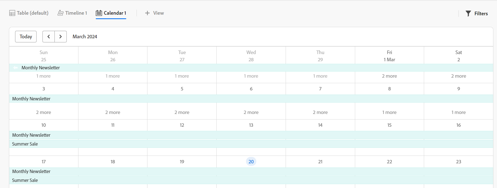

# Manage the calendar view

<!--
title: Manage the calendar view
description: You can display records in a calendar view.
hidefromtoc: yes
author: Alina
feature: Work Management
role: User
hide: yes
-->

<!--update the metadata with real information when making this available in TOC and in the left nav-->

{{maestro-important-intro}}

You can display records and their fields in a calendar view, from the record type page.

For information about Adobe Workfront planning capabilities views and how to manage them, see [Manage record views](../views/manage-record-views.md).

## Access requirements

You must have the following access to perform the steps in this article: 

<table style="table-layout:auto">
 <col>
 </col>
 <col>
 </col>
 <tbody>
    <tr>
<tr>
<td>
   
 Product
 </td>
   <td>
   
 Adobe Workfront
 </td>
  </tr>  
 <td role="rowheader">
Adobe Workfront agreement
</td>
   <td>

Your organization must be enrolled in the Adobe Workfront planning capabilities closed beta program. Contact your account representative to inquire about this new offering. 

   </td>
  </tr>
  <tr>
   <td role="rowheader">
Adobe Workfront plan
</td>
   <td>

Any

   </td>
  </tr>
  <tr>
   <td role="rowheader">
Adobe Workfront license
</td>
   <td>
   
Any
 
  </td>
  </tr>
  
  <tr>
   <td role="rowheader">Access level configuration</td>
   <td> 
There are no access level controls for Adobe Workfront planning capabilities  
  
</td>
  </tr>

  <tr>
   <td role="rowheader">
Permissions
</td>
   <td> 
Manage permissions to the view
  
</td>
  </tr>

<tr>
   <td role="rowheader">Layout template</td>
   <td> 
Your system administrator must add the Maestro area in your layout template. For information, see <a href="../access/access-overview.md">Access overview</a>. 
  
</td>
  </tr>
 </tbody>
</table>

## Manage a calendar view {#manage-a-calendar-view}

<!--insert screen shot of calendar view-->

Consider the following: 

* You can create a Calendar view only when you have at least two date fields associated with a record type. When you have one or no date fields associated with a record type, the Calendar view option is dimmed. 
* The following scenarios exist:

    * When both the Start and End dates have no values, the records do not display on the calendar
    * When the Start or the End dates have no value, the record displays as a one-day event
    * When the Start date is after the End date, the record does not display on the calendar.

To manage a calendar view: 

1. Go to the record type page for which you want to view the calendar. 
1. Create a calendar view, as described in the article [Manage record views](../views/manage-record-views.md). 

    

    The records associated with the record type you selected display as bars in a calendar. The color of the bars matches the color of the record icon. 

1. Do one of the following to navigate through the calendar:

    * Click the left and right icons or use the horizontal scroll to move backwards and forwards in the calendar. 
    * Click **Today** to center the calendar to today's date. 
    * Select one of the following options from the time frame drown-down menu to update the time increments: 

        * Month