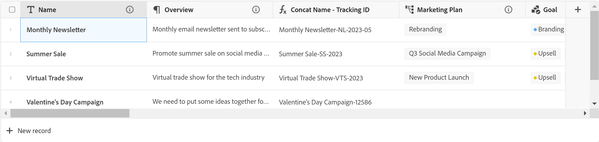
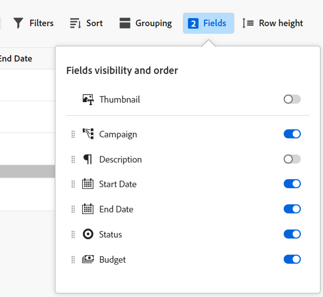
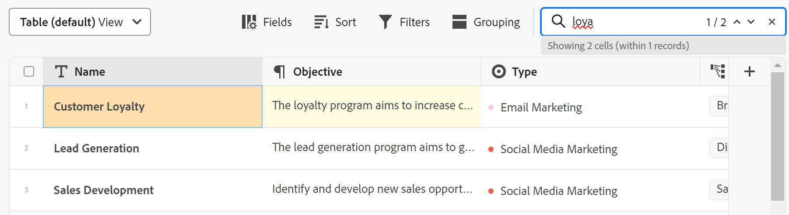
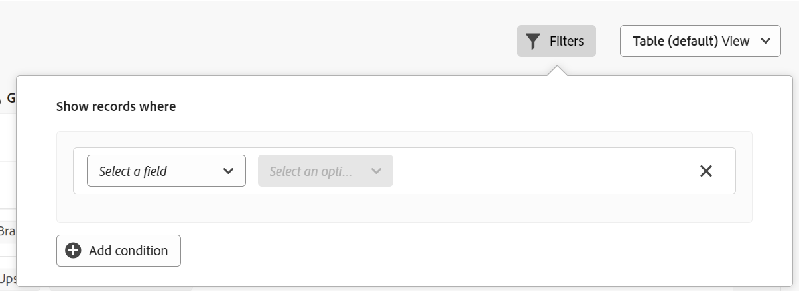
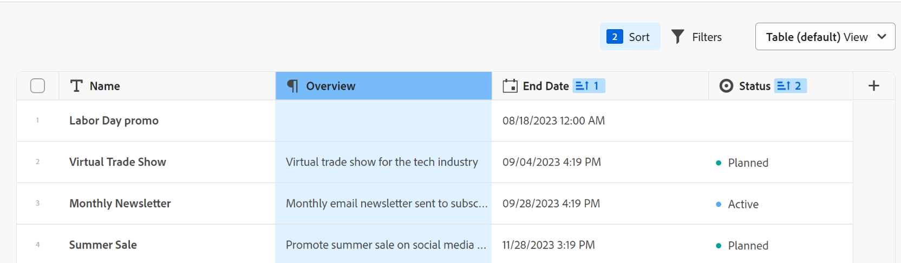

# Manage the table view

<!--
title: Manage the table view
description: You can display records in a table view when using Adobe Maestro. 
hidefromtoc: yes
author: Alina
feature: Work Management
role: User
hide: yes
-->

<!--update the metadata with real information when making this available in TOC and in the left nav-->

>[!IMPORTANT]
>
>Currently, Adobe Maestro is part of a beta program which is open to a limited number of customers. 
>
>Contact your account representative for more information about joining the beta program for Maestro.
>
>For information, see [Adobe Maestro overview](../maestro-overview.md).

You can display records and their fields in a table view, when accessing the record type page in Adobe Maestro. 

For information about Maestro views and how to manage them, see [Manage record views](../views/manage-record-views.md). 

## Access requirements

You must have the following access to perform the steps in this article: 

<table style="table-layout:auto">
 <col>
 <tbody>
<td>
   
 Adobe product
 </td>
   <td>
   
 Adobe Workfront
 </td>
  </tr>  
 <td role="rowheader">
Adobe Workfront agreement
</td>
   <td>

Your organization must be enrolled in the Adobe Maestro closed beta program. Contact your account representative to inquire about this new offering. 

   </td>
  </tr>
  <tr>
   <td role="rowheader">
Adobe Workfront plan
</td>
   <td>

Any

   </td>
  </tr>
  <tr>
   <td role="rowheader">
Adobe Workfront license
</td>
   <td>
   
Any
 
  </td>
  </tr>
  
  <tr>
   <td role="rowheader">Access level</td>
   <td> 
Any
  
</td>
  </tr>
<tr>
   <td role="rowheader">Layout template</td>
   <td> 
Your system administrator must add the Maestro area in your layout template. For information, see <a href="../access/grant-access.md">Grant access to Adobe Maestro</a>. 
  
</td>
  </tr>
 </tbody>
</table>

<!--Maybe enable this at GA - but Maestro is not supposed to have Access controls in the Workfront Access Level: 
>[!NOTE]
>
>If you don't have access, ask your Workfront administrator if they set additional restrictions in your access level. For information on how a Workfront administrator can change your access level, see [Create or modify custom access levels](../administration-and-setup/add-users/configure-and-grant-access/create-modify-access-levels.md). -->

<!-- Notes to add for the table: for the "Workfront plans" row: the above is only for closed beta; when going to GA - activate the following plans:    

Current plan: Prime and Ultimate

Legacy plan: Enterprise
-->

<!-- Notes for the table: for the "Workfront access" row: 
For more information, see <a href="../../administration-and-setup/add-users/access-levels-and-object-permissions/wf-licenses.md" class="MCXref xref">Adobe Workfront licenses overview</a>.
--> 

## Manage a table view {#manage-a-table-view}

<!--insert screen shot of table view-->

When creating a table view, all records of the selected type display in a table. Each row is a unique record and each column is a record field. All fields and all records display by default. 

To manage a table view: 

1. Create a table view, as described in the article [Manage record views](../views/manage-record-views.md). 

    

1. Update the following view elements as described in the subsections below:
    * [Columns (or fields)](#add-columns-or-fields)
    * [Rows (or records)](#add-rows-or-records)
    * [Filters](#add-filters) 
    * [Grouping](#add-groupings)
    * [Sort](#sort-information)  

### Add columns (or fields) {#add-columns}

The column headers of a Maestro table view display fields associated with the records in the view. The same fields displayed in the table view also display in the Details section of a Maestro record. For more information, see [Edit records](../records/edit-records.md). 

<!-- this is not available yet:You can display record fields (or columns) in both a table and a timeline view. However, the number of columns displayed in the table of the timeline view is limited and you cannot add columns in addition to those selected by default. -->

Adding columns to a view is identical to adding fields to a record type.  

You can add up to 500 fields (or columns) in a table view. 

1. Go to a record type page and select a **Table** view from the view drop-down menu.
1. Start adding fields (or columns), as described in the article [Create fields](../architecture-and-fields/create-fields.md). 

    The columns you add are visible to all users who access the record type and are added as new fields on the Details page of the records of the selected record type.

1. Do one of the following to reorder columns in the table:

    * Grab the column header and drag and drop it in the desired position. The column you moved briefly displays with a blue background until you make other adjustments to the table. 

    * Click **Fields** in the table's toolbar, then drag and drop the fields in the desired order, then click outside the **Fields visibility and order box** to close it.

        

    >[!TIP]
    >
    >* The Name field is always the first field in the table view.
    >
    >* You cannot move the Name field to another position.
    >
    >* You cannot hide the Name field. 
    >
    >* The Name field is frozen and is not part of the horizontal scroll.

1. Click and drag the column separation lines and drop them in the desired spot to increase the width of the columns. 

    >[!TIP]
    >
    >The changes you make to the column width and order are permanent and visible to all users who access the record type. 

1. Hover over the column header, then click the downward-pointing arrow, then click **Hide field**

    Or

    Click **Fields** in the table toolbar and disable the toggle associated with the fields (or columns) you want to hide. 

    >[!TIP]
    >
    >The number of hidden fields displays to the left of the Fields icon in the toolbar.

1. Click the **Fields** setting and enable the toggle associated with the fields you want to display in the columns of the table. All fields display by default.

1. Do the following to quickly find records that match a keyword:

    1. Click the **search** icon  and start typing a keyword associated with any field of a record that displays on the screen. The number of correct matches displays next to the search item and the field with the correct match is highlighted in blue. 

        You can use any word or special character that is visible on the screen. 
    
        You cannot use keywords that are associated with fields that are hidden in the table view. 

        

    1. (Optional) If there is more than one match, click the up and down arrows to the right of the search keyword to find all the matches in the table. 

    1. Click the **X** icon in the search box to clear the search keyword. 
   

### Add rows (or records) {#add-rows}

The rows of a Maestro table view display individual records of the selected record type. 

You can have up to 10,000 records (or rows) for a record type in Maestro. 

1. Go to a record type page and select a **Table** view from the view drop-down menu.
1. Start adding records (or rows), as described in the article [Create records](../records/create-records.md). 

    The records you add in the table view are saved immediately and are visible to all users who access Maestro. <!--this will change with permissions-->

1. (Optional) Select one or multiple records in a row, then drag and drop the **handle** icon  to the left of the record name to reorder the rows. 

    >[!NOTE]
    >
    >You cannot reorder rows if you apply at least one sort to the table view. 

<!-- this is not possible right now:

1. To reorder the rows, click the row header, drag and drop it in the desired location. 

    The changes you make to the row order are permanent and visible to all users who access the record type
-->

### Add filters {#add-filters}

<!-- this section links from the timeline view; consider splitting them if they become different-->

Filters help you reduce the amount of information displayed on the screen.

Consider the following when working with filters in the table view: 
<!-- this list is almost identical to the one for the table view - update both-->

* The filters you create for the table view work independently from the filters in the timeline view when applied to the same record type. 

* The filters are unique to the view that you select. Two table views of the same record type can have different filters applied to them. Two users looking at the same table view see the same filter that is currently applied. 

* You cannot name the filters you build and apply to a table view.

* Removing filters removes them from anyone accessing the same record type as you and uses the same view as you use.

* Adding filters to the table view is identical to adding filters to the timeline view. 

To add a filter to a table view: 

1. Create a table view for a record type page, as described in the article [Manage record views](../views/manage-record-views.md). 
1. Select a table view, then click **Filters** in the upper-right corner of the table.    
1. Click **Add condition** and add the following information: 

    * Select a field that you want to filter by <!-- the tip below might change-->

    * Select an option (or a filter modifier) to define what kind of condition the field must meet

        The table below displays the available modifiers for each type of field. 

        >[!TIP]
        >
        > You cannot select linked fields. For information, see [Create fields](../architecture-and-fields/create-fields.md). 

        <table>
        <thead>
        <tr>
            <th><b>Field type</b></th>
            <th><b>Modifiers</b></th>
        </tr>
        </thead>
        <tbody>
        <tr>
            <td>Single-line, paragraph </td>
            <td>
Contains

            
Does not contain

            
Is

            
Is not

            
Is empty

            
Is not empty
</td>
        </tr>
        <tr><td>Single-select</td>
            <td>
Is

            
Is not

            
Is any of

            
Is none of

            
Is empty

            
Is not empty
</td>
        </tr>
        <tr>
            <td>Multi-select</td>
            <td>
Has any of

            
Has all of

            
Is exactly

            
Has none of

            
Is empty

            
Is not empty
</td>
        </tr>
        <tr>
            <td>Numeric, percentage, currency</td>
            <td>
=

            
≠

            
 < 

            
>

            
≤

            
≥

            
Is empty

            
Is not empty
</td>
        </tr>
        <tr>
            <td>Date</td>
            <td>
Is

            
Is not

            
Is after

            
Is before

            
Is between

Is not between

            
Is empty

Is not empty
</td>
        </tr>

        <tr>
            <td>Checkbox</td>
            <td>
Is

        </tr>
        </tbody>
        </table> 

    * Select a value for the field selected. 

     

    There is no limit to how many filtering conditions you can add.    

1. (Optional) Click **Add condition** to add another filtering option and repeat the above steps. The number of filters applied displays to the left of the Filters icon. 
1. Click the following operators to indicate how the filter conditions are joined and should be applied:

    * **And**: All specified conditions must be met. 
    * **Or**: Any of the specified conditions must be met. This is the default option. 
    
    The list of records is filtered automatically.  <!--at this time, you can't name and save the filter - but will this change?!-->
    <!-- asked on the task for the simple filters whether there is a limitation for how many statements a filter can have?!-->
    
1. (Optional) Click **Filters**, then click the **x** icon to remove a filter. <!--right now you cannot "clear all" for filters, but this might come later-->

<!-- this is not available yet

### Add groupings {#add-groupings}

*******************this section might link in the future from the timeline view; right now it's only documented there; also, check the steps below because this was not released to the table when they were written*****************

You can group records by similar information when applying  a grouping to a view.

You can apply groupings both in the table and timeline views. The groupings of the table view are independent from those in the timeline view of the same record type. 

Consider the following:

* You can apply 3 levels of grouping in a Maestro view. The records are grouped in the order of groupings that you select. (***************check on this; this might be true for timeline, but not for table??? One dev said in a demo that there are unlimited groupings in a table - check *********************)
* You can apply up to 4 levels of grouping when using the API. 

To add a grouping:

1. Create a view, as described in [Create or edit record views](#create-or-edit-record-views). 
1. (Conditional) To apply a grouping in the table view, do the following:
    
    1. ***************start adding steps for building a grouping - see if there it a global setting or just per column; also, see if the steps are different for a table vs a timeline view?!**********************
1. (Conditional) To apply a grouping in the timeline view, do the following:

    1. Go to a timeline view, then click **Group**. ************************did they rename this to "Grouping"?!****************************
        ******************insert screen shot***********
    1. Click one of the 5 suggested fields, or click **Choose a different field** to display all fields, then click one when it displays in the list. 
    
        >[!TIP]
        >
        > You cannot select linked fields. For information, see [Create fields](../architecture-and-fields/create-fields.md).  
    The grouping is applied automatically to the timeline and records display inside the grouping box.    <********************ensure this is correct functionality here*************
    
    1. (Optional) Click **Add grouping** to add up to 3 groupings. 

        The number of groupings applied displays to the left of the Grouping icon in the upper-right corner of the toolbar. **********ensure this says "grouping" and not "group"*****************
    
    1. (Optional) Click **Clear all** to remove all groupings.  

--> 

### Add a sort {#sort-information} 

By applying a sort, you can organize information in a given order. 

You can sort the following information:

* All records in a table view. <!--or timeline view. ***********verify this is the case for the timeline view*********************-->
<!--* All groupings. - this is not available yet-->

Consider the following when sorting records in the table view: 

<!-- if this is available for the timeline view, update both when you update one-->

* Sorting is unique to the view that you select. Two table views of the same record type can have different sorting criteria applied to them. Two users looking at the same table view see the same sorting that is currently applied. 

* You cannot name the sortings you build and apply to a table view.

* The sorting you create is preserved when you navigate away.

* You can sort by as many fields as you see displayed in the table view of a record type. 

* Removing sorting criteria removes them from anyone accessing the same record type as you and uses the same view as you use.

To sort <!--ungrouped (add this when sorting for groupings will be available--> records, do the following:

1. Create a table view, as described in the article [Manage record views](../views/manage-record-views.md).
1. Click the **Sort** icon  in the upper-right corner of the table
    
    Or

    Hover over the name of a column in the table view, click the downward-pointing arrow to the right of the column header name, then click **Sort by this field**. The field is added as a sorting selection in the Sort icon in the upper-right corner of the table view. 
1. In the **Sort records by** box, click one of the suggested fields, or click **Choose a different field** and search for a different field, then click it when it displays in the list. 

    The sorting is applied automatically to the table view and records display sorted by your selected criteria. 

    <!-- add a step that you can rearrange the sorting fields here, when this will be possible-->
    
1. (Optional) Repeat the above steps to sort by additional fields.  

    The number of fields that you are sorting by displays to the left of the Sort icon in the upper-right corner of the toolbar. You can choose only fields that display in the columns of the table view. 

    >[!TIP]
    >
    > You cannot select linked fields. For information, see [Create fields](../architecture-and-fields/create-fields.md). 

1. (Optional) In the **Sort records by** box, click the **x** icon to the right of a sorting field to remove the sort

    Or

    Click **Clear all** to remove all fields from the sort. 

1. Click outside the **Sort records by** box to close it. 

    

    The information displayed in the table is sorted according to your selected criteria. 
    
    The fields selected for the sort display a sorting icon followed by a number that indicates the order in which the sorting is applied. 
    
<!-- this is not available yet: 

To sort grouped records: 

1. Create a view, as described in [Create or edit record views](#create-or-edit-record-views). 
1. ************************* add steps here for sorting grouped records****************

-->
