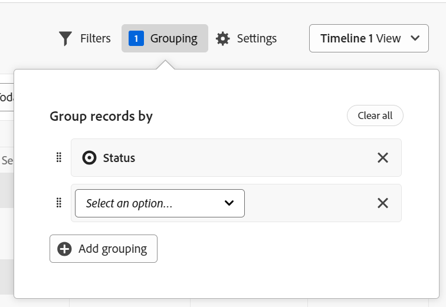

<!--
---
title: Manage the timeline view in Adobe Maestro
description: You can display records in a timeline view, when accessing the record type page in Adobe Maestro. 
hidefromtoc: yes
hide: yes
author: Alina
feature: Work Management
role: User
---
-->

# Manage the timeline view

<!--update the metadata with real information when making this avilable in TOC and in the left nav-->

>[!IMPORTANT]
>
>Currently, Adobe Maestro is part of a closed beta program which is open to a limited number of customers. 
>
>Contact your account representative for more information about joining the beta program for Maestro.
>
>For information, see [Adobe Maestro overview](../maestro-overview.md).

You can display records in a timeline view, when accessing the record type page in Adobe Maestro. 

For information about Maestro views, see [Manage record views in Adobe Maestro](../views/manage-record-views.md).

## Access requirements

You must have the following access to perform the steps in this article: 

<table style="table-layout:auto">
 <col>
 <tbody>
<td>
   
 Adobe product
 </td>
   <td>
   
 Adobe Workfront
 </td>
  </tr>  
 <td role="rowheader">
Adobe Workfront agreement
</td>
   <td>

Your organization must be enrolled in the Adobe Maestro closed beta program. Contact your account representative to inquire about this new offering. 

   </td>
  </tr>
  <tr>
   <td role="rowheader">
Adobe Workfront plan
</td>
   <td>

Any

   </td>
  </tr>
  <tr>
   <td role="rowheader">
Adobe Workfront license
</td>
   <td>
   
Any
 
  </td>
  </tr>
  
  <tr>
   <td role="rowheader">Access level</td>
   <td> 
Any
  
</td>
  </tr>
<tr>
   <td role="rowheader">Layout template</td>
   <td> 
Your system administrator must add the Maestro area in your layout template. For information, see <a href="../access/grant-access.md">Grant access to Adobe Maestro</a>. 
  
</td>
  </tr>
 </tbody>
</table>

<!--Maybe enable this at GA - but Maestro is not supposed to have Access controls in the Workfront Access Level: 
>[!NOTE]
>
>If you don't have access, ask your Workfront administrator if they set additional restrictions in your access level. For information on how a Workfront administrator can change your access level, see [Create or modify custom access levels](../administration-and-setup/add-users/configure-and-grant-access/create-modify-access-levels.md). -->

<!-- Notes to add for the table: for the "Workfront plans" row: the above is only for closed beta; when going to GA - activate the following plans:    

Current plan: Prime and Ultimate

Legacy plan: Enterprise
-->

<!-- Notes for the table: for the "Workfront access" row: 
For more information, see <a href="../../administration-and-setup/add-users/access-levels-and-object-permissions/wf-licenses.md" class="MCXref xref">Adobe Workfront licenses overview</a>.
-->

## Manage the timeline view {#manage-the-timeline-view}

<!--insert screen shot of timeline view-->

When creating a timeline view, all records of the selected record type display in a chronological timeline.

Consider the following: 

* You can create a Timeline view only when you have at least two date fields associated with a record type. When you have one or no date fields associated with a record type, the Timeline view option is dimmed. 
* Depending on the dates associates with the records, some records might not display in the timeline view in the following scenarios:

    * When the Start and End dates have no values.
    * When the Start or the End dates have no value.
    * When the Start date is after the End date.    

<!--these are NOT available now because there won't be a table for the timeline view for the near future, per Andy: 
* The records displayed in the timeline view also display in a view-only table to the left of the timeline. 
* Each row in the table and each bar on the timeline represent the same record. 
* Each column in the table is a record field. The columns of this table are preconfigured and cannot be customized. 
* Only a limited number of fields (or columns) display in the timeline view table. 
* You cannot do the following in a timeline view:
     * Add rows or records
     * Add columns or fields
     * Edit record information
--> 

When creating a timeline view, all records of the selected record type display in a timeline as bars, by default.  

To manage a timeline view: 

1. Go to the record type page for which you want to view the timeline. 
1. Create a timeline view, as described in the article [Manage record views](../views/manage-record-views.md). 

    

    The records associated with the record type you selected display in a chronological timeline, as bars. 

1. Do one of the following to navigate through the timeline:

    * Click the left and right icons or use the horizontal scroll to move backwards and forwards in the timeline. 
    * Click **Today** to center the timeline to today's date. 
    * Select one of the following options from the time frame drown-down menu to update the time increments: 

        * Year
        * Quarter
        * Month
1. Click **Switch to Standard** view to display records in separate lines <!--check to see if they updated the name of the setting here-->

    Or

    Click **Switch to Compact view** to display the records whose dates don't intersect on the same line. <!--check to see if they updated the name of the setting here-->
    
    Records display in the Compact view by default. 

1. Update the following view elements as described in the subsections below:
    * [Filters](#add-filters)
    * [Grouping](#add-grouping)
    <!--* [Sort](#add-sort) not sure if this is present in timeline views?!; also check the anchor and make sure it's correct-->
    * [Settings](#edit-the-timeline-view-settings)

### Add filters

Filters help you reduce the amount of information displayed on the screen.

Consider the following when working with filters in the timeline view: 

<!-- this list is almost identical to the one for the table view - update both-->

* The filters you create for the timeline view work independently from the filters in the table view when applied to the same record type. 

* The filters are dependent on the view you select. Two timeline views of the same record type can have different filters applied to them. Two users looking at the same timeline view see the same filter that is currently applied. 

* You cannot name the filters you build and apply to a timeline view.

* Removing filters removes them from anyone accessing the same record type as you and uses the same view you use.

Adding filters in the timeline view is identical to adding filters in the table view. 

For more information, see the "Add filters" section in the article [Manage the table view](../views/manage-the-table-view.md). 

### Add grouping

<!-- if groupings are identical between the table and the timeline, consider replacing this section with this: 

Adding groupings in the timeline view is identical to adding filters in the table view. 

For more information, see the "Add filters" section in the article [Manage the table view](../views/manage-the-table-view.md). -->

You can group records by similar information when applying  a grouping to a view.

Consider the following when working with groupings in the timeline view:

* You can apply groupings both in the table and timeline views. The groupings of the table view are independent from those in the timeline view of the same record type. 
* You can apply 3 levels of grouping in a Maestro view. The records are grouped in the order of groupings that you select. 
* You can apply up to 4 levels of grouping when using the API. 

To add a grouping:

1. Create a timeline view, as described in the article [Manage record views](../views/manage-record-views.md). 
1. Click **Grouping**.

    

1. Click one of the suggested fields, or click **Choose a different field** and search for a different field, then click it when it displays in the list. 

    >[!TIP]
    >
    >You cannot select linked fields. 

    The grouping is applied automatically to the timeline and records display inside the grouping box. The number of items in a grouping displays on the grouping line. 

    <!-- add a step that you can rearrange the groupings here, when this will be possible-->
    
1. (Optional) Repeat the above steps to add up to 3 groupings. 

    The number of groupings applied displays to the left of the Grouping icon in the upper-right corner of the toolbar.

    

1. (Optional) Click the **x** icon to the right of a grouping to remove the grouping

    Or

    Click **Clear all** to remove all groupings.  

1. Click outside the **Group records by** box to close it. 

<!-- 

### Add sort

this is not possible right now; if this is the same functionality as the table view, document it there and link from here. 

-->

### Edit the timeline view settings {#edit-the-timeline-view-settings}

Update the timeline view settings to indicate what information should display in the timeline section of the view. 

1. Create a timeline view, as described the article [Manage record views](../views/manage-record-views.md). 
1. Click **Settings**. 
1. Click **Date and time** in the left panel, then select a **Start date** and an **End date** to display on the timeline. You can choose the default Start and End dates, or you can choose any date field available. The bars representing the records start on the date you indicate for the Start date and end on the date corresponding with the End date. 

    >[!NOTE]
    >
    >    Records that have no values for the Start or the End dates or have a Start date later than the End date do not display in the timeline view.

1. Click **Record details** to indicate what fields you want to display on the record bards. 

    The Name field is selected by default.

1. Click **Add field** to add up to 4 fields to the record bars.
1. Click inside the **Search fields** box, and click the field you want to add. 

    >[!TIP]
    >
    >   * You must create the fields before you can add them to the record bars. 
    > 
    >   * You must have at least one field selected. **Name** is selected by default.

    A preview of what the bars will look like on the timeline displays on the right.

    

1. Click **Save**.

    The records display in the timeline view with the specifications you selected. 

