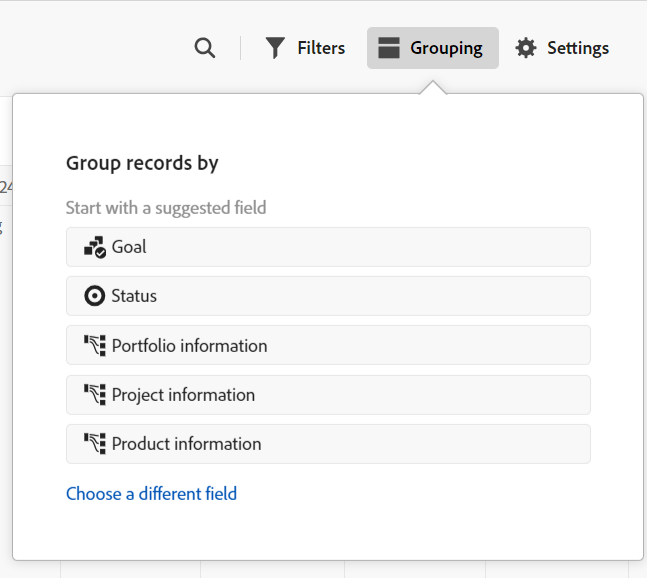

# Manage the timeline view

<!--
title: Manage the timeline view in Adobe Maestro
description: You can display records in a timeline view, when accessing the record type page in Adobe Maestro. 
hidefromtoc: yes
hide: yes
author: Alina
feature: Work Management
role: User
-->

<!--update the metadata with real information when making this available in TOC and in the left nav-->

{{maestro-important-intro}}

You can display records in a timeline view, when accessing the record type page in Adobe Workfront Planning. 

For information about record views, see [Manage record views](../views/manage-record-views.md).

## Access requirements

You must have the following access to perform the steps in this article: 

<table style="table-layout:auto">
 <col>
 </col>
 <col>
 </col>
 <tbody>
    <tr>
<tr>
<td>
   
 Product
 </td>
   <td>
   
 Adobe Workfront
 </td>
  </tr>  
 <td role="rowheader">
Adobe Workfront agreement
</td>
   <td>

Your organization must be enrolled in the Adobe Workfront Planning beta program. Contact your account representative to inquire about this new offering. 

   </td>
  </tr>
  <tr>
   <td role="rowheader">
Adobe Workfront plan
</td>
   <td>

Any

   </td>
  </tr>
  <tr>
   <td role="rowheader">
Adobe Workfront license
</td>
   <td>
   
Any
 
  </td>
  </tr>
  
  <tr>
   <td role="rowheader">Access level configuration</td>
   <td> 
There are no access level controls for Adobe Workfront Planning 
  
</td>
  </tr>

  <tr>
   <td role="rowheader">
Permissions
</td>
   <td> 
Manage permissions to the view
  
</td>
  </tr>

<tr>
   <td role="rowheader">Layout template</td>
   <td> 
Your system administrator must add the Planning area in your layout template. For information, see <a href="../access/access-overview.md">Access overview</a>. 
  
</td>
  </tr>
 </tbody>
</table>

## Manage a timeline view {#manage-a-timeline-view}

<!--insert screen shot of timeline view-->

When creating a timeline view, all records of the selected record type display in a chronological timeline.

Consider the following: 

* You can create a Timeline view only when you have at least two date fields associated with a record type. When you have one or no date fields associated with a record type, the Timeline view option is dimmed. 
* Depending on the dates associates with the records, some records might not display in the timeline view in the following scenarios:

    * When the Start and End dates have no values
    * When the Start or the End dates have no value
    * When the Start date is after the End date 

To manage a timeline view: 

1. Go to the record type page for which you want to view the timeline. 
1. Create a timeline view, as described in the article [Manage record views](../views/manage-record-views.md). 

    

    The records associated with the record type you selected display as bars in a timeline and are sorted in chronological order of their Start Date, by default. 

    >[!TIP]
    >
    >    The sorting of the records in the timeline is not visible in the Compact view.

1. Do one of the following to navigate through the timeline:

    * Click the left and right icons or use the horizontal scroll to move backwards and forwards in the timeline. 
    * Click **Today** to center the timeline to today's date. 
    * Select one of the following options from the time frame drop-down menu to update the time increments: 

        * Year
        * Quarter
        * Month
1. Click **Switch to Standard** view to display records in separate lines <!--check to see if they updated the name of the setting here-->

    Or

    Click **Switch to Compact view** to display the records whose dates don't intersect on the same line. <!--check to see if they updated the name of the setting here-->
    
    Records display in the Compact view by default. 

1. Do the following to quickly find records that match a keyword:

    1. Click the **Search** icon  and start typing a keyword associated with any field of a record that displays on the screen. The number of correct matches displays next to the search item and the record with the correct match is highlighted.

        

        You can use any word or special character that is visible on the screen.

        You cannot use keywords that are associated with fields that do not display in the timeline view.

    1. Press Enter on your keyboard to go to the next found field.
    1. (Optional) If there is more than one match, click the up and down arrows to the right of the search keyword to find all the matches in the table.
    1. Click the **x** icon in the search box to clear the search keyword.

1. Update the following view elements as described in the subsections below:
    * [Filters](#add-filters)
    * [Grouping](#add-grouping)
    * [Settings](#edit-the-timeline-view-settings)
    <!--* [Sort](#add-sort) not sure if this is present in timeline views?!; also check the anchor and make sure it's correct-->

### Add filters

You can reduce the amount of information displayed on the screen by using filters.

Consider the following when working with filters in the timeline view: 

<!-- this list is almost identical to the one for the table view - update both-->

* The filters you create for a timeline view work independently from the filters in any other view applied to the same record type. 

* The filters are unique to the view that you select. Two timeline views of the same record type can have different filters applied to them. 

* Two users looking at the same timeline view see the same filter that is currently applied. 

* You cannot name the filters you build for a timeline view.

* Removing filters removes them from anyone accessing the same record type as you and who displays the same view as you do. 

* Adding filters in the timeline view is identical to adding filters in the table view. 

    For more information, see the "Add filters" section in the article [Manage the table view](../views/manage-the-table-view.md). 

* You can filter by connected record fields or lookup fields, but not for those fields that allow linking to multiple records.

### Add grouping

<!-- groupings are almost identical between this view and table  but they display a little differently, so I kept the steps for both; update in both places if they make changes to groupings-->

You can group records by similar information when applying  a grouping to a view.

Adding groupings in the timeline view is similar to adding groupings to the table view. 

Consider the following when working with groupings in the timeline view:

* You can apply groupings both in the table and timeline views. The groupings of the table view are independent from those in the timeline view of the same record type.
* You can apply 3 levels of grouping in a view. The records are grouped in the order of groupings that you select. 
* You can apply up to 4 levels of grouping when using the API. 
* The groupings are unique to the view that you select. Two timeline views of the same record type can have different groupings applied to them. Two users looking at the same timeline view see the same grouping that is currently applied. 
* You cannot name the groupings you build for a timeline view.
* Removing groupings removes them from anyone accessing the same record type as you and who displays the same view as you do. 
* You can group by connected record fields or lookup fields, but not for those fields that allow linking to multiple records.

To add a grouping in the timeline view:

1. Create a timeline view for a record type, as described in the article [Manage record views](../views/manage-record-views.md). 
1. Click **Grouping** in the upper-right corner of the timeline view.

    

1. Click one of the suggested fields, or click **Choose a different field**, search for a different field, then click it when it displays in the list. 

    The grouping is applied automatically to the timeline and records display inside the grouping box. 

    <!-- add a step that you can rearrange the groupings here, when this will be possible-->
    
1. (Optional) Repeat the above steps to add up to 3 groupings.

    The number of fields selected for the grouping displays next to the Grouping icon.

    <!-- update screen shot with view redesign-->

    

1. (Optional) Inside the **Group records by** box, click the **x** icon to the right of a field selected for the grouping to remove the grouping

    Or

    Click **Clear all** to remove all fields.  

1. Click outside the **Group records by** box to close it. 
1. (Optional) Click **Settings**, then **Color** to color-code groupings. For more information, see the [Edit the timeline view settings](#edit-the-timeline-view-settings) section in this article. 

<!-- 

### Add sort

this is not possible right now; if this is the same functionality as the table view, document it there and link from here. 

-->

### Edit the timeline view settings {#edit-the-timeline-view-settings}

Update the timeline view settings to indicate what and how information displays in the timeline section of the view. 

1. Create a timeline view for a record type, as described in the article [Manage record views](../views/manage-record-views.md). 
1. Click **Settings**. 
1. Click **Date and time** in the left panel, then select a **Start date** and an **End date** to display on the timeline. You can choose the default Start and End dates, or you can choose any date field available. The bars representing the records start on the date that you indicate for the Start date and end on the date corresponding with the End date. 

    >[!NOTE]
    >
    >Records that have no values for the Start or the End dates or have a Start date later than the End date do not display in the timeline view.

1. Click **Bar style** in the left panel, to indicate what fields you want to display on the record bars. 

    The Name field is selected by default. <!--adjust this when the primary field is released??-->

1. (Optional and conditional) If you added thumbnails to records, select the Thumbnail option to display the image associated with records in their record bar. 

    >[!NOTE]
    >
    >    You must first add thumbnails in the table view before you can display them in the timeline view. For more information, see [Add thumbnails to records](/help/quicksilver/maestro/records/add-thumbnails-to-records.md). 

1. Click **Add field** to add up to 4 fields to the record bars.
1. Click inside the **Search fields** box, and click the field you want to add. 

    >[!TIP]
    >
    >   * You must create the fields before you can add them to the record bars. 
    > 
    >   * You must have at least one field selected. **Name** is selected by default.

    A preview of what the bars will look like on the timeline displays on the right.

    

1. Click **Color** in the left panel, to customize the colors of the records and groupings in the timeline. 

    

1. (Conditional and optional) If you added a grouping to the timeline view, select from the following options to set a color for the grouping in the **Set grouping color** section:

    * **Default (gray)**: The color of the groupings is set to gray. This is the default. 
    * **Field values**: The color of the groupings matches the color of the field you group by. 
    You can match the color of the groupings only to fields with color-coded options.
    
    For example, multi-select or single-select fields can have color-coded options. 

    If you group by fields without color-coded options, the grouping color remains gray.

    >[!TIP]
    >
    >If you did not add groupings to the timeline view, this section does not display.

1. In the **Set record color** section, select from the following options to set a color for the records: 

    * **Record type**: The color of the records match the color of the record type you selected. This is the default option. 
    * **Field values**: The color of the records matches the color of a field that you specify. Continue with step 10. <!--ensure this stays accurate-->
    * **Grouping**: The color of the records matches the color that you indicated for the groupings. This option is dimmed when you have no groupings applied to the timeline view. 
    * **None**: Records displays in a white bar. 

1. (Conditional) If you selected **Field values** for the record colors, select a field from the **Match the record color to** drop-down menu. 

    

    Only fields with color-coded options display in the drop-down menu.
    
    For example, multi-select or single-select fields can have color-coded options.  

    If you do not have a field with color-coded options for the selected record type, this option is dimmed.

1. Click **Save**.

    The records display in the timeline view with the specifications that you selected.
