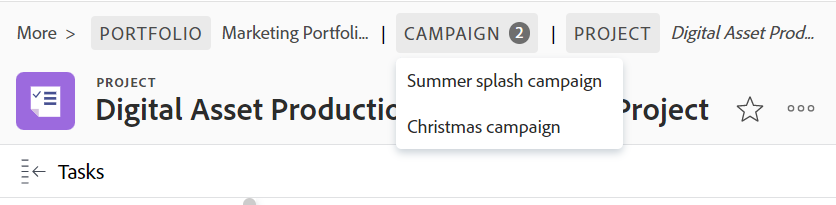

# Add objects to a campaign

>[!NOTE]
>
>The information in this article is available when you participate in the Campaigns beta program. The functionality described here might not be fully available yet. For more information about current available features and how to enroll, see  [Campaigns beta](../../product-announcements/betas/campaign-object-beta.md).

## Access requirements

You must have the following access to perform the steps in this article:

| Requirements                 |                              |
|------------------------------|------------------------------|
| Adobe Workfront plan*        | Any                          |
| Adobe Workfront license*     | Request or higher            |
| Access level configurations* | View access to Projects      |
| Object permissions           | View permissions to projects |

*To find out what plan, license type, or access you have, contact your Workfront administrator.

For information about modifying access levels, see [Create or modify custom access levels](../../administration-and-setup/add-users/configure-and-grant-access/create-modify-access-levels.md)

For information about requesting additional permissions, see [Request access to objects](../../workfront-basics/grant-and-request-access-to-objects/request-access.md)

## Prerequisites

Before you begin, you must have the following: 

* A System or Group administrator must add the [!UICONTROL Campaigns] area to the layout template associated with you. 

## Add projects to a campaign

1. Click the [!UICONTROL **Main Menu**] icon  in the upper-right corner of Workfront, then click [!UICONTROL **Campaigns**].

   A list of all campaigns in the system displays.
1. (Optional) Click the [!UICONTROL **search**] icon  to quickly search for a campaign using a keyword.
1. Click the name of a campaign to open it. 

   The [!UICONTROL Projects] section should open by default.
1. Click [!UICONTROL **New Project**], then [!UICONTROL **Existing Project**].  

   The Add projects box opens and displays a list of projects.
1. (Optional) Click the [!UICONTROL **search**] icon  to type a keyword and find a particular project.
1. (Optional) Click the [!UICONTROL **Filter**], [!UICONTROL **View**], or [!UICONTROL **Grouping**] icons to modify the list of projects in the list.
1. Select the projects that you want to add to the campaign, then click [!UICONTROL **Add**].
   
   The projects are added to the [!UICONTROL Projects] section of the campaign.
1. (Optional) Click a project to open it.

   If the added project belongs to multiple campaigns, there is an indication in the breadcrumb of the project that displays all the campaigns connected to the project.
   
   If the project belongs to a portfolio or a program, the campaign displays in the breadcrumb after the program and immediately before the project.

   

