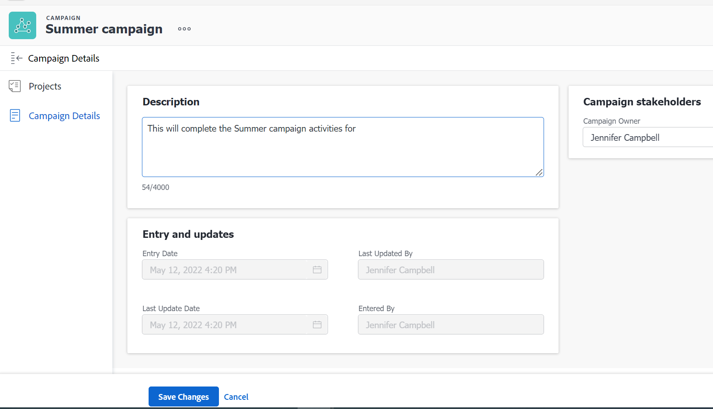

# Create campaigns

<!--

The name of the object might change - update the titles when/ if that happens. 

-->

[Introduction]

<!--

<strong>Delete this box before publishing</strong>  You can delete any table rows that don't apply.

-->

## Access requirements

You must have the following access to perform the steps in this article:

| Requirements            |                   |
|--------------------------|-------------------|
| Adobe Workfront plan*    | Any               |
| Adobe Workfront license* | Request or higher |

*To find out what plan, license type, or access you have, contact your Workfront administrator.

## Prerequisites

Before you begin, you must

* A System or Group administrator must add the Campaigns area to the layout template associated with you. 

* [List out prerequisites]

## Create a campaign

1. Click the Main Menu icon  in the upper-right corner of Workfront, then click **Campaigns**.
   
   A list of all campaigns in the system displays.
1. Click **New Campaign**.
1. Update the name of the campaign by inline editing it in the header. By default, the campaign's name is **Untitled Campaign**.
1. (Optional) Update the **Campaign Owner** in the header of the new campaign. As the creator of the campaign, you are designated as the owner of the campaign.
1. (Optional) Click **Campaign Details** in the left panel and update or review the following fields:
    * **Description**: Add additional information about the campaign.
    * **Campaign Owner**: By default, the campaign owner is the user who created the campaign. When you replace the original owner of the campaign with another user, the user you specify is automatically given permissions to edit the campaign. The user who is designated as the Campaign Owner must be a Workfront active user.
    * **Entry Date**: This is the date when the campaign was created. You cannot edit the Entry Date.
    * **Last Updated By**: This is the name of the user who updated the campaign last. You cannot edit the Last Updated By field.
    * **Entered By**: This is the name of the user who created the campaign. You cannot edit the Entered By field.

    
    
1. Click **Save Changes**. 
A new campaign is created and everyone who has the Campaigns area available in their Main Menu can view it.
1. (Optional) Associate other objects with the campaign. For more information, see **Add objects to a campaign**.

 

