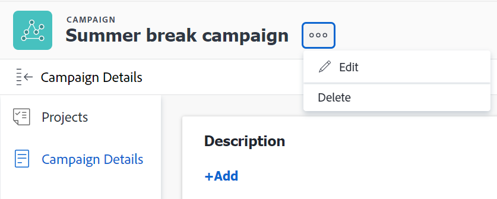

# Delete campaigns

<!--drafted for campaign removal:  
take down the article altogether at 23.1 release (the week of Jan. 23 2023 ) -->

>[!IMPORTANT] 
> 
>The functionality described in this article has been deprecated and removed from the Preview environment. This functionality was never released to the Production environment. 
>
>The Workfront Product team is going to review this functionality and include it in a future product release.  
> 
>  This article will also be removed with the 23.1 release. At this time, we recommend that you update any bookmarks accordingly.  
> 
>  For information about current feature releases, visit the [Product releases](../../product-announcements/product-releases/product-releases.md) page. 

You can delete campaigns that are no longer needed.

For information about creating campaigns, see [Create campaigns](create-campaigns.md).

## Access requirements

You must have the following access to perform the steps in this article:

| Requirements |  |
|--------------------------|-------------------|
| [!DNL Adobe Workfront] plan* | Any |
| [!DNL Adobe Workfront] license* | Request or higher |

*To find out what plan or license type you have, contact your [!DNL Workfront] administrator.

For information about modifying access levels, see [Create or modify custom access levels](../../administration-and-setup/add-users/configure-and-grant-access/create-modify-access-levels.md)

<!--
When the access, permissions will be implemented for above, replace that *sentence under the table with this; 
*To find out what plan, license type, or access you have, contact your [!DNL Workfront] administrator.
-->

## Prerequisites

Before you begin, you must have the following:

* A System or Group administrator must add the [!UICONTROL Campaigns] area to the layout template associated with you.
* You are the owner of the campaign

   Or

   You are a System Administrator.

## Considerations about deleting a campaign

* You cannot recover a deleted campaign.
* Deleting a campaign deletes it for all users in the system who can view it.
* Deleting a campaign does not delete the projects associated with it.

<!--
* The campaign information at the project level is deleted.
* You can add projects, portfolios, or programs to a campaign. (replace the sentence above about projects only with this one when these objects become available.)
-->

## Delete a campaign

1. Click the [!UICONTROL **Main Menu**] icon  in the upper-right corner of [!DNL Workfront], then click [!UICONTROL **Campaigns**].

   A list of all campaigns in the system displays.

1. (Optional) Click the **[!UICONTROL search]** icon  to quickly search for a campaign using a keyword.
1. Select a campaign, then click the **[!UICONTROL Delete]** icon at the top of the list

   Or

   Click the name of a campaign to open it, then click [!UICONTROL **More**] >[!UICONTROL **Delete**].

   

1. Click [!UICONTROL **Delete**].

The campaign is deleted and cannot be recovered.
