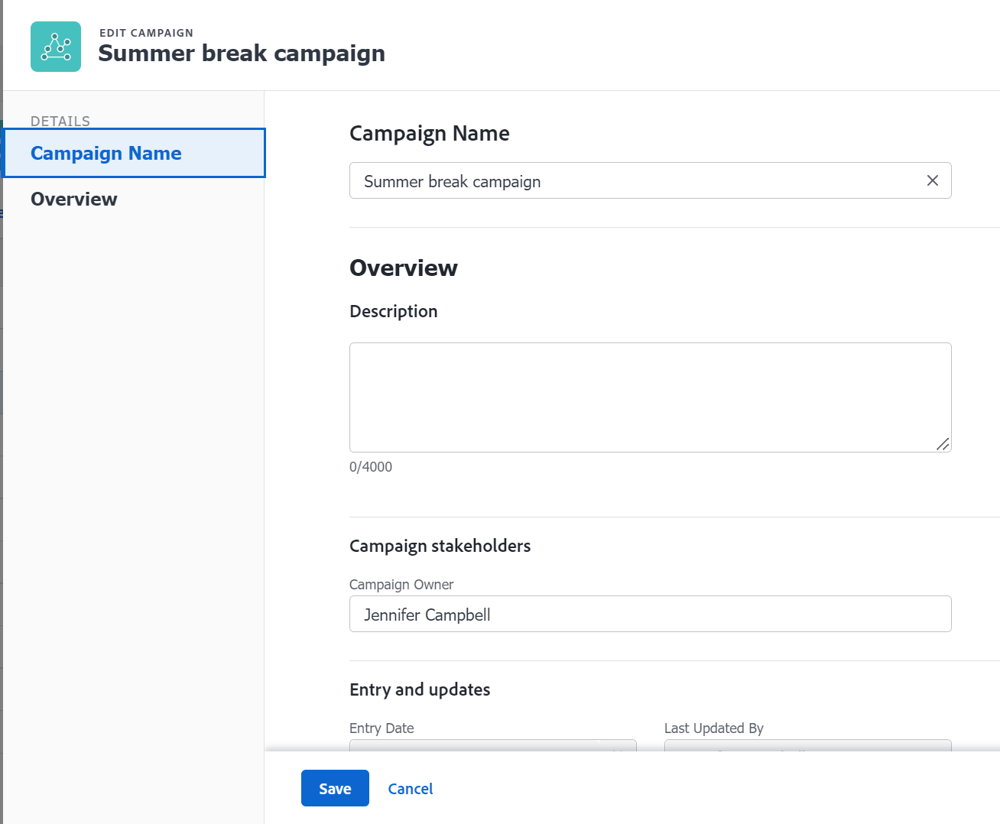

# Edit Campaigns

 >[!NOTE]
>
>You can opt in to access Campaigns by enrolling in the beta program. The functionality described in this article might not be fully available yet. For more information about current available functionality and how to enroll, see [Campaigns beta](../../product-announcements/betas/campaign-object-beta.md).

## Access requirements

You must have the following access to perform the steps in this article:

| Requirements             |                   |
|--------------------------|-------------------|
| Adobe Workfront plan*    | Any               |
| Adobe Workfront license* | Request or higher |

*To find out what plan, license type, or access you have, contact your Workfront administrator.

## Prerequisites

Before you begin:

* A System or Group administrator must add the Campaigns area to the layout template associated with you.
* You are the owner of the campaign 

    Or 

    You are a System Administrator.

## Edit a campaign

1. Click the Main Menu icon  in the upper-right corner of Workfront, then click **Campaigns**. 

    A list of all campaigns in the system displays.
1. (Optional) Click the **search** icon    to quickly search for a campaign using a keyword.
1. Select a campaign, then click the **Edit** icon at the top of the list
    
    Or 
    
    Click the name of a campaign to open it, then click **More** > **Edit**. 

    >[!TIP]
    >
    >To edit limited information about the campaign, click **Campaign Details** and update any of the available fields. To update all information about a campaign, continue to follow these instructions.

    
1. Update or review information in the following areas:
    * [Campaign Name](#campaign-name)
    * [Overview](#overview)

### Campaign Name {#campaign-name}

1. Begin editing your campaign as described above.
1. Click Campaign Name in the left panel.
1. Update the name of the campaign.
1. Click **Save**.

### Overview {#overview}

1. Begin editing your campaign as described above.
1. Click Overview in the left panel.
1. Update or review the following information:
    * **Description**: Add additional information about the campaign.
    * **Campaign Owner**: By default, the Campaign Owner is the user who created the campaign. When you replace the original owner of the campaign with another user, the user you specify is automatically given permissions to edit the campaign. The user who is designated as the Campaign Owner must be a Workfront active user. 
    >[!TIP]
    >
    > You can update the Campaign Owner in the campaign header.
    * **Entry Date**: This is the date when the campaign was created. You cannot edit the Entry Date.
    * **Entered By**: This is the name of the user who created the campaign. You cannot edit the Entered By field.
    * **Last Update Date**: This is the date when the campaign was last updated. You cannot edit the Last Update Date.
    * **Last Updated By**: This is the name of the user who updated the campaign last. You cannot edit the Last Updated By field.
1. Click **Save**.