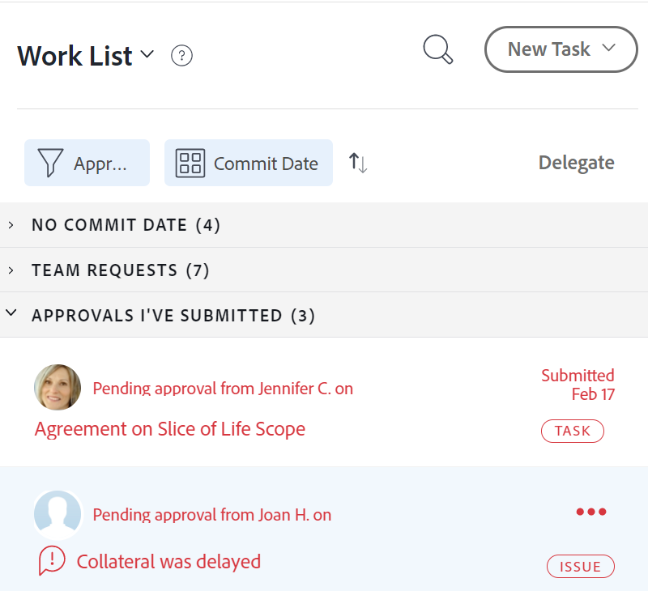
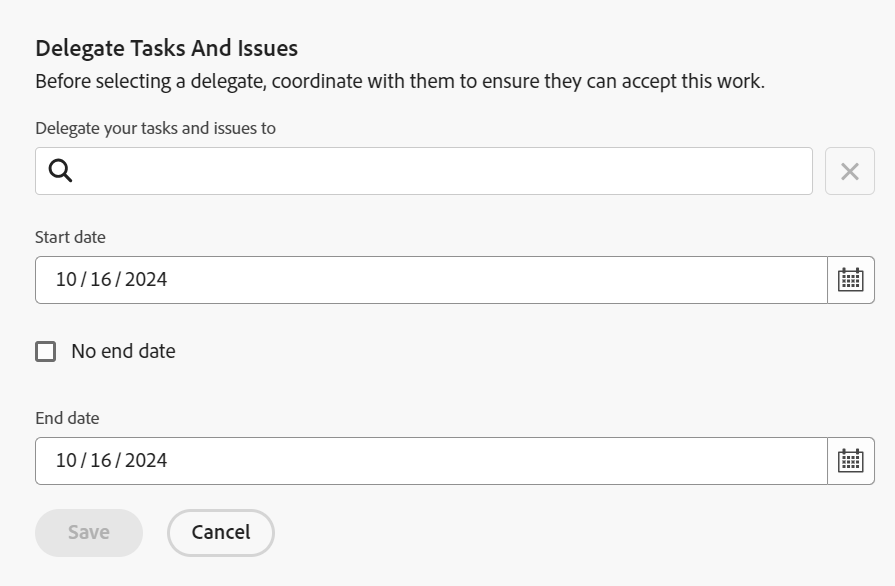
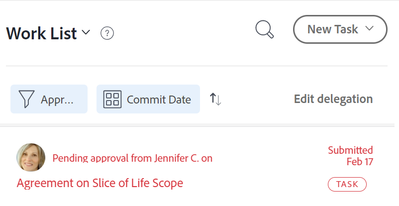
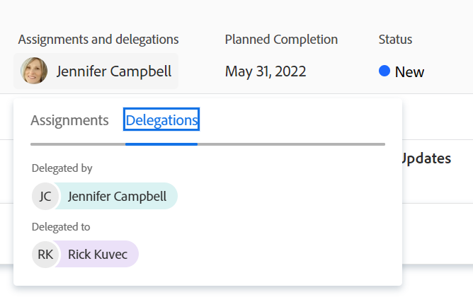
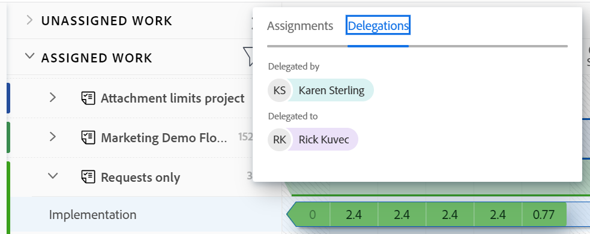
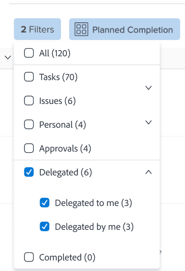

# Manage task and issue delegation

<!--
<NOTE: 
<you might need to change the tile to Delegate PTI, etc, when that functionality is added. Named it this so it will not conflict with the TOC article for Delegate section which was also "Delegate work"
I wrote thhis as a "Manage..." article and I did not add three separate articles, to match what we have for delegating approval requests)
-->

You can temporarily delegate the work you are assigned to while you are out of the office.

You can delegate task and issue assignments or you can delegate approvals. This article describes how to delegate task and issue assignments.

For general information about delegating work, see [Delegate work overview](../../manage-work/delegate-work/delegate-work-overview.md).

## Access requirements

>[!IMPORTANT]
>
>* The users that you select as delegates receive the same permissions as your permissions on the tasks and issues you delegate to them.
>* The permissions must work within their access levels, and sometimes their access levels might be lower than yours.
>
>   
>   For example, if a user has only View access to tasks in their access level and you have Manage permissions on the tasks you delegate to them, they receive Manage permissions to the tasks you delegate to them. However, they will not be able to perform the same actions as you on the delegated tasks. They must request Edit access to Tasks from the system administrator to be able to update tasks in your absence.
>
>   
>   For information on how a  can modify your access level, see [Create or modify custom access levels](../../administration-and-setup/add-users/configure-and-grant-access/create-modify-access-levels.md).
>
>* For items that are assigned after the delegation already started, it can take up to one hour after the item was assigned for [!DNL Workfront] to share the newly-assigned items with the delegate.

You must have the following access to perform the steps in this article:

<table style="table-layout:auto"> 
 <col> 
 <col> 
 <tbody> 
  <tr> 
   <td role="rowheader">[!DNL Adobe Workfront] plan*</td> 
   <td> 
Any
 </td> 
  </tr> 
  <tr> 
   <td role="rowheader">[!DNL Adobe Workfront] license*</td> 
   <td> 
Review or higher

>[!NOTE]
>
>Although you can be assigned to work when you have a Request license, you cannot delegate your work to others. [!DNL Workfront] does not recommend assigning work to Review or Request users.

</tr> 
  <tr> 
   <td role="rowheader">Access level configurations*</td> 
   <td> 
Edit access to Tasks and Issues 
     If you still don't have access, ask your [!DNL Workfront] administrator if they set additional restrictions in your access level. For information on how a [!DNL Workfront] administrator can modify your access level, see <a href="../../administration-and-setup/add-users/configure-and-grant-access/create-modify-access-levels.md" class="MCXref xref"> Create or modify custom access levels</a>.
 </td> 
  </tr> 
  <tr> 
   <td role="rowheader">Object permissions</td> 
   <td> 
View or higher permissions to the tasks or issues that you are assigned to
 
    
For information on requesting additional access, see <a href="../../workfront-basics/grant-and-request-access-to-objects/request-access.md" class="MCXref xref">Request access to objects </a>.
 </td> 
  </tr> 
 </tbody> 
</table>

*To find out what plan, license type, or access you have, contact your [!DNL Workfront] administrator.

<!--note from the table for Object permissions:
     
Contribute or higher permissions to the projects where you are designated as the Project&nbsp;Owner (NOTE:&nbsp;you cannot delegate projects yet)

    -->

## Prerequisites

Before you can perform the activities described in this article, you must ensure the following:

* Your [!DNL Workfront] or group administrator enabled the [!UICONTROL Allow users to delete tasks & issues with logged hours] setting in the [!UICONTROL Setup] area of your [!DNL Workfront] instance.

   For more information, see [Configure system-wide task and issue preferences](../../administration-and-setup/set-up-workfront/configure-system-defaults/set-task-issue-preferences.md).

## Delegate tasks and issues to another user

Before delegating work to others, we recommend that you reach out to them and inform them that they will be designated as delegates on your work items. Ask for their verbal approval before delegating work to ensure they have the time necessary to complete the work while you are out of the office.

For general information about delegating tasks and issues, see [Delegate tasks and issues overview](delegate-work.md).

To delegate your tasks and issues to others:

1. Go to the [!UICONTROL **Home**] area, then click [!UICONTROL **Delegate**] at the top of the [!UICONTROL **Work List**].

   

1. In the [!UICONTROL **Delegate tasks and issues**] tab, update the following:

   * [!UICONTROL **Delegate your tasks and issues to**]: Start typing the name of a user that you want your tasks and issues to be delegated to, then select it when it displays in the list. You can only select one user.\

      The user that you select as a delegate receives the same  permissions as your permissions on the tasks and issues you delegate to them. For more information, see [Delegate task and issue overview](delegate-work-overview.md).

   * [!UICONTROL **Start date**]: Select a date from the calendar when the delegation of your work items should start.

      >[!TIP]
      >
      >The Start date cannot be in the past.

   * [!UICONTROL **No end date**]: Select this option if you do not want to specify the end-date for your delegation.

   * [!UICONTROL **End date**]: Select a date from the calendar when the delegation should stop.

      >[!TIP]
      >
      >Not selecting an End date enables the delegation only for the current day.

      

1. Click [!UICONTROL **Save**].

   The following things happen:

   * Your work is delegated to the specified user. Any incomplete tasks or issues that have dates within the time frame you selected (including newly assigned ones, after the delegation was enabled) are delegated.

   >[!TIP]
   >
   >   Completed work items that have dates within the time frame of the delegation are not delegated.

   * You receive a message in the upper-right corner of the screen to confirm that you have enabled the delegation of your work to another user. The name of the delegate user displays in the confirmation message.

   * An indication that your tasks and issues are delegated to other users displays in most areas where you can see assignments in [!DNL Workfront]. For more information about what areas do not include delegates' names, see [Delegate task and issue overview](delegate-work-overview.md).

   * The [!UICONTROL **Delegate**] button in the [!UICONTROL Home] area changes to [!UICONTROL **Edit delegation**] to indicate that there is a delegation in place.
   <!--
   <MadCap:conditionalText data-mc-conditions="QuicksilverOrClassic.Draft mode">
   (NOTE: is this shot correct?&nbsp;See UI - this is a mock)
   </MadCap:conditionalText>
   -->

   

   * If your event notifications and your personal notifications are enabled, you also receive an email confirmation of your delegation.

   * The user you selected as your delegate receives an email about the delegation, if their event notifications are enabled.

      For information about enabling personal email notifications, see [Activate or deactivate your own event notifications](../../workfront-basics/using-notifications/activate-or-deactivate-your-own-event-notifications.md).

## Edit or stop delegation

You can let a delegation expire, if you selected an End Date, or you can manually stop it. You can also modify the time frame for the delegation, if the dates for the delegation changed.

1. Go to the [!UICONTROL Home] area, then click [!UICONTROL Edit delegation] in the upper-right corner of the Work List.
1. In the [!UICONTROL Delegate tasks and issues] tab, do one of the following:
   * Modify the [!UICONTROL **Start date**] or the [!UICONTROL **End date**]
   * Click [!UICONTROL **Stop delegation**]

   >[!TIP]
   >
   >    You can edit only the End date of a delegation if the delegation already started.

   

1. (Conditional) click [!UICONTROL **Save**] to save the new delegation dates

   Or

   Click [!UICONTROL **Stop delegation**] in the confirmation box to confirm stopping the delegation.

   The delegation either updated the dates or it stopped and the delegated users have been removed from your tasks and issues. Their permissions to the tasks and issues remain in place.

## Locate delegated work and delegates information

<!--(if this was released, make sure that viewing delegated approvals has not changed, as documented here: /Content/Review and approve work/Manage Approvals/delegate-approval-requests.html) 
-->

When tasks and issues are delegated, there are several areas in [!DNL Workfront] where you can see the delegated work or who the delegates are.

* [Locate delegates in the Assignments box](#locate-delegates-in-the-assignments-box)
* [Locate delegated work in [!UICONTROL Home]](#locate-delegated-work-in-home)

### Locate delegates in the [!UICONTROL Assignments] box

When your system or group administrator enables work delegation in your system, the [!UICONTROL Assignments] box displays the following tabs everywhere you can access it:

* [!UICONTROL **Assignments**]: Users assigned to the task or issue display here.
* [!UICONTROL **Delegations**]: Users designated as delegates by the assignees on the task or issue display here.

You can access the [!UICONTROL Assignments] box in the following areas:

* The task or issue header

   

   The [!UICONTROL Assignments] field in the task or issue header changes to [!UICONTROL Assignments and delegations].

* The [!IUCONTROL Workload Balancer] when manually assigning tasks or issues

   

>[!NOTE]
>
> You cannot view delegates in the [!UICONTROL Assignments] section of a task or issue Edit box.

If a task or an issue is delegated and the [!UICONTROL Delegations] subtab is empty, one of the following scenarios might exist:

* You are not assigned to the task or issue.
* The task or issue dates are outside of the delegation time frame.

>[!TIP]
>
>The Planned or Actual Hours for delegated tasks and issues are not taken into account in resource management tools, like the [!IUCONTROL Workload Balancer] or the [!DNL Resource Planner] for the delegated users. The hours remain associated only with the assigned user.

### Locate delegated work in [!UICONTROL Home]

1. Go to the [!UICONTROL **Home**] area, then click the filter drop-down menu and select one or more of the following options:
   * [!UICONTROL **Delegated**]: to view tasks and issues delegated to you or by you.
   * [!UICONTROL **Delegated to me**]: to view tasks and issues delegated to you by another user.
   * [!UICONTROL **Delegated by me**]: to view tasks and issues delegated by you to other users.

   

1. Click the [!UICONTROL sorting] drop-down menu to sort the list by the following criteria:
   * [!UICONTROL Planned Completion]. This is the default sorting option.
   * [!UICONTROL Planned Start]
   * [!UICONTROL Commit Date]
   * [!UICONTROL Project]
   * [!UICONTROL My Priority]
1. Expand the groupings in the [!UICONTROL **Work List**] to view delegated work items. The following scenarios exist:
   * For items that you delegated to others, the delegate's name displays in the [!UICONTROL **Work List**] as well as the [!UICONTROL **Assignments and delegations**] field on the right.

   * For items delegated to you, the assignee's name displays in the [!UICONTROL **Work List**] as well as the **[!UICONTROL Assignments and delegations]** field on the right.

   >[!TIP]
   >
   >    If the delegation is set to start at a date after today's date, the start date of the delegation also displays in the [!UICONTROL Work List]. The delegated items display in the grouping you select for the [!UICONTROL Work List], according to the type of the grouping. For example, if you group by [!UICONTROL Planned Completion Date], the delegated items display in the grouping that matches their planned completion dates.
