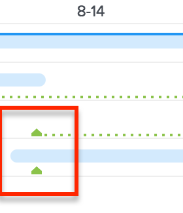
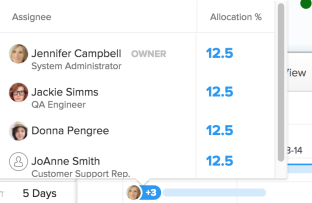
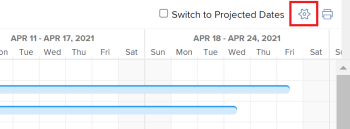

# Configure how information displays on the [!UICONTROL Gantt Chart]

<!-- Audited: 5/2025 -->

You can configure what information displays in both the Task List Gantt Chart and Project List Gantt Chart.

## Access requirements

+++ Expand to view access requirements for the functionality in this article.

You must have the following to follow the steps in this article:

<table style="table-layout:auto"> 
 <col> 
 <col> 
 <tbody> 
  <tr> 
   <td role="rowheader"> Adobe Workfront plan</td> 
   <td> 
Any 
 </td> 
  </tr> 
  <tr> 
   <td role="rowheader">Adobe Workfront license</td> 
   <td> 
   
New: Light

   
Or

   
Current: Review

   </td> 
  </tr> 
  <tr> 
   <td role="rowheader">Access level configurations</td> 
   <td> 
[!UICONTROL View] or higher access to Projects and Tasks
 
Note: If you still don't have access, ask your [!DNL Workfront] administrator if they set additional restrictions in your access level. For information on how a [!DNL Workfront] administrator can modify your access level, see <a href="../../../administration-and-setup/add-users/configure-and-grant-access/create-modify-access-levels.md" class="MCXref xref">Create or modify custom access levels</a>.
 </td> 
  </tr> 
  <tr> 
   <td role="rowheader">Object permissions</td> 
   <td> 
[!UICONTROL View] or higher access to the project
 
For information on requesting additional access, see <a href="../../../workfront-basics/grant-and-request-access-to-objects/request-access.md" class="MCXref xref">Request access to objects </a>.
 </td> 
  </tr> 
 </tbody> 
</table>

For more detail about the information in this table, see [Access requirements in Workfront documentation](/help/quicksilver/administration-and-setup/add-users/access-levels-and-object-permissions/access-level-requirements-in-documentation.md).

+++

## Understand Display Options

The following table details the display options for the [!UICONTROL Gantt chart]:

<table style="table-layout:auto"> 
 <col> 
 <col> 
 <col> 
 <tbody> 
  <tr> 
   <td role="rowheader">Actual Dates</td> 
   <td>  </td> 
   <td> 
[!UICONTROL Actual Start Date] and [!UICONTROL Actual Completion Date] are displayed with a triangle icon. If the [!UICONTROL Actual Completion Date] is null, only the [!UICONTROL Actual Start Date] is displayed.
 
For more information, see <a href="../../../manage-work/projects/planning-a-project/project-actual-completion-date.md" class="MCXref xref">Overview of the project [!UICONTROL Actual Completion Date] </a> and <a href="../../../manage-work/projects/planning-a-project/project-actual-start-date.md" class="MCXref xref">Overview of the project [!UICONTROL Actual Start Date] </a>.
 </td> 
  </tr> 
  <tr> 
   <td role="rowheader">[!UICONTROL Assignments]</td> 
   <td>  </td> 
   <td> 
Shows task assignees. Hover over the Details link next to the assignee's name to see more detailed information about them, including the percentage of their allocation to the task.
 
Assignees don't display on the [!UICONTROL Gantt chart] when the [!UICONTROL Gantt chart] is exported to PDF. When the [!UICONTROL Gantt chart] is exported to PDF, assignees only display in the task list.
 </td> 
  </tr> 
  <tr> 
   <td role="rowheader">[!UICONTROL Baseline]</td> 
   <td>  </td> 
   <td> 
A project snapshot that represents key pieces of data about the project included in the initial project plan. Baselines can be taken throughout the project's timeline. When you enable to display baselines in the [!UICONTROL Gantt chart], select which baseline you want to display. You can view only one baseline on the [!UICONTROL Gantt chart] at a time, and it will be shown in the form of a gray bar.
 
For more information about baselines, see <a href="../../../manage-work/projects/create-projects/create-baselines.md" class="MCXref xref">Create project baselines</a>.
 </td> 
  </tr> 
  <tr> 
   <td role="rowheader">[!UICONTROL Commit Date]</td> 
   <td>  </td> 
   <td> 
The date an assignee gives as their commitment of when the task will be completed is displayed with a marker in the [!UICONTROL Gantt chart]. 
 
For more information about commit dates, see <a href="../../../manage-work/projects/updating-work-in-a-project/overview-of-commit-dates.md" class="MCXref xref">[!UICONTROL Commit Date] overview</a>.
 </td> 
  </tr> 
  <tr> 
   <td role="rowheader">[!UICONTROL % Complete]</td> 
   <td>  </td> 
   <td>  The percentage of the task that is completed displays in the task line.  </td> 
  </tr> 
  <tr> 
   <td role="rowheader">[!UICONTROL Critical Path]</td> 
   <td>  </td> 
   <td>The tasks that could affect the project's timeline are considered part of the Critical Path and are clearly marked in red. </td> 
  </tr> 
  <tr> 
   <td role="rowheader">[!UICONTROL Milestone] Diamonds</td> 
   <td>  </td> 
   <td> 
A diamond icon displays after the task that's associated with a milestone. Hover over a milestone to view the name and date of the milestone. The [!DNL Workfront] administrator determines the color of each milestone diamond.
 
For more information about milestones, see <a href="../../../administration-and-setup/customize-workfront/configure-approval-milestone-processes/create-milestone-path.md" class="MCXref xref">Create a milestone path</a>.
 </td> 
  </tr> 
  <tr> 
   <td role="rowheader">[!UICONTROL Milestone] Lines</td> 
   <td>  </td> 
   <td> 
A line displays after the task that is associated with a milestone. Hover over a milestone to view the name and date of the milestone. The [!DNL Workfront] administrator determines the color of each milestone line.
 
 For more information about milestones, see  <a href="../../../administration-and-setup/customize-workfront/configure-approval-milestone-processes/create-milestone-path.md" class="MCXref xref">Create a milestone path</a>
 </td> 
  </tr> 
  <tr> 
   <td role="rowheader">[!UICONTROL Predecessors]</td> 
   <td>  </td> 
   <td> 
A line from one task to another that shows the predecessor relationship between the two tasks. To highlight an individual predecessor line, hover over it. Click it to keep it highlighted. You can only highlight one predecessor line at a time.
 
A [!UICONTROL Predecessor] icon is displayed next to any task that has a predecessor relationship that spans multiple pages on the Gantt chart or on any task that has a cross-project predecessor.
 
Click the [!UICONTROL Predecessor] icon to view all predecessor and successor tasks and their details, such as task name, type of predecessor relationship, and key dates.
 
Note: The [!UICONTROL Gantt Chart] in a list of projects displays information about cross-project predecessors. For more information about how to create predecessor relationships between different projects see <a href="../../../manage-work/tasks/use-prdcssrs/cross-project-predecessors.md" class="MCXref xref">Create cross-project predecessors</a>
 
For more information about predecessors, see <a href="../../../manage-work/tasks/use-prdcssrs/enforced-predecessors.md" class="MCXref xref">Enforce predecessors</a>.
 </td> 
  </tr> 
  <tr> 
   <td role="rowheader">[!UICONTROL Progress Status]</td> 
   <td> 
[!UICONTROL On Time] 
 
[!UICONTROL Behind]    
 
[!UICONTROL At Risk]    
 
Late        
 </td> 
   <td> 
 
 
The status of the current progress on a given task. 
 
For more information, see <a href="../../../manage-work/tasks/task-information/task-progress-status.md" class="MCXref xref">Task [!UICONTROL Progress Status] overview</a>.
 </td> 
  </tr> 
  <tr> 
   <td role="rowheader">Projected Dates</td> 
   <td>  </td> 
   <td> 
The expected projected timeline marking the Projected Start and Completion dates based on the current work completed, plus work remaining. 
 
For more information on projected completion dates, see <a href="../../../manage-work/projects/planning-a-project/project-projected-completion-date.md" class="MCXref xref">Overview of the Projected Completion Date for projects, tasks, and issues</a>.
 </td> 
  </tr> 
 </tbody> 
</table>

## Configure Display Options

1. Go to the **Task List Gantt Chart** or the **Project List Gantt Chart**.\
   For more information on where either Gantt chart is located, see [Get started with the [!UICONTROL Gantt Chart]](../../../manage-work/gantt-chart/use-the-gantt-chart/get-started-with-gantt.md).

1. (Optional) Select the **Switch to Projected Dates** setting to display the tasks by their Projected Dates. By default, tasks are displayed by their Planned Dates.
1. Click the **Options** icon. The **Options** dialog box opens.\
   

1. Select the configuration options that you want to display in the [!UICONTROL Gantt chart].

   >[!NOTE]
   >
   > Not all of the configuration options are available in the Project List [!UICONTROL Gantt Chart].

1. Click anywhere in the Gantt chart to close the **Options** dialog box. 
