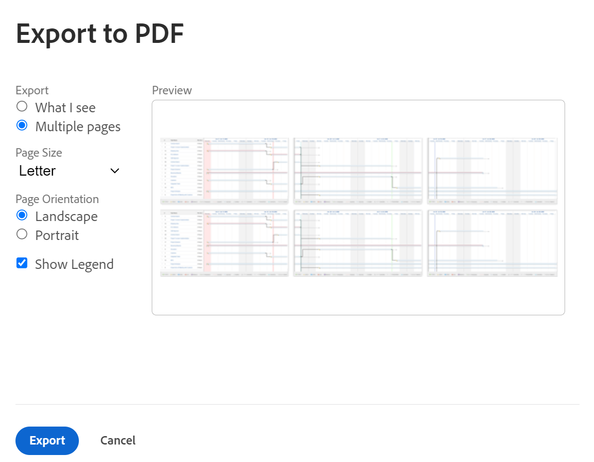
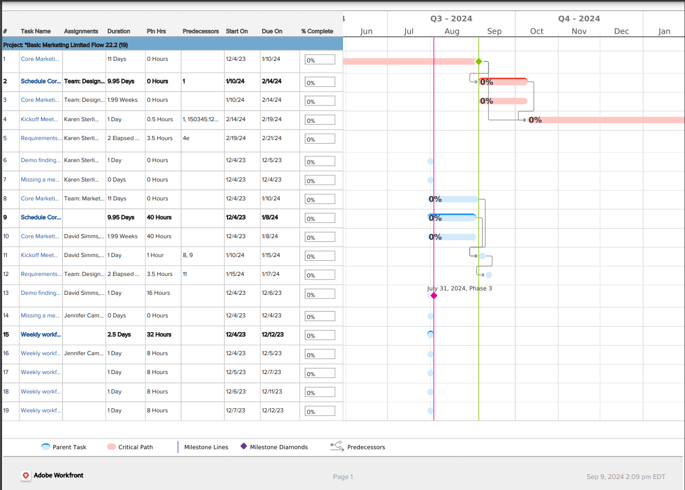

# Export the [!UICONTROL Gantt Chart] to PDF

You can export the [!UICONTROL Gantt chart] to a PDF.

After exporting the [!UICONTROL Gantt chart] to PDF, you can print or attach it to an email, to share it with other users. 

## Access requirements

You must have the following to follow the steps in this article:

<table style="table-layout:auto"> 
 <col> 
 <col> 
 <tbody> 
  <tr> 
   <td role="rowheader">[!UICONTROL Adobe Workfront] plan*</td> 
   <td> 
Any 
 </td> 
  </tr> 
  <tr> 
   <td role="rowheader">[!UICONTROL Adobe Workfront] license*</td> 
   <td> 
[!UICONTROL Review] or higher
 </td> 
  </tr> 
  <tr> 
   <td role="rowheader">Access level configurations*</td> 
   <td> 
[!UICONTROL View] or higher access to Projects and Tasks
 
Note: If you still don't have access, ask your [!DNL Workfront] administrator if they set additional restrictions in your access level. For information on how a [!DNL Workfront] administrator can modify your access level, see <a href="../../../administration-and-setup/add-users/configure-and-grant-access/create-modify-access-levels.md" class="MCXref xref">Create or modify custom access levels</a>.
 </td> 
  </tr> 
  <tr> 
   <td role="rowheader">Object permissions</td> 
   <td> 
[!UICONTROL View] or higher access to the project
 
For information on requesting additional access, see <a href="../../../workfront-basics/grant-and-request-access-to-objects/request-access.md" class="MCXref xref">Request access to objects </a>.
 </td> 
  </tr> 
 </tbody> 
</table>

&#42;To find out what plan, license type, or access you have, contact your [!DNL Workfront] administrator.

## Export the [!UICONTROL Gantt chart]

1. Access the [!UICONTROL Gantt chart] that you want to export to PDF, as described in [Get started with the [!UICONTROL Gantt Chart]](../../../manage-work/gantt-chart/use-the-gantt-chart/get-started-with-gantt.md).
1. Ensure that you have configured the [!UICONTROL Gantt chart] to display the appropriate information before you export it.

   >[!NOTE]
   >
   >If you export the [!UICONTROL Gantt chart] from a list of projects, the PDF file contains just the projects in the list, not the tasks on each project. If you want to export a list of tasks, you can do so from the project they are associated with, or by building a task report and displaying the results of the report in the [!UICONTROL Gantt View]. 

   You can configure the following information:

   * Filters, Views, and Groupings as desired in the list of tasks. Any Filters and Groupings that are selected in the list view are maintained when viewing the [!UICONTROL Gantt chart]. Views are reflected on the exported [!UICONTROL Gantt chart] only within the list that is displayed next to the [!UICONTROL Gantt chart] on the first page. Views are not displayed on the [!UICONTROL Gantt chart] itself.

      >[!TIP]
      >
      >To allow more room for the [!UICONTROL Gantt chart] itself, apply a view that contains as few columns as possible.

   * Configuration options on the [!UICONTROL Gantt chart]. For example, you can enable milestones, dates, [!UICONTROL baselines], or [!UICONTROL percent complete] to appear on the [!UICONTROL Gantt chart].

      For more information, see   [Configure how information displays on the [!UICONTROL Gantt Chart]](../../../manage-work/gantt-chart/use-the-gantt-chart/configure-info-on-gantt-chart.md).

      >[!NOTE]
      >
      > Assignments are not displayed on the [!UICONTROL Gantt chart] when the [!UICONTROL Gantt chart] is exported to PDF. When the [!UICONTROL Gantt chart] is exported to PDF, assignments are displayed only in the list view.

   * The time period that is displayed on the [!UICONTROL Gantt chart].\

      For more information, see [Viewing Information in the [!UICONTROL Gantt Chart]](../../../manage-work/gantt-chart/use-the-gantt-chart/view-info-in-gantt.md).

      The way the time period is displayed in the export file depends on whether you select **[!UICONTROL What I see]** or **[!UICONTROL Multiple pages]** in a later step.

1. (Optional) To include only certain tasks in the exported PDF, select the tasks that you want to include.

   If you do not select any tasks, all tasks are included in the exported PDF.

   For example, if you are viewing the [!UICONTROL Gantt chart] for a project that contains 50 tasks, but you want to display only 10 tasks on the exported [!UICONTROL Gantt chart], select the 10 tasks that you want to display.

1. Click the printer icon.\
   The **[!UICONTROL Export to PDF]** dialog box is displayed.\
   

1. Select whether you want to export only what you see or the entire [!UICONTROL Gantt chart]:

   * **[!UICONTROL What I see]:** Exports all tasks (including any subtasks) that are displayed on the screen prior to exporting up to 500 items. (This is not what is displayed in the **[!UICONTROL Preview]** section; the [!UICONTROL Preview] section contains only sample data.)

      Subtasks are included in the exported PDF even if the parent task is collapsed and the subtasks are not visible. To include only parent tasks, select the parent tasks you want to include and leave any subtasks unselected.

      You can use the **[!UICONTROL Zoom To]** drop-down menu or the slider tool to display only a portion of the [!UICONTROL Gantt chart], as described in [Viewing Information in the [!UICONTROL Gantt Chart]](../../../manage-work/gantt-chart/use-the-gantt-chart/view-info-in-gantt.md) .

   * **[!UICONTROL Multiple pages]:** Exports the entire [!UICONTROL Gantt chart], even that which is not visible on the current screen up to 500 items.\

      You can use the **[!UICONTROL Zoom To]** drop-down menu or the slider tool to determine how much information is displayed on each page, as described in [Configure how information displays on the [!UICONTROL Gantt Chart]](../../../manage-work/gantt-chart/use-the-gantt-chart/configure-info-on-gantt-chart.md). Select a more granular option to display more pages to export, or select a less granular option to display fewer pages to export.

      >[!NOTE]
      >
      >If you need to export a [!UICONTROL Gantt chart] that contains more than 500 items, apply a Filter to the list before viewing the [!UICONTROL Gantt chart] so that fewer than 500 items or 250 pages are displayed. For information about how to apply a filter, see  [Filters overview](../../../reports-and-dashboards/reports/reporting-elements/filters-overview.md).
      >
      >
      >You cannot export the entire Gantt chart in the following circumstances: 
      >
      >   
      >   
      >   * When it spans more than 250 pages
      >   * When it contains more than 500 items

1. If the PDF will be printed after it is exported to PDF, in the **[!UICONTROL Page Size]** drop-down menu, select the size of paper you want to print to.\
   You can select **[!UICONTROL Letter]**, **[!UICONTROL Legal]**, **[!UICONTROL Ledger]**, **[!UICONTROL A1]**, **[!UICONTROL A2]**, **[!UICONTROL A3]** (available only for some languages), or **[!UICONTROL A4]**.
1. In the **[!UICONTROL Page Orientation]** section, select whether you want the PDF to be exported in landscape or portrait orientation.
1. Select **[!UICONTROL Show Legend]** if you want to include the Legend in your exported PDF. 
1. Click **[!UICONTROL Export]**.

   The pdf of the [!UICONTROL Gantt chart] is created and downloaded to your computer.

   Notice the legend at the bottom of the exported file. It explains only the options that you have enabled in your [!UICONTROL Gantt chart] and that are available in your task list.

   For example, milestones are displayed in the legend only if you have at least one task associated with a milestone.

    
