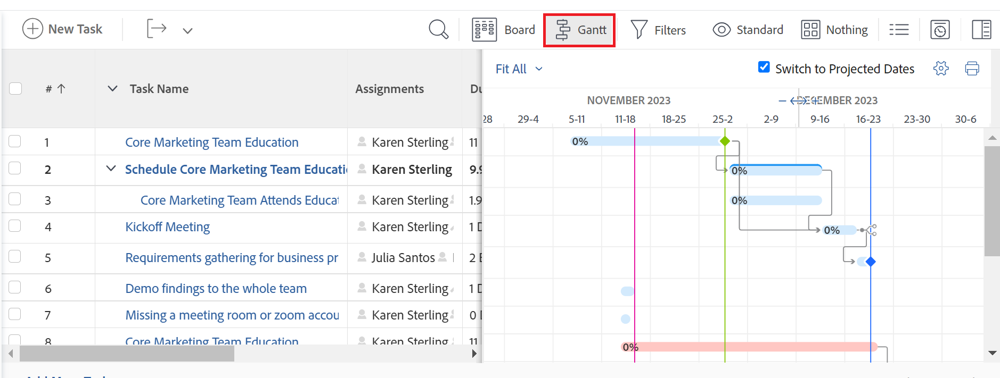
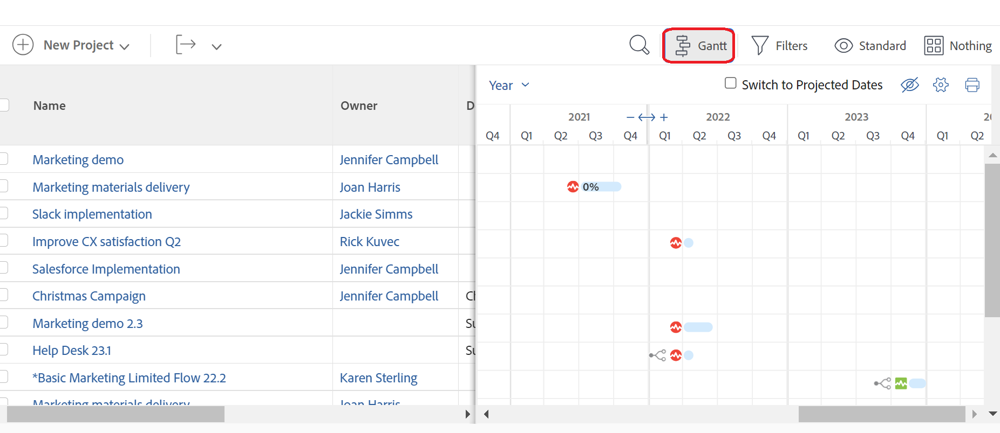

# Get started with the [!UICONTROL Gantt Chart]

The Gantt charts in Adobe Workfront provide a visual representation of the timeline of a list of tasks or projects. 

In [!DNL Adobe Workfront], there are two [!UICONTROL Gantt Charts] with similar functionality:

* **The task list [!UICONTROL Gantt Chart]**: displays information about tasks and their timeline at the project level. A similar [!UICONTROL Gantt Chart] displays information about template tasks at the template level.
* **The project list [!UICONTROL Gantt Chart]**: displays information about projects and their timeline. 

Although they look and feel similar, the functionality of each one is different.

## Considerations about the Gantt Chart

* You can edit information in the following [!UICONTROL Gantt Chart]:
   * A task list
* You cannot edit information in the following [!UICONTROL Gantt Charts]:
   * A template task list
   * A project list
* There is no [!UICONTROL Gantt Chart] option for a list of templates.
* You can configure what information displays on both the task list [!UICONTROL Gantt Chart] and the project list [!UICONTROL Gantt Chart].
* You cannot configure the colors or the fonts in which the [!UICONTROL Gantt chart] information is displayed.
* When information is updated from tasks, it is automatically reflected in both the task list [!UICONTROL Gantt Chart] and the project list [!UICONTROL Gantt Chart].
* When information is updated from the template tasks, it is automatically reflected in the template task list [!UICONTROL Gantt Chart]. 

## Access the [!UICONTROL Gantt Chart]

The [!UICONTROL Gantt] charts in [!DNL Workfront]  provide a visual representation of a list of tasks or projects. 

You can view the task list [!UICONTROL Gantt Chart] directly from the task list on a project or from a task report. 

You can view the project list [!UICONTROL Gantt Chart] in a project list or a project report.

* [Task list [!UICONTROL Gantt Chart]](#task-list-gantt-chart)
* [Project list [!UICONTROL Gantt Chart]](#project-list-gantt-chart)

### Task list [!UICONTROL Gantt Chart] {#task-list-gantt-chart}

<!--The task list [!UICONTROL Gantt Chart] is accessible in the following areas:

* In a Project

   * [!UICONTROL Tasks] section
   * [!UICONTROL Subtasks] section of a task

* In a [!UICONTROL Template]

* In a [!UICONTROL Task] report-->

To access the task list [!UICONTROL Gantt Chart] of a project or a template:

1. Go to any of the following areas: 

   * A project, then click [!UICONTROL **Tasks**] in the left panel.
   * A template, then click [!UICONTROL **Template Tasks**] in the left panel
   * A task or template task, then click [!UICONTROL **Subtasks**] in the left panel.
   * A task report

1. Click the [!UICONTROL **Gantt**] icon  at the top of the task list. 

   

   The task list [!UICONTROL Gantt Chart] opens to the right of the task list. 

1. To configure what information you want to display in the task [!UICONTROL Gantt] chart, click the [!UICONTROL **Settings**] icon, then enable any of the following options: 

   * [!UICONTROL Actual Dates]
   * [!UICONTROL Assignments]
   * [!UICONTROL Baseline]
   * [!UICONTROL Commit Date]
   * [!UICONTROL % Complete]
   * [!UICONTROL Critical Path]
   * [!UICONTROL Milestone Diamonds]
   * [!UICONTROL Milestone Lines]
   * [!UICONTROL Predecessors]
   * [!UICONTROL Progress Status]
   * [!UICONTROL Projected Dates]
   
1. Start editing the tasks as described in the following articles:

   * [Configure how information displays on the Gantt Chart](../use-the-gantt-chart/configure-info-on-gantt-chart.md)
   * [Update information in the task list Gantt Chart](../use-the-gantt-chart/update-info-task-list-gantt.md)

### Project list [!UICONTROL Gantt Chart] {#project-list-gantt-chart}

<!--The project list [!UICONTROL Gantt Chart] is accessible in the following areas:

* In the [!UICONTROL Projects] area
* In the [!UICONTROL Projects] section of a [!UICONTROL Portfolio]
* In the [!UICONTROL Projects] section of a [!UICONTROL Program]
* In a [!UICONTROL Project] report-->

To access the project list [!UICONTROL Gantt Chart]:

1. Go to any of the following areas: 

   * The [!UICONTROL **Projects**] area
   * The [!UICONTROL **Projects**] section of a [!UICONTROL Portfolio]
   * The [!UICONTROL **Projects**] section of a [!UICONTROL Program]
   * A [!UICONTROL **Project**] report

1. Click the [!UICONTROL **Gantt**] icon at the top of the project list.

   

   The project list [!UICONTROL Gantt Chart] opens. 

1. To configure what information you want to display in the project [!UICONTROL Gantt] chart, click the [!UICONTROL **Settings**] icon, then enable any of the following options: 

   * [!UICONTROL Actual Dates]
   * [!UICONTROL % Complete]
   * [!UICONTROL Milestone Diamonds]
   * [!UICONTROL Milestone Lines]
   * [!UICONTROL Predecessors]
   * [!UICONTROL Progress Status]
   * [!UICONTROL Projected Dates]
