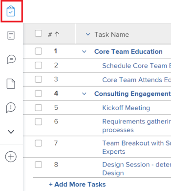
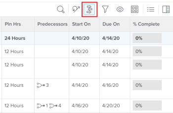
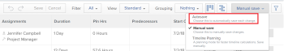

# Update information in the task list Gantt Chart

The task list Gantt Chart shows details about tasks that are on a project or template.

In a template, the task list Gantt Chart reflects updates made in the template's task list at the task level. This Gantt chart is not editable.

In a project, you can update task information directly in the task list Gantt Chart.

You can perform the following actions directly in the Task List Gantt Chart:

* Modify Task Duration
* Create or remove Predecessor relationships
* Change Task Start and End Dates
* Update Percent Complete
* Level Project Resources

## Access requirements

You must have the following to follow the steps in this article:

<table cellspacing="0"> 
 <col> 
 <col> 
 <tbody> 
  <tr> 
   <td role="rowheader">Adobe Workfront plan*</td> 
   <td> 
Any 
 </td> 
  </tr> 
  <tr> 
   <td role="rowheader">Adobe Workfront license*</td> 
   <td> 
Plan 
 </td> 
  </tr> 
  <tr> 
   <td role="rowheader">Access level configurations*</td> 
   <td> 
Edit access to Projects and Tasks
 
Note: If you still don't have access, ask your Workfront administrator if they set additional restrictions in your access level. For information on how a Workfront administrator can modify your access level, see <a href="../../../administration-and-setup/add-users/configure-and-grant-access/create-modify-access-levels.md" class="MCXref xref">Create or modify custom access levels</a>.
 </td> 
  </tr> 
  <tr> 
   <td role="rowheader">Object permissions</td> 
   <td> 
Manage access to the project and tasks 
 
For information on requesting additional access, see <a href="../../../workfront-basics/grant-and-request-access-to-objects/request-access.md" class="MCXref xref">Request access to objects in Adobe Workfront</a>.
 </td> 
  </tr> 
 </tbody> 
</table>

&#42;To find out what plan, license type, or access you have, contact your Workfront administrator.

## Modify Task Duration

1. Go to the project you want to modify.
1. Click **Tasks** in the left panel.

   

1. Click the **Gantt chart** icon.

   

   All changes are saved automatically when the **Autosave** option is enabled. It is enabled by default. 

1. (Optional) Click the **Plan mode** icon and select **Manual save Standard** or **Timeline Planning** to save your changes manually.

   

1. Hover over the timeline of a task and drag the time line indicator to a different date.
1. Drop the indicator when you have reached the correct new Completion Date for the task. 
1. (Optional and conditional) If you have selected to manually save your changes, click the **Undo** or**Redo** icons if you want to cancel or duplicate any of the changes.

   >[!TIP]
   >
   >You can use the following keyboard shortcuts to undo or redo changes on the Gantt chart:
   >
   >   
   >   
   >   * Mac: Use Command + Z to undo and Command + Shift + Z to redo.
   >   * Windows: Use Ctrl + Z to undo and Ctrl + Y to redo.
   >   
   >

1. Click **Save** in the upper-right corner of the Gantt chart.

## Create or remove Predecessor relationships

1. Go to the project you want to modify.
1. In the **Tasks** area, click the **Gantt chart** icon.

   The **Autosave** option is selected by default, in which case all changes are saved automatically.

   

1. (Optional) Click the **Plan mode** icon and select **Manual save Standard** or **Timeline Planning** to save your changes manually.

   

1. 
1. To create a predecessor relationship, click the start point of a task and drag it to the end point of task. 
1. To delete a predecessor relationship, c lick a predecessor line that connects two tasks to select it, then press **Delete** on your keyboard.  
   

1. (Optional and conditional) If you selected to save your changes manually, click the **Undo** or**Redo** icons if you want to cancel or duplicate any of the changes.

   >[!TIP]
   >
   >You can use the following keyboard shortcuts to undo or redo changes on the Gantt chart:
   >
   >   
   >   
   >   * Mac: Use Command + Z to undo and Command + Shift + Z to redo.
   >   * Windows: Use Ctrl + Z to undo and Ctrl + Y to redo.  
   >   
   >

1. Click **Save** .

## Change Task Start and End Dates

1. Go to the project you want to modify. 
1. In the **Tasks** area, click the **Gantt chart** icon.

   All changes are saved automatically when the **Autosave** option is enabled. It is enabled by default.

   

1. (Optional) Click the **Plan mode** icon and select **Manual save Standard** or **Timeline Planning** to save your changes manually.

   

1. Hover over the center of the task and locate the multi-directional arrow.
1. Click and drag the task to the desired date.

   

1. If you change the task date in a way that affects the task constraint, click **Accept** to acknowledge the task constraint change.

   >[!NOTE]
   >
   >If the task has one of the following constraints, the system updates the Task Constraint to Start No Earlier Than if the project is scheduled from the Start Date or Finish No Later Than if the project is scheduled from the Completion Date:
   >
   >   
   >   
   >   * As Soon As Possible
   >   * As Late As Possible
   >   * Earliest Available Time
   >   * Latest Available Time
   >   
   >   
   >In some cases, the predecessor relationships might prevent the tasks from starting earlier, and the task move is not allowed.

1. (Optional and conditional) If you have selected to save your changes manually, click the **Undo** or**Redo** icons if you want to cancel or duplicate any of the changes.

   >[!TIP]
   >
   >You can use the following keyboard shortcuts to undo or redo changes on the Gantt chart:
   >
   >   
   >   
   >   * Mac: Use Command + Z to undo and Command + Shift + Z to redo.
   >   * Windows: Use Ctrl + Z to undo and Ctrl + Y to redo.  
   >   
   >

1. Click **Save**.

## Update Percent Complete

1. Go to the project you want to modify.
1. In the **Tasks** area, click the **Gantt chart** icon.

   

   All changes are saved automatically when the **Autosave** option is enabled. It is enabled by default. 

1. (Optional) Click the **Plan mode** icon and select **Manual save Standard** or **Timeline Planning** to save your changes manually.
1. Double-click the percent number inside of the task and enter the number.

   >[!IMPORTANT]
   >
   >You must have % Complete selected in the Options dialog in order to update percent complete. To do this, click the **Options** icon and select **% Complete**.
   >
   >
   >   >
   >

1. (Optional and conditional) If you selected to save your changes manually, click the **Undo** or**Redo** icons if you want to cancel or duplicate any of the changes.

   >[!TIP]
   >
   >You can use the following keyboard shortcuts to undo or redo changes on the Gantt chart:
   >
   >   
   >   
   >   * Mac: Use Command + Z to undo and Command + Shift + Z to redo.
   >   * Windows: Use Ctrl + Z to undo and Ctrl + Y to redo.  
   >   
   >

1. Click **Save** in the upper-right corner of the Gantt chart.

## Level Project Resources

You can use the Task List Gantt Chart to level your resources. For information on about leveling resources in the Gantt chart, see [Level Resources in the Gantt Chart](../../../manage-work/gantt-chart/use-the-gantt-chart/level-resources-in-gantt.md).

1. Go to the project you want to level.
1. In the **Tasks** area, click the **Gantt chart** icon.

   All changes are saved automatically when the **Autosave** option is enabled. It is enabled by default. 

1. 
   (Optional) Click the **Plan mode** icon and select **Manual save Standard** or **Timeline Planning** to save your changes manually.

   

1. Click the **Level Resources** drop-down menu.

   

1. Select one of following options:

   * **Level Now**: Applies resource leveling to the selected task.
   * **Clear Leveling**: Removes all resource leveling from the selected task.

1. (Optional and conditional) If you have disabled the Autosave option, click the **Undo** or**Redo** icons if you want to cancel or duplicate any of the changes.

   >[!TIP]
   >
   >You can use the following keyboard shortcuts to undo or redo changes on the Gantt chart:
   >
   >   
   >   
   >   * Mac: Use Command + Z to undo and Command + Shift + Z to redo.
   >   * Windows: Use Ctrl + Z to undo and Ctrl + Y to redo.
   >   
   >

1. Click **Save** in the upper-right corner of the Gantt chart.

<!--
<h2 data-mc-conditions="QuicksilverOrClassic.Draft mode">Editing the Task List in Gantt Chart Edit Mode</h2>
-->

<!--

You can keep the edit mode enabled mode in the Gantt chart to preview changes made in the task list before saving. This allows you to try out what-if scenarios to understand how changes can affect your project timeline. If the Gantt chart is not in edit mode, inline edits are permanent. 

-->

<!--
<note type="note">
When making changes affecting the timeline (such as dates and durations), the system performs timeline calculations and provides a new state of the project as if the change is actually committed. However, the changes are not permanently applied to the project until they are saved. Undoing the action should change the project timeline back to the previous state.
</note>
-->

<!--

In the Preview environment, you can edit the task list with or without the Gantt Chart enabled. 

-->

<!--

If you want to reverse the changes you make to the task list in the Preview environment, you must disable the <strong>Autosave</strong> icon.

-->

<!--

For information about editing the task list in the Preview environment, see <a href="../../../manage-work/tasks/manage-tasks/edit-tasks.md">Editing tasks</a>.

-->

<!--

You can perform the following actions directly in the task list while the Gantt chart is in edit mode in the Production environment:

-->

  <!--
  <li data-mc-conditions="QuicksilverOrClassic.Draft mode"><a href="#add-or-remove-tasks" class="MCXref xref">Add or Remove Tasks</a> </li>
  -->

  <!--
  <li data-mc-conditions="QuicksilverOrClassic.Draft mode"><a href="#edit-task-fields" class="MCXref xref">Edit Task Fields</a> </li>
  -->

<!--
<h3 data-mc-conditions="QuicksilverOrClassic.Draft mode" id="add-or-remove-tasks">Add or Remove Tasks</h3>
-->

<!--

To preview how adding or removing tasks impacts the project timeline:

-->

   <!--
   <li value="1" data-mc-conditions="QuicksilverOrClassic.Draft mode"> Go to a project for which you want to edit tasks. </li>
   -->

1. 

   <!--
   
 On the <strong>Tasks</strong> tab, click the <strong>Gantt chart</strong> icon in the upper-right corner. 

   -->

   <!--
   
All changes are saved automatically when the <strong>Autosave</strong> option is enabled. It is enabled by default. 

   -->

1. 

   <!--
   
In the <strong>Tasks</strong> area, click the Gantt chart icon in the upper-right corner.

   -->

   <!--
   
All changes are saved automatically when the <strong>Autosave</strong> option is enabled. It is enabled by default. 

   -->

1. 

   <!--
   
(Optional) Disable the <strong>Autosave</strong> toggle.

   -->

   <!--
   
  

   -->

   <!--
   <li value="5" data-mc-conditions="QuicksilverOrClassic.Draft mode"> To add tasks to the task list:
   <ul>
   <!--
   <li data-mc-conditions="QuicksilverOrClassic.Draft mode"> If you have no tasks in the task list, click <strong>Start Adding Tasks</strong>. </li>
   --><!--
   <li data-mc-conditions="QuicksilverOrClassic.Draft mode"> If you need to add tasks , click <strong>Add More Tasks</strong>. </li>
   -->
   </ul></li>
   -->

   <!--
   <li value="6" data-mc-conditions="QuicksilverOrClassic.Draft mode"> To remove a task, select the task, then click <strong>Delete</strong>. </li>
   -->

1. 

   <!--
   
(Optional and conditional) If you have disabled the Autosave option, click the <strong>Undo</strong> or<strong>Redo</strong> icons if you want to cancel or duplicate any of the changes. 

   -->

   <!--
   
    

   -->

   >[!TIP]
   >
   >
   >
   ><!--   >
   >
You can use the following keyboard shortcuts to undo or redo changes on the Gantt chart:
   >
   >-->   >
   >
   >
   >   
   >   
   >   
   >   
   >     <!--   >   
   >     <li data-mc-conditions="QuicksilverOrClassic.Draft mode">Mac: Use Command + Z to undo and Command + Shift + Z to redo.</li>   >   
   >     -->   >   
   >   
   >   
   >   
   >     <!--   >   
   >     <li data-mc-conditions="QuicksilverOrClassic.Draft mode">Windows: Use Ctrl + Z to undo and Ctrl + Y to redo. </li>   >   
   >     -->   >   
   >   
   >   
   >

   <!--
   <li value="8" data-mc-conditions="QuicksilverOrClassic.Draft mode">To commit the changes to the project, click <strong>Save</strong>. Or To discard the changes, click the <strong>Cancel</strong> icon. </li>
   -->

<!--
<h3 data-mc-conditions="QuicksilverOrClassic.Draft mode" id="edit-task-fields">Edit Task Fields</h3>
-->

<!--

To preview how editing task fields impacts the project:

-->

   <!--
   <li value="1" data-mc-conditions="QuicksilverOrClassic.Draft mode"> Go to a project for which you want to edit tasks. </li>
   -->

1. 

   <!--
   
 On the <strong>Tasks</strong> tab, click the <strong>Gantt chart</strong> icon in the upper-right corner. 

   -->

   <!--
   
In the <strong>Tasks</strong> tab, click the Gantt chart icon in the upper-right corner.

   -->

   <!--
   
All changes are saved automatically when the <strong>Autosave</strong> option is enabled. It is enabled by default. 

   -->

1.

   <!--
   
(Optional) Disable the <strong>Autosave</strong> toggle.

   -->

   <!--
   
  

   -->

1. 

   <!--
   
 You can update any inline editable fields that display in the task list. The fields displayed vary depending on what View you select for your task list. 

   -->

   >[!NOTE]
   >
   >
   >
   ><!--   >
   >
The ability to edit the Duration, Planned Hours, Planned Start Date, and Completion Date of the tasks depends on the Task Constraint and Duration Type. Not all Task Constraints and Duration Types allow for these fields to be edited.
   >
   >-->   >
   >
   >
   >
   ><!--   >
   >
For more information about Task Constraint, see <a href="../../../manage-work/tasks/task-constraints/task-constraint-overview.md" class="MCXref xref">Task Constraint overview</a>.
   >
   >-->   >
   >
   >
   >
   ><!--   >
   >
For more information about Task Duration Type, see <a href="../../../manage-work/tasks/taskdurtn/task-duration-and-duration-type.md" class="MCXref xref">Overview of Task Duration and Duration Type</a>. 
   >
   >-->   >
   >

1. 

   <!--
   
(Optional and conditional) If you have disabled the Autosave option, click the <strong>Undo</strong> or<strong>Redo</strong> icons if you want to cancel or duplicate any of the changes. 

   -->

   <!--
   
  

   -->

   >[!TIP]
   >
   >
   >
   ><!--   >
   >
You can use the following keyboard shortcuts to undo or redo changes on the Gantt chart:
   >
   >-->   >
   >
   >
   >   
   >   
   >   
   >   
   >     <!--   >   
   >     <li data-mc-conditions="QuicksilverOrClassic.Draft mode">Mac: Use Command + Z to undo and Command + Shift + Z to redo.</li>   >   
   >     -->   >   
   >   
   >   
   >   
   >     <!--   >   
   >     <li data-mc-conditions="QuicksilverOrClassic.Draft mode">Windows: Use Ctrl + Z to undo and Ctrl + Y to redo. </li>   >   
   >     -->   >   
   >   
   >   
   >

   <!--
   <li value="6" data-mc-conditions="QuicksilverOrClassic.Draft mode"> To officially commit the changes to the project, click <strong>Save</strong>. Or To discard the changes, click the <strong>Cancel</strong> icon.  </li>
   -->

