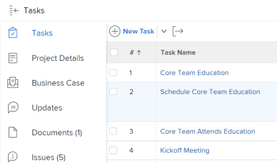
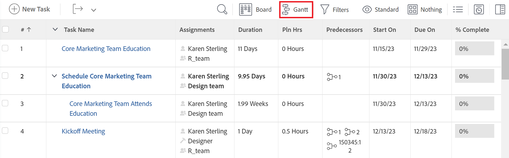
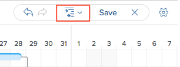

# Update information in the task list [!UICONTROL Gantt Chart]

The task list [!UICONTROL Gantt Chart] shows details about tasks that are on a project or template.

In a template, the task list [!UICONTROL Gantt Chart] reflects updates made in the template's task list at the task level. You cannot edit the [!UICONTROL Gantt chart] associated with a template.

In a project, you can update task information directly in the task list [!UICONTROL Gantt Chart].

This article describes the following actions that you can perform directly in the Task List [!UICONTROL Gantt Chart]:

* Modify Task Duration
* Create or remove Predecessor relationships
* Change Task Start and End Dates
* Update Percent Complete
* Level Project Resources

## Access requirements

You must have the following to follow the steps in this article:

<table style="table-layout:auto"> 
 <col> 
 <col> 
 <tbody> 
  <tr> 
   <td role="rowheader">[!DNL Adobe Workfront] plan*</td> 
   <td> 
Any 
 </td> 
  </tr> 
  <tr> 
   <td role="rowheader">[!DNL Adobe Workfront] license*</td> 
   <td> 
[!UICONTROL Plan] 
 </td> 
  </tr> 
  <tr> 
   <td role="rowheader">Access level configurations*</td> 
   <td> 
[!UICONTROL Edit] access to Projects and Tasks
 
Note: If you still don't have access, ask your [!DNL Workfront] administrator if they set additional restrictions in your access level. For information on how a [!DNL Workfront] administrator can modify your access level, see <a href="../../../administration-and-setup/add-users/configure-and-grant-access/create-modify-access-levels.md" class="MCXref xref">Create or modify custom access levels</a>.
 </td> 
  </tr> 
  <tr> 
   <td role="rowheader">Object permissions</td> 
   <td> 
[!UICONTROL Manage] access to the project and tasks 
 
For information on requesting additional access, see <a href="../../../workfront-basics/grant-and-request-access-to-objects/request-access.md" class="MCXref xref">Request access to objects </a>.
 </td> 
  </tr> 
 </tbody> 
</table>

&#42;To find out what plan, license type, or access you have, contact your [!DNL Workfront] administrator.

## Modify Task Duration

1. Go to the project you want to modify.
1. Click **[!UICONTROL Tasks]** in the left panel.

   

1. Click the **[!UICONTROL Gantt chart]** icon.

   

   All changes are saved automatically when the **[!UICONTROL Autosave]** option is enabled. It is enabled by default. 

1. (Optional) Click the **[!UICONTROL Plan mode]** icon and select **[!UICONTROL Manual save Standard]** or **[!UICONTROL Timeline Planning]** to save your changes manually.

   

1. Hover over the timeline of a task and drag the time line indicator to a different date.
1. Drop the indicator when you have reached the correct new Completion Date for the task. 
1. (Optional and conditional) If you have selected to manually save your changes, click the **[!UICONTROL Undo]** or&#x200B;**[!UICONTROL Redo]** icons if you want to cancel or duplicate any of the changes.

   >[!TIP]
   >
   >You can use the following keyboard shortcuts to undo or redo changes on the Gantt chart:
   >
   >   
   >   
   >   * [!DNL Mac]: Use [!UICONTROL Command + Z] to undo and [!UICONTROL Command + Shift + Z] to redo.
   >   * [!DNL Windows]: Use [!UICONTROL Ctrl + Z] to undo and [!UICONTROL Ctrl + Y] to redo.
   >   
   >

1. Click **[!UICONTROL Save]** in the upper-right corner of the [!UICONTROL Gantt chart].

## Create or remove predecessor relationships

1. Go to the project you want to modify.
1. In the **[!UICONTROL Tasks]** area, click the **[!UICONTROL Gantt chart]** icon.

   The **[!UICONTROL Autosave]** option is selected by default, in which case all changes are saved automatically.

   

1. (Optional) Click the **[!UICONTROL Plan mode]** icon and select **[!UICONTROL Manual save Standard]** or **[!UICONTROL Timeline Planning]** to save your changes manually.

   

1. To create a predecessor relationship, click the start point of a task and drag it to the end point of task. 
1. To delete a predecessor relationship, click a predecessor line that connects two tasks to select it, then press **[!UICONTROL Delete]** on your keyboard.  
   

1. (Optional and conditional) If you selected to save your changes manually, click the **[!UICONTROL Undo]** or&#x200B;**[!UICONTROL Redo]** icons if you want to cancel or duplicate any of the changes.

   >[!TIP]
   >
   >You can use the following keyboard shortcuts to undo or redo changes on the Gantt chart:
   >
   >   
   >   
   >   * [!DNL Mac]: Use [!UICONTROL Command + Z] to undo and [!UICONTROL Command + Shift + Z] to redo.
   >   * [!DNL Windows]: [!UICONTROL Use Ctrl + Z] to undo and [!UICONTROL Ctrl + Y] to redo.  
   >   
   >

1. Click **[!UICONTROL Save]** .

## Change Task Start and End Dates

1. Go to the project you want to modify. 
1. In the **[!UICONTROL Tasks]** area, click the **[!UICONTROL Gantt chart]** icon.

   All changes are saved automatically when the **[!UICONTROL Autosave]** option is enabled. It is enabled by default.

   

1. (Optional) Click the **[!UICONTROL Plan mode]** icon and select **[!UICONTROL Manual save Standard]** or **[!UICONTROL Timeline Planning]** to save your changes manually.

   

1. Hover over the center of the task and locate the multi-directional arrow.
1. Click and drag the task to the desired date.

   

1. If you change the task date in a way that affects the task constraint, click **[!UICONTROL Accept]** to acknowledge the task constraint change.

   >[!NOTE]
   >
   >If the task has one of the following constraints, the system updates the [!UICONTROL Task Constraint] to [!UICONTROL Start No Earlier] Than if the project is scheduled from the [!UICONTROL Start Date] or [!UICONTROL Finish No Later Than] if the project is scheduled from the [!UICONTROL Completion Date]:
   >
   >   
   >   
   >   * [!UICONTROL As Soon As Possible]
   >   * [!UICONTROL As Late As Possible]
   >   * [!UICONTROL Earliest Available Time]
   >   * [!UICONTROL Latest Available Time]
   >   
   >   
   >In some cases, the predecessor relationships might prevent the tasks from starting earlier, and the task move is not allowed.

1. (Optional and conditional) If you have selected to save your changes manually, click the **[!UICONTROL Undo]** or&#x200B;**[!UICONTROL Redo]** icons if you want to cancel or duplicate any of the changes.

   >[!TIP]
   >
   >You can use the following keyboard shortcuts to undo or redo changes on the [!UICONTROL Gantt chart]:
   >
   >   
   >   
   >   * [!DNL Mac]: Use [!UICONTROL Command + Z] to undo and [!UICONTROL Command + Shift + Z] to redo.
   >   * [!DNL Windows]: Use [!UICONTROL Ctrl + Z] to undo and [!UICONTROL Ctrl + Y] to redo.  
   >   
   >

1. Click **[!UICONTROL Save]**.

## Update Percent Complete

1. Go to the project you want to modify.
1. In the **[!UICONTROL Tasks]** area, click the **[!UICONTROL Gantt chart]** icon.

   

   All changes are saved automatically when the **[!UICONTROL Autosave]** option is enabled. It is enabled by default. 

1. (Optional) Click the **[!UICONTROL Plan mode]** icon and select **[!UICONTROL Manual save Standard]** or **[!UICONTROL Timeline Planning]** to save your changes manually.
1. Double-click the percent number inside of the task and enter the number.

   >[!IMPORTANT]
   >
   >You must have [!UICONTROL % Complete] selected in the [!UICONTROL Options] dialog in order to update percent complete. To do this, click the **[!UICONTROL Options]** icon and select **[!UICONTROL % Complete]**.
   >
   >
   >   >
   >

1. (Optional and conditional) If you selected to save your changes manually, click the **[!UICONTROL Undo]** or&#x200B;**[!UICONTROL Redo]** icons if you want to cancel or duplicate any of the changes.

   >[!TIP]
   >
   >You can use the following keyboard shortcuts to undo or redo changes on the [!UICONTROL Gantt chart]:
   >
   >   
   >   
   >   * [!DNL Mac]: Use [!UICONTROL Command + Z] to undo and [!UICONTROL Command + Shift + Z] to redo.
   >   * [!DNL Windows]: Use [!UICONTROL Ctrl + Z] to undo and [!UICONTROL Ctrl + Y] to redo.  
   >   
   >

1. Click **[!UICONTROL Save]** in the upper-right corner of the [!UICONTROL Gantt chart].

## Level project resources

You can use the Task List [!UICONTROL Gantt Chart] to level your resources.

For information on about leveling resources in the [!UICONTROL Gantt chart], see [Level Resources in the [!UICONTROL Gantt Chart]](../../../manage-work/gantt-chart/use-the-gantt-chart/level-resources-in-gantt.md).

<!--

(NOTE:&nbsp;this is drafted because I moved the whole content to the article linked above)

<ol>
<li value="1">Go to the project you want to level.</li>
<li value="2"> 
 In the <strong>Tasks</strong> area, click the <strong>Gantt chart</strong> icon.
 
All changes are saved automatically when the <strong>Autosave</strong> option is enabled. It is enabled by default. 
 </li>
<li value="3">

(Optional) Click the <strong>Plan mode</strong> icon and select <strong>Manual save Standard</strong> or <strong>Timeline Planning</strong> to save your changes manually.
 <note type="tip">
You cannot level resources in the Gantt chart when the Autosave option is enabled.
</note>

  

 </li>
<li value="4"> 
Click the <strong>Level Resources</strong> drop-down menu.
 
  
 </li>
<li value="5">Select one of following options:
<ul>
<li><strong>Level Now</strong>: Applies resource leveling to the selected task.</li>
<li>
<strong>Clear Leveling</strong>: Removes all resource leveling from the selected task.
</li>
</ul><note type="note">
Your resources might be overallocated if they are assigned to multiple tasks which occur during the same time frame.
</note></li>
<li value="6"> 
(Optional and conditional) If you have disabled the Autosave option, click the <strong>Undo</strong> or<strong>Redo</strong> icons if you want to cancel or duplicate any of the changes. 
 <note type="tip">

You can use the following keyboard shortcuts to undo or redo changes on the Gantt chart:

<ul>
<li>Mac: Use Command + Z to undo and Command + Shift + Z to redo.</li>
<li>Windows: Use Ctrl + Z to undo and Ctrl + Y to redo.</li>
</ul>
</note> </li>
<li value="7">Click <strong>Save</strong> in the upper-right corner of the Gantt chart.</li>
</ol>

-->

<!--
<h2 data-mc-conditions="QuicksilverOrClassic.Draft mode"> </h2>
-->
