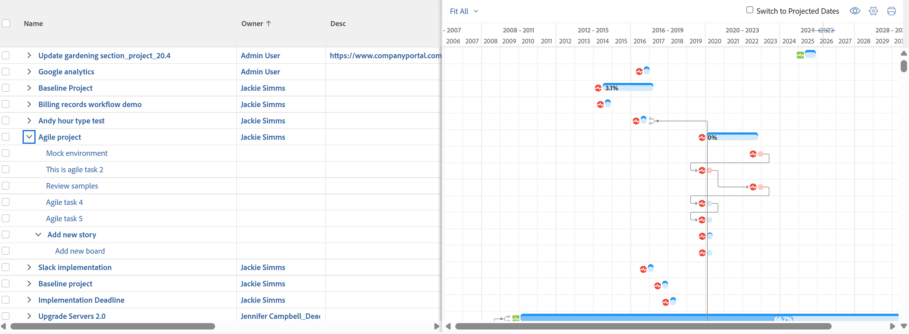
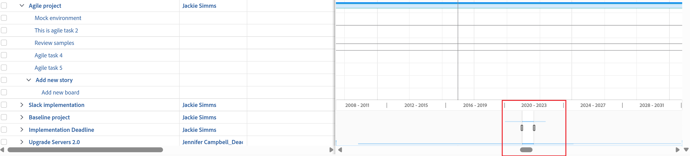

# View information in the  [!UICONTROL Gantt Chart]

The task list [!UICONTROL Gantt Chart] and project list [!UICONTROL Gantt Chart] display information about projects and tasks.

## Access requirements

You must have the following to follow the steps in this article:

<table style="table-layout:auto"> 
 <col> 
 <col> 
 <tbody> 
  <tr> 
   <td role="rowheader">[!DNL Adobe Workfront] plan*</td> 
   <td> 
Any 
 </td> 
  </tr> 
  <tr> 
   <td role="rowheader">[!DNL Adobe Workfront] licenses overview*</td> 
   <td> 
[!UICONTROL Review] or higher
 </td> 
  </tr> 
  <tr> 
   <td role="rowheader">Access level configurations*</td> 
   <td> 
[!UICONTROL View] or higher access to Projects and Tasks
 
<b>NOTE</b>

If you still don't have access, ask your [!DNL Workfront] administrator if they set additional restrictions in your access level. For information on how a [!DNL Workfront] administrator can modify your access level, see <a href="../../../administration-and-setup/add-users/configure-and-grant-access/create-modify-access-levels.md" class="MCXref xref">Create or modify custom access levels</a>.
 </td>
</tr> 
  <tr> 
   <td role="rowheader">Object permissions</td> 
   <td> 
[!UICONTROL View] or higher access to the project
 
For information on requesting additional access, see <a href="../../../workfront-basics/grant-and-request-access-to-objects/request-access.md" class="MCXref xref">Request access to objects </a>.
 </td> 
  </tr> 
 </tbody> 
</table>

&#42;To find out what plan, license type, or access you have, contact your [!DNL Workfront] administrator.

## Locate the  [!UICONTROL Gantt Chart]

You can locate both the task list Gantt chart and project list [!UICONTROL Gantt chart] from multiple areas within Workfront. For more information, see [Get started with the [!UICONTROL Gantt Chart]](../../../manage-work/gantt-chart/use-the-gantt-chart/get-started-with-gantt.md).

## View tasks on the [!UICONTROL Critical Path]

In the Project List [!UICONTROL Gantt Chart], tasks that are not on the [!UICONTROL Critical Path] display as light blue horizontal lines. Tasks that are on the [!UICONTROL Critical Path] of a project display as red horizontal lines.

For more information about tasks on the [!UICONTROL Critical Path], see [Overview of the project [!UICONTROL Critical Path]](../../../manage-work/tasks/manage-tasks/critical-path.md).

## View task information in the project list [!UICONTROL Gantt Chart]

You can view the task information for a project directly from the Project List. Tasks are listed under the name of each project.

>[!NOTE]
>
>You cannot edit tasks from the Project List [!UICONTROL Gantt Chart]. 

You can view the task information for a project directly from a list of projects in the following areas:

* In the [!UICONTROL Projects] area
* Within a Portfolio
* Within a Program

To view tasks in a project from a list of projects:

1. Go to one of the areas mentioned above.

   For example, from the [!UICONTROL Main Menu], click **[!UICONTROL Projects]**.

   A list of projects displays.

1. Click the **[!UICONTROL Gantt chart]** icon  in the upper-right corner of the screen.

   <!--
   
(NOTE: images conditioned for classic and nwe)  

   -->

1. Click the **[!UICONTROL Show Task List]** icon.

1. In the project list to the left, click the drop-down arrow next to the name of the project to display any tasks under that project.\
   This displays task information on the  [!UICONTROL Gantt Chart].\
   

1. (Optional) Click the **[!UICONTROL Print]** icon in the upper-right corner to export the [!UICONTROL Gantt Chart].

   >[!NOTE]
   >
   >The Project List [!UICONTROL Gantt Chart] exports only projects. Task information is not included.

## Change the time period for which information displays in the [!UICONTROL Gantt Chart]

You can adjust the time period shown on the [!UICONTROL Gantt Chart] to display information on a granular level, or you can quickly navigate to a day, week, month, quarter, or year view: 

* [Change the time period on a granular level](#change-the-time-period-on-a-granular-level)
* [View information by Day, Week, Month, Quarter, or Year](#view-information-by-day-week-month-quarter-or-year)

### Change the time period on a granular level {#change-the-time-period-on-a-granular-level}

1. Hover over the timeline of the  [!UICONTROL Gantt Chart], then drag the zoom indicator from left to right to expand or contract the timeline.\
   

### View information by Day, Week, Month, Quarter, or Year {#view-information-by-day-week-month-quarter-or-year}

1. In the  [!UICONTROL Gantt Chart], click the time frame drop-down menu.

   

1. Select a time frame from the following available options:

   * **[!UICONTROL Fit All]**: This option displays the time line of the entire project.
   * **[!UICONTROL All Projects]**: This option is available only in the Project List Gantt chart.
   * **[!UICONTROL Year]**
   * **[!UICONTROL Quarter]**
   * **[!UICONTROL Month]**
   * **[!UICONTROL Week]**
   * **[!UICONTROL Day]**

1. (Optional) Select a more granular time frame, such as [!UICONTROL Week] or [!UICONTROL Day], and click and drag the horizontal scroll bar at the bottom of the  [!UICONTROL Gantt Chart] to move left to right on the time line of the project.\
   A timeline snapshot of the [!UICONTROL Gantt] displays to show the entire project.

   >[!TIP]
   >
   >The timeline snapshot displays only after you click the horizontal scroll bar.

   

1. (Optional) Click anywhere inside the time line snapshot to navigate to a specific point in the life of the project.\
   Or\
   Drag the handles of the snapshot viewer to select a specific time line range to display it in the main [!UICONTROL Gantt]. 

## Use filters, views, and groupings

The [!UICONTROL Gantt Chart] is a visual representation of the information that is currently displayed in the task list. You can apply filters, views, and groupings to the objects listed in both [!UICONTROL Gantt Chart]s. 

>[!CAUTION]
>
>You cannot apply filters, views, and groupings when you select [!UICONTROL Manual] save [!UICONTROL Timeline Planning] to save changes to your task list. For information about saving changes to tasks in a list, see [Edit tasks in a list](../../../manage-work/tasks/manage-tasks/edit-tasks-in-a-list.md).

Filters and groupings that you apply to the list are reflected on both the Project List and Task List  [!UICONTROL Gantt Chart]s and are also included when the Gantt charts are exported:

* Filters\
   You can apply a Filter to the list in order to control the information that is displayed in the [!UICONTROL Gantt Chart].\
   For information about applying a Filter, see  [Filters overview](../../../reports-and-dashboards/reports/reporting-elements/filters-overview.md).

* Groupings\
   Groupings that you apply to the list are reflected on the [!UICONTROL Gantt Chart].\
   For information about applying a Grouping, see  [Groupings overview in Adobe Workfront](../../../reports-and-dashboards/reports/reporting-elements/groupings-overview.md).

Views are not reflected on the [!UICONTROL Gantt Chart]. However, when you export the [!UICONTROL Gantt Chart] (as described in  [Export the [!UICONTROL Gantt Chart] to PDF](../../../manage-work/gantt-chart/use-the-gantt-chart/export-gantt-chart-to-pdf.md)), the task list is exported in addition to the [!UICONTROL Gantt chart], with the current View applied to the list.

## Configure Display Options

You can choose what type of information displays in both [!UICONTROL Gantt charts]. For more information, see [Configure how information displays on the [!UICONTROL Gantt Chart]](../../../manage-work/gantt-chart/use-the-gantt-chart/configure-info-on-gantt-chart.md).
