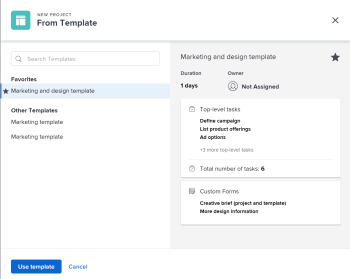

# Convert an issue to a project in Adobe Workfront

<!--

(NOTE: below, is no longer the case - drafted)

-->

<!--
<note type="note">
The ability to convert an issue to a project using a template as described in this article was temporarily removed from the Production environment on March 4 and it was reverted to the previous experience. Converting issues to a project using a template as described in this article is currently being re-released to Production in a phased roll-out that started on April 28, 2022. Some customers might not see this functionality in their Production environment until the roll-out is completed. The functionality described in this article is available to all customers in the Preview environment.
</note>
-->

If more work needs to be done to complete an issue after the issue is submitted, you can convert the issue to a project.

You can convert an issue to a new project or you can convert it to a project using a template. This article describes both ways for converting issues to projects.

For general information about converting issues, see [Overview of converting issues in Adobe Workfront](../../../manage-work/issues/convert-issues/convert-issues.md).

## Access requirements

You must have the following access to perform the steps in this article:

<table style="table-layout:auto"> 
 <col> 
 <col> 
 <tbody> 
  <tr> 
   <td role="rowheader">Adobe Workfront plan*</td> 
   <td> 
Any
 </td> 
  </tr> 
  <tr> 
   <td role="rowheader">Adobe Workfront license*</td> 
   <td> 
Plan 
 </td> 
  </tr> 
  <tr> 
   <td role="rowheader">Access level configurations*</td> 
   <td> 
Edit access to Issues, Tasks, and Projects
 
Edit access to Financial Data to update financial information for a projected converted from the issue
 
Note: If you still don't have access, ask your Workfront administrator if they set additional restrictions in your access level. For information on how a Workfront administrator can change your access level, see <a href="../../../administration-and-setup/add-users/configure-and-grant-access/create-modify-access-levels.md" class="MCXref xref">Create or modify custom access levels</a>.
 </td> 
  </tr> 
  <tr> 
   <td role="rowheader">Object permissions</td> 
   <td> 
View permissions to the issue
 
You obtain Manage permissions to the project after the issue is converted
 
For information on requesting additional access, see <a href="../../../workfront-basics/grant-and-request-access-to-objects/request-access.md" class="MCXref xref">Request access to objects </a>.
 </td> 
  </tr> 
 </tbody> 
</table>

&#42;To find out what plan, license type, or access you have, contact your Workfront administrator.

## Convert an issue to a project

You can convert an issue to a blank project or convert an issue to a project using a template.

1. Go to a project and click **Issues** in the left panel. 
1. In the list of issues that displays, do one of the following:

   * To convert an issue to a blank project, click the name of the issue, click the **More** menu to the right of the issue name, then click **Convert to a blank project**.

     <!--   
     
   
     
Or
   
     
(NOTE: drafted and in yellow - this is NOT possible yet in a list (in 22.1), but will be released later!) 
   
     
Select the issue in the list of issue, click the <strong>More</strong> menu  at the top of the list, then click <strong>Convert to a blank project</strong>. 
   
     
   
     <blockquote>  
You must manually add tasks to the project or attach a template to the project after you convert the issue. 
  
Continue with Step 3e below. <MadCap:conditionalText data-mc-conditions="QuicksilverOrClassic.Draft mode">    (is this accurate?)   </MadCap:conditionalText>
 </blockquote>    
     -->   
   
     >[!TIP]
     >   
     >* If the issue was created using a request queue, the new project inherits the request queue's Group. 
     >* If the issue was created by adding it to the Issues section of the project, the new project inherits the Group if the issue's project. 
     >

   * To convert an issue to a project using a template, do one of the following:

      * Click the name of an issue, then click the **More** menu  to the right of the issue name

        

        Or
      
      * Select the issue in the list of issues, in a report, or dashboard, click the **More** menu  at the top of the list, then click **Convert to project from Template** and start typing the name of a template in the **Search Template** box, then click the name of the template when it displays in the list. Continue with Step 3.       
      
        <!--      
        <MadCap:conditionalText data-mc-conditions="QuicksilverOrClassic.Draft mode">      
        (is this accurate?)      
        </MadCap:conditionalText>      
        -->

     >[!TIP]
     >
     >If you have added templates to your Favorites list, you can hover over the **Favorite templates** menu and click the template you want to use.

     The New Project from Template box displays

     

     >[!TIP]
     >
     >If the issue is associated with an approval process or it is already associated with a resolving object, Workfront displays a warning at the top of the Convert to Project box to notify you that the approval will be removed or the resolving object will be overwritten during the conversion. For more information, see [Overview of converting issues in Adobe Workfront](../../../manage-work/issues/convert-issues/convert-issues.md).

1. (Conditional) If you selected to convert the issue to a project using a template, continue with the following steps:

   1. Review template details on the right.

      The template details include the following:

      * Template duration
      * Template owner
      * The number of top-level tasks which includes the names of the top three tasks
      * The number of all tasks in the template
      * The names of the template custom forms

   1. (Optional) Hover over the name of a template and click the Favorites icon  to mark it as a favorite for future use.

      >[!TIP]
      >
      >You can have up to 40 Workfront items marked as favorites. This includes templates and other items.

   1. Click **Use template** to select a template.

      The Convert to Project box opens.

      

   1. If a field is already populated in the template, the field is pre-populated in the **Convert to project** box. You can edit the pre-populated values to better match your project. For more information, see [Edit projects](../../../manage-work/projects/manage-projects/edit-projects.md).

      >[!TIP]
      >
      >To update fields in the Finance section in the Convert to Project box you must have Edit access to Financial Data in your access level. If you have View access to Financial Data in your access level all financial information from the template transfers to the new project and you cannot edit it while you convert the issue. For information, see [Grant access to financial data](../../../administration-and-setup/add-users/configure-and-grant-access/grant-access-financial.md) and [Sharing a template](../../../workfront-basics/grant-and-request-access-to-objects/share-a-template.md).

   1. (Optional and conditional) Click **Options**, then select from the options that are available:

      * **Keep the original issue and tie its resolution to the this project**

        When deselected, the original issue is deleted.

        >[!NOTE]
        >
        >Users without access or permissions to delete issues will not be able to delete the issue as they are converting it, regardless of the status of this setting. For information about access and permissions to issues, see:
        >
        >* [Grant access to issues](../../../administration-and-setup/add-users/configure-and-grant-access/grant-access-issues.md) 
        >* [Share an issue](../../../workfront-basics/grant-and-request-access-to-objects/share-an-issue.md) 

      * **Allow `<User Name>` to have access to this project**

        If unselected, the issue's Primary Contact has no access to the new task.

        >[!NOTE]
        >
        >The options that are available here depend on how the Workfront administrator has configured them for everyone in the system or for your group. For more information, see [Configure system-wide task and issue preferences](../../../administration-and-setup/set-up-workfront/configure-system-defaults/set-task-issue-preferences.md).
        >
        >
        >Or, if the top-level groups in your organization configured them separately, the options available here depend on which group you selected for the new project in step 6. For more information, see [Configure task and issue preferences for a group](../../../administration-and-setup/manage-groups/create-and-manage-groups/configure-task-issue-preferences-group.md).

   1. Click **Custom Forms** and do any of the following:

      * Review the custom forms attached to the template. They will transfer to the new project.
      * Ensure all required fields have valid information. 
      * Rearrange the custom forms by dragging them  where you want them. 
      * Click the **x icon** to the right of any form that you do not want to transfer to the project. 
      * If necessary, transfer custom form information from the issue to the project.

        >[!TIP]
        >
        >If a multi-object custom form attached to the issue is configured for use with both issues and projects, all information saved in the form is retained when you make the conversion.
        >
        >If you are using a template for the conversion and a custom form attached to the template contains a custom field also found in a custom form attached to the issue, the field value from the issue is used for the new project. However, if the custom field is blank on the issue, the value from the template is used.

   1. Click **Convert to project**.

      >[!TIP]
      >
      >If you decided to delete the original issue, the issue is now a project.   
      >Or  
      >If you decided to keep the original issue, the issue is now linked to the new project and it will complete when the project completes. 
      >
      >Some issue fields transfer to the project. Most fields defined in the template automatically transfer to the newly created project if you didn't change them in previous steps. For information, see [Overview of converting issues in Adobe Workfront](../../../manage-work/issues/convert-issues/convert-issues.md).

1. (Optional) Set any further project details ​(project owner, project dates) and tasks as necessary.
1. Click **Convert to project**.

   The issue is now converted to a project. 

1. Click **Go to project** inside the Success notification in the upper-right corner of the page. This opens the project page.

