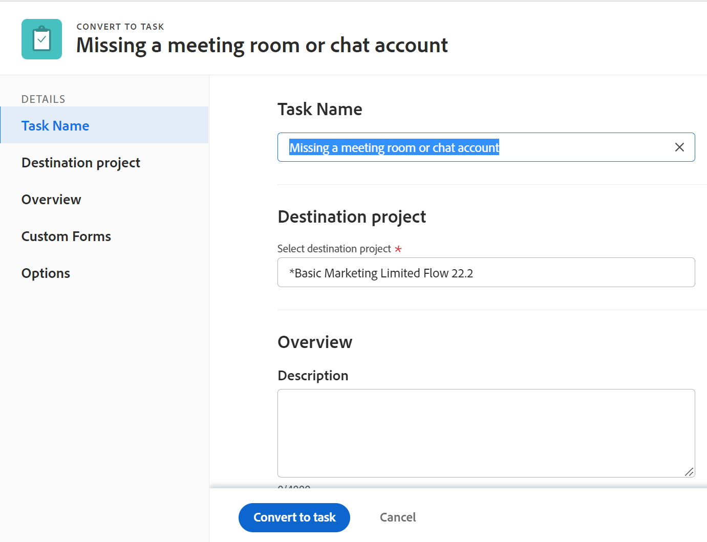

# Convert an issue to a task in&nbsp;Adobe Workfront

If more work must be done to complete an issue after the issue is submitted, you can convert the issue to a task.

For general information about converting issues, see [Overview of converting issues in Adobe Workfront](../../../manage-work/issues/convert-issues/convert-issues.md).

## Access requirements

You must have the following access to perform the steps in this article:

<table style="table-layout:auto"> 
 <col> 
 <col> 
 <tbody> 
  <tr> 
   <td role="rowheader">Adobe Workfront plan*</td> 
   <td> 
Any
 </td> 
  </tr> 
  <tr> 
   <td role="rowheader">Adobe Workfront license*</td> 
   <td> 
Work or higher
 </td> 
  </tr> 
  <tr> 
   <td role="rowheader">Access level configurations*</td> 
   <td> 
Edit access to Issues, Tasks, and Projects
 
Note: If you still don't have access, ask your Workfront administrator if they set additional restrictions in your access level. For information on how a Workfront administrator can change your access level, see <a href="../../../administration-and-setup/add-users/configure-and-grant-access/create-modify-access-levels.md" class="MCXref xref">Create or modify custom access levels</a>.
 </td> 
  </tr> 
  <tr> 
   <td role="rowheader">Object permissions</td> 
   <td> 
View permissions to the issue
 
Contribute permissions to the project
 
You obtain&nbsp;Manage permissions to the task after the issue is converted
 
For information on requesting additional access, see <a href="../../../workfront-basics/grant-and-request-access-to-objects/request-access.md" class="MCXref xref">Request access to objects </a>.
 </td> 
  </tr> 
 </tbody> 
</table>

*To find out what plan, license type, or access you have, contact your Workfront administrator.

## Convert an issue to a task

1. Go to a project and click [!UICONTROL **Issues** ] in the left panel.  
1. Click the issue you want to convert to go to the issue's landing page. 
1. Click the [!UICONTROL **More**] menu on the issue, then [!UICONTROL **Convert to Task**].

   

   >[!TIP]
   >
   >If the issue is associated with an approval process or it is already associated with a resolving object, Workfront displays a warning at the top of the [!UICONTROL Convert to Project] box to notify you that the approval is removed or the resolving object is overwritten during the conversion. For more information, see [Overview of converting issues in Adobe Workfront](../../../manage-work/issues/convert-issues/convert-issues.md).

1. Update the task name in the [!UICONTROL Task Name] section. By default, the name of the task will be the same name as that of the original issue.

   

1. Click [!UICONTROL **Destination Project**], then start typing the name of the project where you want to place the new task in the [!UICONTROL **Destination Project**] field and select it when it displays in the list. The issue's project is selected by default.

1. Click [!UICONTROL **Overview**], then type a [!UICONTROL **Description**] for the task. 

   >[!TIP]
   >
   >   A system or group administrator might change the order of the sections in the left panel of the conversion box by modifying your layout template.

1. (Optional and conditional) Click [!UICONTROL **Options**], select any of the options below.

   The Workfront administrator or group administrator must enable these preferences before they are visible during the conversion of issues:

   * [!UICONTROL **Keep the original issue and tie its resolution to this task**]

     If unselected, the original issue is deleted.

     >[!NOTE]
     >
     >Users without access or permissions to delete issues will not be able to delete the issue as they are converting it, regardless of the status of this setting. For information about access and permissions to issues, see:
     >   
     >   * [Grant access to issues](../../../administration-and-setup/add-users/configure-and-grant-access/grant-access-issues.md) 
     >   * [Share an issue](../../../workfront-basics/grant-and-request-access-to-objects/share-an-issue.md) 
     >   
     >

   * [!UICONTROL **Allow (User Name) to have access to this task**]

     If unselected, the issue's Primary Contact has no access to the new task.
   
   * [!UICONTROL **Keep the planned completion date of the issue**]

     If unselected, the [!UICONTROL Planned Completion Date] of the new task is calculated from the [!UICONTROL Planned Start Date] of the task. The [!UICONTROL Planned Start Date] of the new task is set according to the system preferences for new tasks.

     >[!NOTE]
     >
     >
     >The options that display here depend on how the Workfront administrator configured them for everyone in the system. For more information, see [Configure system-wide task and issue preferences](../../../administration-and-setup/set-up-workfront/configure-system-defaults/set-task-issue-preferences.md).
     >
     >Or, if the top-level groups in your organization configured them separately, the options that display here depend on which group is associated with the project you selected in step 6. For more information, see [Configure task and issue preferences for a group](../../../administration-and-setup/manage-groups/create-and-manage-groups/configure-task-issue-preferences-group.md).

1. (Optional) Click [!UICONTROL **Custom Forms**] and attach a custom form for the new task.

      >[!TIP]
      >
      >* If a multi-object custom form attached to the issue is configured for use with both issues and tasks, all information saved in the form is retained when you make the conversion if the fields exist both on the issue as well as the task's custom forms.
      >* If a multi-object custom form with a calculated field is attached to the issue as well as to the task, the issue and the task must be compatible with all fields referenced in the form's calculated custom fields. If there is an incompatibility, a message alerts you to make adjustments. For more information, see [Add calculated fields to a form](/help/quicksilver/administration-and-setup/customize-workfront/create-manage-custom-forms/form-designer/design-a-form/add-a-calculated-field.md). 
      >* If the destination project has any default forms defined in the Task Default Custom Forms field when editing the project, those task forms are also added to the new task. Any custom fields that are common between the original issue and the fields on the default task forms are pre-populated with information from the issue fields.
       

1. Click [!UICONTROL **Convert to task**]. 

   The issue is now a task on the designated project, if you decided to delete the original issue.

   Or

   The issue is now linked to the new task on the project you chose, and it will complete once the task completes, if you decided to keep the original issue.

   Some issue fields transfer to the task. For information, see the [View original issue information on projects and tasks](#view-original-issue-information-on-projects-and-tasks) section in this article.

1. (Optional) Continue editing the task as necessary.

## View original issue information on projects and tasks {#view-original-issue-information-on-projects-and-tasks}

You can view the original issue information in project and task lists and reports or in the Project Details area. For information about building reports, see [Create a custom report](../../../reports-and-dashboards/reports/creating-and-managing-reports/create-custom-report.md).

The following table illustrates which issue fields are visible from the converted projects and tasks. 

| Issue fields |Project or task field |Project list or report |Project Details area |Task list or report |Task Details area |
|---|---|---|---|---|---|
| [!UICONTROL Issue Name] |[!UICONTROL Converted Issue Name] |✔ |✔ |✔ |✔ |
| [!UICONTROL Primary Contact] | [!UICONTROL Converted Issue Originator Name] |✔ | ✔  |✔ |
| [!UICONTROL Entry Date] |[!UICONTROL Converted Issue Entry Date] |✔ ||✔ |

>[!CAUTION]
>
>If the [!UICONTROL Primary Contact] of an issue changes or if the issue becomes unlinked from the project or task after the issue has been converted, the [!UICONTROL Converted Issue Originator Name ]does not update and it displays the original [!UICONTROL Primary Contact] of the issue at the time the issue was converted.
