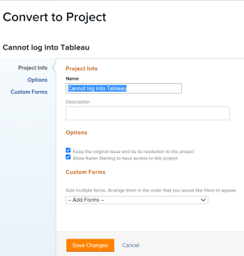
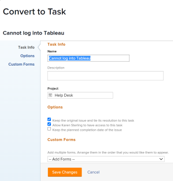

# Overview of converting issues in Adobe Workfront

If more work needs to be done to complete an issue after the issue is submitted, you can convert the issue to a project or to a task.

For information about converting issues to tasks, see [Convert an issue to a task in Adobe Workfront](../../../manage-work/issues/convert-issues/convert-issue-to-task.md).

For information about converting issues to projects, see [Convert an issue to a project in Adobe Workfront](../../../manage-work/issues/convert-issues/convert-issue-to-project.md).

## Considerations when converting issues

* Your Workfront administrator or group administrator has already set the preferences for what happens to an issue, its resolution, and the its Primary&nbsp;Contact's access when it is converted to a project or a task, as outlined in [Configure system-wide task and issue preferences](../../../administration-and-setup/set-up-workfront/configure-system-defaults/set-task-issue-preferences.md).
* Workfront removes any approvals that are associated with issues during conversion.
* Workfront overwrites the Resolving Object of the issue when you convert it to a task or an project. The new task or issue becomes the new Resolving Object of the issue after conversion. 
* Consider the following:

   * During conversion, you might be asked whether you want to keep the issue and its resolution tied to the project or task you are creating.
   * If you keep the issue, the status and percent complete of the project or task automatically update the status and the percent complete of the issue when any changes occur on the project, task, or the issue or when the Workfront recalculates the timeline.

* When converting an issue to a task or a project, the issue is removed from the Home area of the user assigned to the issue.

* When converting an issue, the permissions to the original issues are not transferred to the converted object (task or project).

* When converting an issue to a project using a template, most information from the template transfers to the new project. However, some information from the issue can also transfer to the new project. For more information, see the [Overview of project fields when converting an issue to a project using a template](#overview-of-project-fields-when-converting-an-issue-to-a-project-using-a-template) section in this article. 
* While converting an issue, not all documents or their information are moved to the new object that the issue is converted to. The following items are included when you convert an issue that has documents or document links attached:

   * Document
   * Document links to third-party services, such as Google Drive or SharePoint.
   * Versions
   * Proofs are included only when the option **Keep the original issue and tie its resolution to this task** is unselected.
   * Document approvals are not included when you convert an issue that has documents and document links attached.

* If you decided to keep the issue in the conversion and it has documents attached, the document and its versions are copied to the project or the task. The proofs and the document approvals are not copied to the project or the task.  
* If you decided to not keep the issue in the conversion, and it has documents attached, the document, its versions, and the proofs transfer to the project or the task. The document approvals will not transfer to the project or the task.  
* If you have documents and folders linked to the original issue from third party services, like Google Drive, regardless of whether you are keeping the issue or not during the conversion, those links will be copied to the new object.
* Issue comments are also copied to the task or project converted from the issue, but tagged users will not transfer.
* If you want to transfer custom form information from the issue to the project or task you are converting it to, ensure you have a project or task custom form that include the same fields you want to transfer from the issue. For more information, see [Transfer custom form data when converting an object](../../../administration-and-setup/customize-workfront/create-manage-custom-forms/transfer-custom-form-data-larger-item.md).

## Overview of project fields when converting an issue to a project using a template {#overview-of-project-fields-when-converting-an-issue-to-a-project-using-a-template}

When converting an issue to a project, you can either convert it to a blank project or use a template.

For information, see [Convert an issue to a project in Adobe Workfront](../../../manage-work/issues/convert-issues/convert-issue-to-project.md).

When using a template, some fields that are populated on the template transfer to the project created from the converted issue. Other fields transfer to the project from the converted issue.

The following table lists project information and whether it transfers from the template or from the issue: 

<table style="table-layout:auto"> 
 <col> 
 <col> 
 <tbody> 
  <tr> 
   <td>Description</td> 
   <td> 
The Description of the issue transfers to the new project. 
 
 If there is no description on the issue, the Description from the template transfers to the project. 
 
If the Description field is empty both for the issue and for the template, the field is empty on the project. 
 </td> 
  </tr> 
  <tr> 
   <td>Status</td> 
   <td>Default status selected for the group on the template. If the template is not associated with the group, the project status is set to the default status set by the Workfront administrator in the Project&nbsp;Preferences area of Setup. For information, see <a href="../../../administration-and-setup/set-up-workfront/configure-system-defaults/set-project-preferences.md" class="MCXref xref">Configure system-wide project preferences</a>.</td> 
  </tr> 
  <tr> 
   <td>Priority</td> 
   <td>Transfers from the template. </td> 
  </tr> 
  <tr> 
   <td>URL</td> 
   <td> 
The URL&nbsp;from the issue transfers to the new project. 
 
 If there is no URL specified on the issue, the URL from the template transfers to the project. 
 
If the URL&nbsp;field is empty both for the issue and for the template, the field is empty on the project. 
 </td> 
  </tr> 
  <tr> 
   <td>Project&nbsp;Condition Type</td> 
   <td>Transfers from the template.</td> 
  </tr> 
  <tr> 
   <td>Project&nbsp;Condition</td> 
   <td>Matches the system-level default preference as determined by the Workfront administrator in the Setup area. For information, see <a href="../../../administration-and-setup/customize-workfront/create-manage-custom-conditions/set-custom-condition-default-projects.md" class="MCXref xref">Set a custom condition as the default for projects</a></td> 
  </tr> 
  <tr> 
   <td>Schedule From</td> 
   <td>Transfers from the template.</td> 
  </tr> 
  <tr> 
   <td>Project dates</td> 
   <td> 
    <ul> 
     <li> 
<b>Planned Start Date</b>: The closest working time based on the template schedule's working time should be preselected, according to the timezone of the template's schedule. This field is disabled if the Schedule From field is set to From&nbsp;Completion. 
 </li> 
     <li> 
<b>Planned Completion Date</b>: The closest working time based on the template schedule's working time should be preselected, according to the timezone of the template's schedule. This field is disabled if the Schedule From field is set to From&nbsp;Start. 
 </li> 
    </ul> </td> 
  </tr> 
  <tr> 
   <td>Portfolio</td> 
   <td>Transfers from the template.&nbsp;Otherwise, this field is empty.</td> 
  </tr> 
  <tr> 
   <td>Program</td> 
   <td>Transfers from the template.&nbsp;Otherwise, this field is empty.</td> 
  </tr> 
  <tr> 
   <td>Group</td> 
   <td>
 The following scenarios exist:

     <ul><li>If a group is specified during the conversion, that becomes the group of the project</li>
     <li>If you convert to a project using a template, and there is a group on the template, and during the conversion you do not specify a group, then the group of the template becomes the group of the new project</li>
      <li> If there is no group on the template and you do not specify a group during the conversion, then the group of the original issue's project becomes the group of the new project</li> </ul>
      </td> 
  </tr> 
  <tr> 
   <td>Company</td>    
   <td>  Transfers from the template. Otherwise, this field is empty.</td>
     
  </tr> 
  <tr> 
   <td>Project Owner</td> 
   <td>Transfers from the Template Owner field on the template. Otherwise, it is set to the logged-in user who is performing the conversion. </td> 
  </tr> 
  <tr> 
   <td>Project Sponsor</td> 
   <td>Transfers from the Template Sponsor field on the template. Otherwise, this field is empty.</td> 
  </tr> 
  <tr> 
   <td>Resource&nbsp;Manager</td> 
   <td>Transfers from the template. Otherwise, this field is empty.</td> 
  </tr> 
  <tr> 
   <td>Task Settings</td> 
   <td>Transfer from the template.</td> 
  </tr> 
  <tr> 
   <td>Issue Settings</td> 
   <td>Transfer from the template. </td> 
  </tr> 
  <tr> 
   <td>Access</td> 
   <td> 
Transfers from the Access section on the template. 
 </td> 
  </tr> 
  <tr> 
   <td>Approvals</td> 
   <td>Transfer from the template. The approvals associated with the issue are removed during the conversion. </td> 
  </tr> 
 </tbody> 
</table>

<!--WRITER

<h2>Convert an issue to a project</h2> 

(NOTE:&nbsp;moved to its own article)

-->
<!--
<ol>
<li value="1"> Click the <strong>Issues</strong> icon on a project. </li>
<li value="2"> 
Click the issue to be converted to access the issue.
 </li>
<li value="3"> 
 Click the <strong>More</strong> menu, then click <strong>Convert to Project</strong>. 
  </li>
<li value="4"> 
In the submenu that displays, do one of the following:

<ul>
<li>Click <strong>New Project</strong></li>
<li>Under <strong>New from Template</strong>, click the name of a project template you want to use</li>
</ul> </li>
<li value="5"> 
Specify a name for the project.
 
The default name is the name of the issue you are converting.
 </li>
<li value="6">(Optional and conditional) If you are creating this project from a template, update the available fields in the Convert to Project box. For more information about editing fields on projects, see <a href="../../../manage-work/projects/manage-projects/edit-projects.md" class="MCXref xref">Edit projects</a>.</li>
<li value="7"> 
(Optional and conditional) Under <strong>Options</strong>, select any of the available options:

<ul>
<li> 
<strong>Keep the original issue and tie its resolution to the this project</strong>When deselected, the original issue is deleted.
 <note type="note">

Users without access or permissions to delete issues will not be able to delete the issue as they are converting it, regardless of the status of this setting. For information about access and permissions to issues, see:

<ul>
<li> 
<a href="../../../administration-and-setup/add-users/configure-and-grant-access/grant-access-issues.md" class="MCXref xref">Grant access to issues</a> 
 </li>
<li> 
<a href="../../../workfront-basics/grant-and-request-access-to-objects/share-an-issue.md" class="MCXref xref">Share an issue </a> 
 </li>
</ul>
</note> </li>
<li><strong>Allow <User Name> to have access to this project</strong>If unselected, the user who entered the issue has no access to the new task.</li>
</ul> <note type="note">

The options that are available here depend on how the Workfront administrator has configured them for everyone in the system or for your group. For more information, see <a href="../../../administration-and-setup/set-up-workfront/configure-system-defaults/set-task-issue-preferences.md" class="MCXref xref">Configure system-wide task and issue preferences</a>.

Or, if the top-level groups in your organization configured them separately, the options available here depend on which group you selected for the new project in step 6. For more information, see <a href="../../../administration-and-setup/manage-groups/create-and-manage-groups/configure-task-issue-preferences-group.md" class="MCXref xref">Configure task and issue preferences for a group</a>.

</note> </li>
<li value="8">(Optional) In the <strong>Custom Forms</strong> section, attach any custom forms. For more information about transferring information from the custom form of the issue to that of the new project, see <a href="../../../administration-and-setup/customize-workfront/create-manage-custom-forms/transfer-custom-form-data-larger-item.md" class="MCXref xref">Transfer custom form data when converting an object</a>.</li>
<li value="9"> 
Click <strong>Save Changes.</strong>
 
  
 
The issue is now a project, if you decided to delete the original issue. Or The issue is now linked to the new project and it will complete when the project completes, if you decided to keep the original issue. 
 
Some issue fields transfer to the project. For information, see the <a href="#view-original-issue-information-on-projects-and-tasks" class="MCXref xref">View original issue information on projects and tasks</a> section in this article. 
 </li>
<li value="10"> 
(Optional) Set any further project details ​(project owner, project dates) and tasks as necessary.
 </li>
</ol>

-->

<!--

<h2>Convert an issue to a task</h2> 
(NOTE: moved to its own article)

-->
<!--
<ol>
<li value="1"> Click the Issues icon on a project.  </li>
<li value="2"> 
Click the issue you want to convert to go to the issue's landing page. 
 </li>
<li value="3"> 
 Click the <strong>More</strong> menu on the issue, then <strong>Convert to Task</strong>.  
  </li>
<li value="4"> 
Name the task.
 </li>
<li value="5"> 
Identify the project where the task will reside. 
 
You can select a different project from the project that the issue is on.
 </li>
<li value="6"> 
In the <strong>Project</strong> box, start typing the name of the project where you want to put the new task, then press <strong>Enter</strong> when it appears.
 
By default, this box the name of the project containing the issue that you are converting.
 </li>
<li value="7"> 
(Optional and conditional) Under <strong>Options</strong>, select any of the following options. 
 
The Workfront administrator or group administrator must enable these preferences before they are visible during the conversion of issues: 

<ul>
<li> 
<strong>Keep the original issue and tie its resolution to the this task</strong> 
 
If unselected, the original issue is deleted.
 <note type="note">

Users without access or permissions to delete issues will not be able to delete the issue as they are converting it, regardless of the status of this setting. For information about access and permissions to issues, see:

<ul>
<li> 
<a href="../../../administration-and-setup/add-users/configure-and-grant-access/grant-access-issues.md" class="MCXref xref">Grant access to issues</a> 
 </li>
<li> 
<a href="../../../workfront-basics/grant-and-request-access-to-objects/share-an-issue.md" class="MCXref xref">Share an issue </a> 
 </li>
</ul>
</note> </li>
<li> 
<strong>Allow <User Name> to have access to this task</strong> 
 
If unselected, the user who entered the issue has no access to the new task.
 </li>
<li> 
<strong>Keep the planned completion date of the issue</strong> 
 
If unselected, the Planned Completion Date of the new task is calculated from the Planned Start Date of the task. The Planned Start Date of the new task is set according to the system preferences for new tasks.
 </li>
</ul> <note type="note">

The options that display here depend on how the Workfront administrator configured them for everyone in the system. For more information, see <a href="../../../administration-and-setup/set-up-workfront/configure-system-defaults/set-task-issue-preferences.md" class="MCXref xref">Configure system-wide task and issue preferences</a>.

Or, if the top-level groups in your organization configured them separately, the options that display here depend on which group is associated with the project you selected in step 6. For more information, see <a href="../../../administration-and-setup/manage-groups/create-and-manage-groups/configure-task-issue-preferences-group.md" class="MCXref xref">Configure task and issue preferences for a group</a>.

</note> </li>
<li value="8">(Optional) Attach custom forms. For more information about transferring information from the custom form of the issue to that of the new task, see <a href="../../../administration-and-setup/customize-workfront/create-manage-custom-forms/transfer-custom-form-data-larger-item.md" class="MCXref xref">Transfer custom form data when converting an object</a>. 

</li>
<li value="9"> 
Click <strong>Save Changes</strong> when all task settings are set.
 
The issue is now a task on the designated project, if you decided to delete the original issue.
 
Or
 
The issue is now linked to the new task on the project you chose, and it will complete once the task completes, if you decided to keep the original issue.
 
Some issue fields transfer to the task. For information, see the <a href="#view-original-issue-information-on-projects-and-tasks" class="MCXref xref">View original issue information on projects and tasks</a> section in this article.  
 </li>
<li value="10"> 
(Optional) Continue editing the task (assignments, dates) as necessary. 
 </li>
</ol>

-->

## View original issue information on projects and tasks {#view-original-issue-information-on-projects-and-tasks}

You can view the original issue information in project and task lists and reports or in the Project Details area. For information about building reports, see [Create a custom report](../../../reports-and-dashboards/reports/creating-and-managing-reports/create-custom-report.md).

The following table illustrates which&nbsp;issue fields are visible from the converted projects and tasks. 

| Issue fields |Project or task field |Project list or report |Project Details area |Task list or report |Task Details area |
|---|---|---|---|---|---|
| Issue Name |Converted Issue Name |✔ |✔ |✔ |✔ |
| Primary Contact | Converted Issue Originator Name |✔ | `✔`  |✔ |&nbsp; |
| Entry Date |Converted Issue Entry&nbsp;Date |✔ |&nbsp; |✔ |&nbsp; |

>[!CAUTION]
>
>If the Primary&nbsp;Contact of an issue changes or if the issue becomes unlinked from the project or task after the issue has been converted, the Converted Issue Originator Name does not update and it displays the original&nbsp;Primary&nbsp;Contact of the issue at the time the issue was converted.
