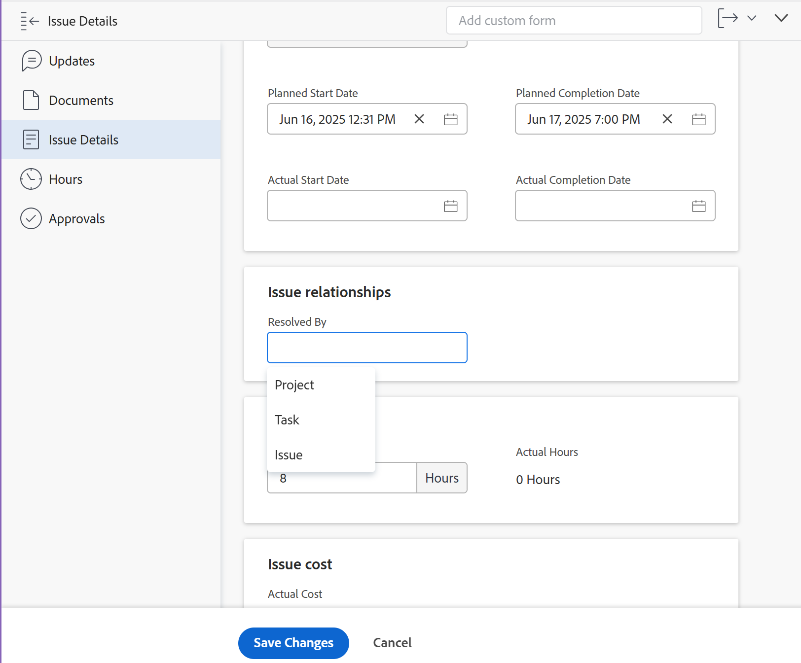

# Manually tie the resolution of an issue to other issues, tasks, or projects

You can manually tie the resolution of an issue to the resolution of a project, task, or issue without converting the issue. The issue becomes one of the Resolvable Objects of the project, task, or issue you select. When you do this, a change in the status of the project, task, or issue triggers a change in the status of the original issue.

>[!TIP]
>
>When you tie the resolution of an issue to the resolution of another object you can no longer manually edit the status of the original issue.

For more information about resolving and resolvable objects, see [Overview of Resolving and Resolvable Objects](../../../manage-work/issues/convert-issues/resolving-and-resolvable-objects.md).

## Access requirements

You must have the following:

<table style="table-layout:auto"> 
 <col> 
 <col> 
 <tbody> 
  <tr> 
   <td role="rowheader">Adobe Workfront plan*</td> 
   <td> 
Any 
 </td> 
  </tr> 
  <tr> 
   <td role="rowheader">Adobe Workfront license*</td> 
   <td> 
Request or higher
 </td> 
  </tr> 
  <tr> 
   <td role="rowheader">Access level configurations*</td> 
   <td> 
Edit access to Issues,&nbsp;Tasks, Projects
 
Note: If you still don't have access, ask your Workfront administrator if they set additional restrictions in your access level. For information on how a Workfront administrator can modify your access level, see <a href="../../../administration-and-setup/add-users/configure-and-grant-access/create-modify-access-levels.md" class="MCXref xref">Create or modify custom access levels</a>.
 </td> 
  </tr> 
  <tr> 
   <td role="rowheader">Object permissions</td> 
   <td> 
Manage permissions to the issue you link to another issue, task, or project
 
View or higher permissions to the issue, task, or project you add to the existing issue
 
For information on requesting additional access, see <a href="../../../workfront-basics/grant-and-request-access-to-objects/request-access.md" class="MCXref xref">Request access to objects </a>.
 </td> 
  </tr> 
 </tbody> 
</table>

&#42;To find out what plan, license type, or access you have, contact your Workfront administrator.

## Prerequisites

Before you begin, you must:

* Have an issue whose resolution you want to tie to the resolution of another issue, task, or project

* Have an additional issue, task, or project

## Tie the resolution of an issue to the resolution of a another issue, task, or project

1. Navigate to an issue whose resolution you want to tie to the resolution of another issue or to the resolution of a task or project.
1. Click the **Issue Details** in the left panel, then expand the **Overview** area.

   

1. Click the **Resolved By** field, and select from the following types of resolving objects: 

   * **Project**
   * **Task**
   * **Issue**

   Depending on which object you selected, the following fields display:
 
   * **Resolving Project**
   * **Resolving Task**
   * **Resolving Issue**

1. Start typing the name of a specific project, task, or issue in the **Resolving Project**, **Task**, or **Issue** field, then click it when it appears in the list. 

      >[!NOTE]
      >
      >You cannot tie the resolution of an issue to the task or the project where the issue is located. The task or project of the issue do not display in the Resolving Task or the Resolving Task fields.

1. Click **Save Changes**.  

   The original issue becomes the Resolvable Object for the project, task, or issue you selected in step 4 and 5. This means that the original issue completes when the resolving object (the project, task, or issue you linked it to) is completed.

   >[!NOTE]
   >
   >One project, task, or issue may have multiple issues as Resolvable Objects.
