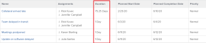

# Issue Duration overview

The Duration of an issue is the number of days between the Planned Start Date and the Planned Completion Date of the issue.

The duration of an issue is automatically calculated by Adobe Workfront and it cannot be manually modified.

You can display the Duration of an issue in an issue report or the view of a list of issues.

For more information about building a report, see [Create a custom report](../../../reports-and-dashboards/reports/creating-and-managing-reports/create-custom-report.md).

