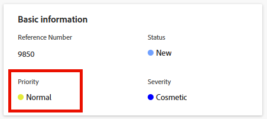

# Update issue Priority

You can define a priority for an issue to indicate how important the issue is.

## Access requirements

+++ Expand to view access requirements for the functionality in this article.

<table style="table-layout:auto"> 
 <col> 
 <col> 
 <tbody> 
  <tr> 
   <td role="rowheader">Adobe Workfront package</td> 
   <td> 
Any
 </td> 
  </tr> 
  <tr> 
   <td role="rowheader">Adobe Workfront license</td> 
   <td>
Contributor or higher
 
   
Request or higher
 </td> 
  </tr> 
  <tr> 
   <td role="rowheader">Access level configurations</td> 
   <td> 
Edit access to Issues
 </td> 
  </tr> 
  <tr> 
   <td role="rowheader">Object permissions</td> 
   <td> 
Manage permissions to the issue
 </td> 
  </tr> 
 </tbody> 
</table>

For more information, see [Access requirements in Workfront documentation](/help/quicksilver/administration-and-setup/add-users/access-levels-and-object-permissions/access-level-requirements-in-documentation.md).

+++

## Overview of issue Priorities

Each priority label has a number associated with it that can not be modified.

Adobe Workfront administrators can modify priority labels within Workfront or they can create new priorities. As a result, the options you might have for the Priority field in your Workfront instance might differ from those listed below.

You should become familiar with the numbering sequence for priorities used in your organization.   
For example, your organization might use the number 1 to refer to urgent tasks, if the label of the priority has been modified.

For more information about customizing the names of priorities in your instance, see [Create and customize priorities](../../../administration-and-setup/customize-workfront/creating-custom-status-and-priority-labels/create-customize-priorities.md).

Refer to the following table to understand each default priority label and its corresponding number: 

<table style="table-layout:auto"> 
 <col> 
 <col> 
 <thead> 
  <tr> 
   <th>Priority Label  (Can be modified) </th> 
   <th>Priority Number  (Cannot be modified) </th> 
  </tr> 
 </thead> 
 <tbody> 
  <tr> 
   <td> None </td> 
   <td> 0 </td> 
  </tr> 
  <tr> 
   <td> Low </td> 
   <td> 1 </td> 
  </tr> 
  <tr> 
   <td> Normal </td> 
   <td> 2 </td> 
  </tr> 
  <tr> 
   <td> High </td> 
   <td> 3 </td> 
  </tr> 
  <tr> 
   <td> Urgent </td> 
   <td> 4 </td> 
  </tr> 
 </tbody> 
</table>

## Update the Priority of an issue {#update-the-priority-of-an-issue}

1. Go to the issue whose priority you want to modify.
1. Click **Issue Details** in the left panel.

   The **Overview** section should display by default.  

1. Click the **Priority** field in the **Basic information** area.

   

1. Select a value for the **Priority** field.

   Depending on how your Workfront administrator configured Priorities in your system, the options might vary.

1. Click **Save Changes**.
