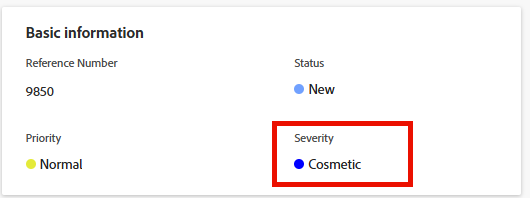

# Update issue severity

You can associate a severity with issues in Adobe Workfront. Tasks and projects do not have severities.

Issues are unexpected events that can prevent your projects from finishing on time or within budget.&nbsp;You can use severities to indicate how serious an issue is.&nbsp;

Your Workfront administrator defines the severities available in Workfront. After they establish them, they are available for you to associate with an issue.  
For more information about creating severities in Workfront, see [Create or customize issue severities](../../../administration-and-setup/customize-workfront/creating-custom-status-and-priority-labels/create-customize-issue-severities.md).

You must have Contribute permissions on an issue to be able to update its severity.&nbsp;

You can update the severity of issues in the following areas of Workfront:

* In the&nbsp;**Edit Issue** dialog box
* In the **Issue Details** area of an issue  
* In an issue list or report

## Access requirements

You must have the following access to perform the steps in this article:

<table style="table-layout:auto"> 
 <col> 
 <col> 
 <tbody> 
  <tr> 
   <td role="rowheader">Adobe Workfront plan*</td> 
   <td> 
Any 
 </td> 
  </tr> 
  <tr> 
   <td role="rowheader">Adobe Workfront license*</td> 
   <td> 
Request or higher
 </td> 
  </tr> 
  <tr> 
   <td role="rowheader">Access level configurations*</td> 
   <td> 
Edit access to Issues
 
Note: If you still don't have access, ask your Workfront administrator if they set additional restrictions in your access level. For information on how a Workfront administrator can modify your access level, see <a href="../../../administration-and-setup/add-users/configure-and-grant-access/create-modify-access-levels.md" class="MCXref xref">Create or modify custom access levels</a>.
 </td> 
  </tr> 
  <tr> 
   <td role="rowheader">Object permissions</td> 
   <td> 
Manage permissions to the issue
 
For information on requesting additional access, see <a href="../../../workfront-basics/grant-and-request-access-to-objects/request-access.md" class="MCXref xref">Request access to objects </a>.
 </td> 
  </tr> 
 </tbody> 
</table>

&#42;To find out what plan, license type, or access you have, contact your Workfront administrator.

## Update issue severity

To update the severity of an issue in the Issue Details area of an issue:

1. Go to the issue whose severity you want to update.
1. Click **Issue Details** in the left panel.

   The **Overview** section should display by default. 

1. Click the **Severity** field in the **Basic information** area.

   

1. Select the appropriate **Severity** from the drop-down menu.

   Depending on how your Workfront administrator configured severities in your system, the options might vary.

1. Click **Save Changes**.
