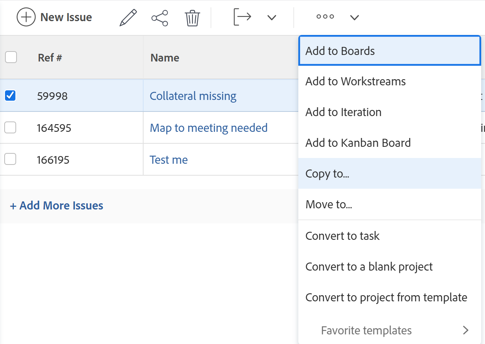
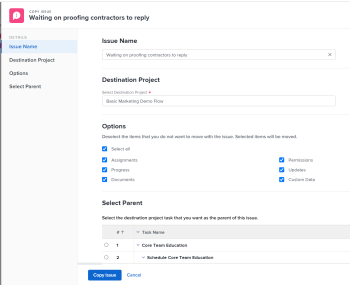
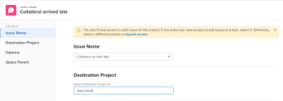

# Copy issues

You can copy an issue or a request and save them on the same or another project. You can also copy an issue from a task to another project.

You can copy issues from the following objects:

* From a project to the same project (duplicate it on the same project)
* From a task to the same task (duplicate if on the same task)
* From a project to another project
* From a task to a project

>[!TIP]
>
>"Issues" and "requests" are used interchangeably in Workfront. You can record issues on both projects and tasks to indicate unforeseen work that needs to be addressed. You can also submit requests which are recorded as issues on a project designated as a Request Queue.

## Access requirements

You must have the following access to perform the steps in this article:

<table style="table-layout:auto"> 
 <col> 
 <col> 
 <tbody> 
  <tr> 
   <td role="rowheader">Adobe Workfront plan*</td> 
   <td> 
Any
 </td> 
  </tr> 
  <tr> 
   <td role="rowheader">Adobe Workfront license*</td> 
   <td> 
Request or higher
 
Review or higher license to copy an issue in the Issues section of a project.
 </td> 
  </tr> 
  <tr> 
   <td role="rowheader">Access level*</td> 
   <td> 
Edit access to Issues
 
View or higher access to Projects and Tasks
 
Note: If you still don't have access, ask your Workfront administrator if they set additional restrictions in your access level. For information about access to issues in your Access Level, see <a href="../../../administration-and-setup/add-users/configure-and-grant-access/grant-access-issues.md" class="MCXref xref">Grant access to issues</a>. For information on how a Workfront administrator can change your access level, see <a href="../../../administration-and-setup/add-users/configure-and-grant-access/create-modify-access-levels.md" class="MCXref xref">Create or modify custom access levels</a>. 
 </td> 
  </tr> 
  <tr> 
   <td role="rowheader">Object permissions</td> 
   <td> 
Manage permissions to the issue
 
Contribute permissions to the item where you are copying the issue to with the ability to Add Issues.
 
 For information about granting permissions to issues, see <a href="../../../workfront-basics/grant-and-request-access-to-objects/share-an-issue.md" class="MCXref xref">Share an issue </a>
 
For information on requesting additional permissions, see <a href="../../../workfront-basics/grant-and-request-access-to-objects/request-access.md" class="MCXref xref">Request access to objects </a>.
 </td> 
  </tr> 
 </tbody> 
</table>

&#42;To find out what plan, license type, or access you have, contact your Workfront administrator.

## Considerations when copying issues

### General considerations when copying issues

You have a chance to select to copy some items associated with the issue to the copied issue during the copying process. However, some items transfer to the new issue by default, while others do not, as described in the lists below. 

The following items are copied to the new issue, by default: 

* Primary Contact
* Custom forms. The information in the custom fields copies to the new issue only when you select Custom Data in the copying process. 
* Approvals
* Planned Start and Planned Completion Dates

The following objects are not copied to the new issue, by default: 

* Logged hours

### Considerations for issues associated with documents or request queues

Consider the following when copying issues that contain documents or are associated with a request queue:

* **When an issue is associated with a request queue:** When you copy an issue to another object and the issue is associated with a request queue, the copied issue is no longer associated with the original queue the first issue originated from.
* **When a document is attached to the issue:** When you copy an issue to another object and the issue has a document attached to it, the document and its versions also move to the new issue. Any proofs or approvals associated with the document do not move.
* **When an issue is linked to a document or a folder:** When you copy an issue which has documents or folders linked to a third party service like Google Drive, the links to the documents transfer to the copied issue. 

## Copy issues in a list

You can copy one or multiple issues from a list of issues or from an issue report.

1. Go to the project that contains the issue or issues that you want to copy.

   Or

   Go to an issue report. 

1. If you selected to go to a project, click **Issues** in the left panel. 
1. Select the issue or issues that you want to copy and click the **More menu** at the top of the issue list, then click **Copy to**.

   

1. Continue with copying the issue, as described in the section [Copy a single issue](#copy-a-single-issue) starting with Step 2.

   <!--
   <MadCap:conditionalText data-mc-conditions="QuicksilverOrClassic.Draft mode">
   (NOTE: ensure step number stays accurate)
   </MadCap:conditionalText>
   -->

## Copy a single issue {#copy-a-single-issue}

You can copy one issue when viewing it.

1. Go to an issue that you want to copy, then click the **More** menu  to the right of the issue name, then **Copy** to.

   

   The **Copy Issue** box displays.

   

1. In the **Select Destination Project** section, specify the name of the project where you want to copy the issues. The name of the current project displays by default.

   >[!TIP]
   >
   >Only 100 projects display in the list.

1. (Conditional) Click **request access** if you do not have access to copy issues to the project. 
1. (Conditional) Continue to copy the issue to the selected destination project without requesting access if you have access to add issues to one of the tasks on the destination project.

   

   >[!TIP]
   >
   >Similar messages display if the project selected is in pending approval, completed, or dead, when the Workfront administrator prevents adding issues to these projects. For more information, see [Configure system-wide project preferences](../../../administration-and-setup/set-up-workfront/configure-system-defaults/set-project-preferences.md).

1. (Optional) In the **Options** section, deselect any of the items listed in the table below to remove them from the new issue. All options are selected by default.

   >[!NOTE]
   >
   >This impacts only the copied issues not the original issues.

   <table style="table-layout:auto"> 
    <col> 
    <col> 
    <tbody> 
     <tr> 
      <td role="rowheader">Assignments</td> 
      <td>Removes users, job roles, or teams that are assigned to the issue.</td> 
     </tr> 
     <tr> 
      <td role="rowheader">Progress</td> 
      <td>Removes the percent complete, if any, of the issue.</td> 
     </tr> 
     <tr> 
      <td role="rowheader">Documents</td> 
      <td>Removes everything in the documents tab, including document versions, linked documents, and folders.  By default, document proofs and approvals cannot be copied to another issue.</td> 
     </tr> 
     <tr> 
      <td role="rowheader">Permissions</td> 
      <td>Removes the entities that the issue is shared with. </td> 
     </tr> 
     <tr> 
      <td role="rowheader">Updates</td> 
      <td>Removes comments from the Updates section of the issue.</td> 
     </tr> 
     <tr> 
      <td role="rowheader">Custom Data</td> 
      <td>Removes the information from the custom form on the issue, as well as the information on the custom forms associated with Documents attached to the issue, if those are also copied with the issue. The custom forms will remain attached to the issues and documents, but the information on the forms will not carry over to the new issue. </td> 
     </tr> 
    </tbody> 
   </table>

1. (Optional) In the **Select Task** section, select the task where you want to move the issue. 
1. Click **Copy issue** or **Copy issues** if you selected multiple issues in a list.

   The copied issues are added to the specified project.

 
