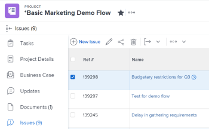
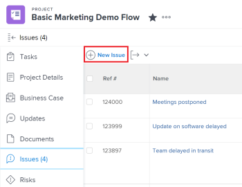
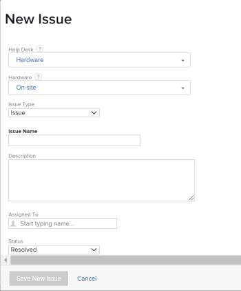
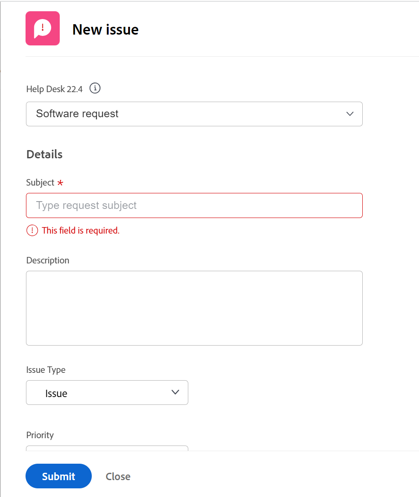
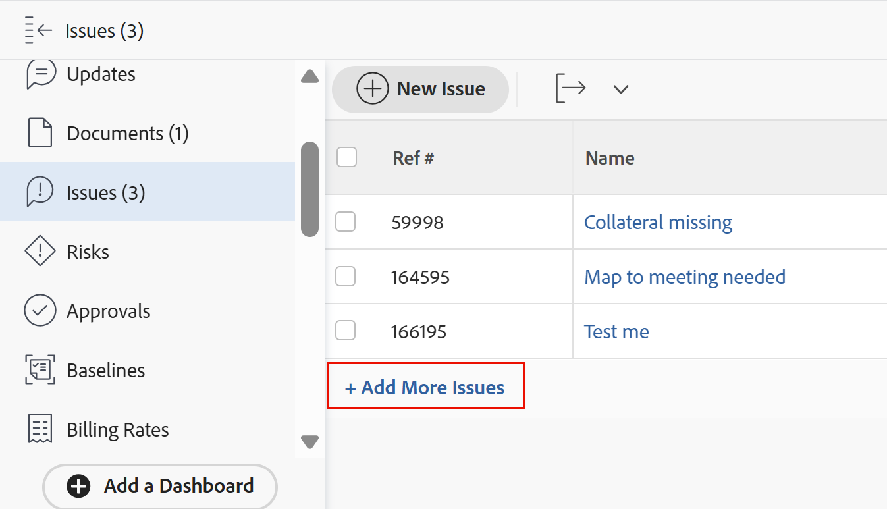

# Create issues

<!--remove Preview and Prod references when this comes to Prod-->

The highlighted information on this page refers to functionality not yet generally available. It is available only in the Preview environment for all customers. After the monthly releases to Production, the same features are also available in the Production environment for customers who enabled fast releases. 

For information about fast releases, see [Enable or disable fast releases for your organization](../../../administration-and-setup/set-up-workfront/configure-system-defaults/enable-fast-release-process.md).  

For information about the current release, see [Fourth Quarter 2023 release overview](../../../product-announcements/product-releases/23-q4-release-activity/23-q4-release-overview.md).  

While working on a project, you might discover that unexpected events arise. You can log those unexpected events as issues for a particular project or of a task. Users with the appropriate access can view and monitor the status of issues as the project or the task progresses to completion, eliminating the need for lengthy email chains or status meetings. Unlike tasks, which are planned events, issues represent unplanned work items in Adobe Workfront.

You can also add issues to projects as requests. For information, see [Create and submit Adobe Workfront requests](../../../manage-work/requests/create-requests/create-submit-requests.md).

>[!TIP]
>
>Issues and requests are used interchangeably in Workfront. You can record issues on both projects and tasks to indicate unforeseen work that needs to be addressed. You can also submit requests which are recorded as issues on a project designated as a Request Queue.

## Access requirements

You must have the following access to perform the steps in this article:

<table style="table-layout:auto"> 
 <col> 
 <col> 
 <tbody> 
  <tr> 
   <td role="rowheader">Adobe Workfront plan*</td> 
   <td> 
Any
 </td> 
  </tr> 
  <tr> 
   <td role="rowheader">Adobe Workfront license*</td> 
   <td> 
Review or higher to add issues to a project or task
 
Request or higher to add issues as requests, using a Request Queue.
 </td> 
  </tr> 
  <tr> 
   <td role="rowheader">Access level configurations*</td> 
   <td> 
Edit access to Issues
 
View or higher access to Projects and Tasks
 
Note: If you still don't have access, ask your Workfront administrator if they set additional restrictions in your access level. For information about access to issues in your Access Level, see <a href="../../../administration-and-setup/add-users/configure-and-grant-access/grant-access-issues.md" class="MCXref xref">Grant access to issues</a>. For information on how a Workfront administrator can change your access level, see <a href="../../../administration-and-setup/add-users/configure-and-grant-access/create-modify-access-levels.md" class="MCXref xref">Create or modify custom access levels</a>. 
 </td> 
  </tr> 
  <tr> 
   <td role="rowheader">Object permissions</td> 
   <td> 
Contribute or higher permissions with ability to Add Issues to the task or project where you create the issue
 
 For information about granting permissions to issues, see <a href="../../../workfront-basics/grant-and-request-access-to-objects/share-an-issue.md" class="MCXref xref">Share an issue </a>
 
For information on requesting additional permissions, see <a href="../../../workfront-basics/grant-and-request-access-to-objects/request-access.md" class="MCXref xref">Request access to objects </a>.
 </td> 
  </tr> 
 </tbody> 
</table>

&#42;To find out what plan, license type, or access you have, contact your Workfront administrator.

<!--
(NOTE: in NWE Requestors CAN see the Issues tab on a project but in classic they cannot! However, even when they DO see it, they cannot enter the issues - logged this issue for it but they might decide not to fix it: https://hub.workfront.com/issue/60181e28000058980cce29597185b2d6/updates?email-source=comm)

-->

## Limitations in creating issues

When you have the correct access and permissions you can create issues on a project or task. However, the following are cases when you might not be able to create issues:

* Your Workfront administrator or a group administrator must enable adding issues to a project that is in a Complete or Dead status in your Project Preferences area. For information about setting project preferences, see [Configure system-wide project preferences](../../../administration-and-setup/set-up-workfront/configure-system-defaults/set-project-preferences.md).
* You cannot add issues to a project that is in Pending Approval.

## Prepare the New Issue form

Your organization should have a well-defined process in place for when and how to record an issue. When you configure this process, the first step is to create the form necessary for submitting an issue. Whether you will allow for issues to be added to tasks and projects directly, or if you have request queues where issues are submitted, you can define what Workfront fields as well as what custom fields are available for users when they submit new issues and must be completed. The New Issue form can contain important information that will be helpful in resolving the issue quickly.

The fields for the new issues on a project are defined in the  Queue Details section of the project where the issues will be logged. For information about configuring the  Queue Details section of the project, see [Create a Request Queue](../../../manage-work/requests/create-and-manage-request-queues/create-request-queue.md).

For information about creating issues by submitting them to a request queue, see the [Create issues by entering a new request](#create-issues-by-entering-a-new-request) section in this article.

## Create issues on a task or project using the New Issue button

After you have defined the fields of a new issue form on your project, you can start creating issues.

Creating issues differs depending on which environment you choose to create the issue. 

### Create issues on a task or project using the New Issue button in the Production environment

To create an issue on a task or a project:

1. Go to a project where you want to create the issue. 
1. (Optional) If you want to log the issue for a task, go to the **Tasks** area, then click the name of a task. 
1. Click the **Issues** section.

   

1. Click **New Issue**.

   

1. (Conditional) If the project creator created Queue Topics or Topic Groups on the project they are added to the new issue form. Specify the **Topic Group** or the **Queue Topic** of your new issue. Topic Groups and Queue Topics have names customized to your environment.  
   For more information about creating Topic Groups, see [Create Topic Groups](../../../manage-work/requests/create-and-manage-request-queues/create-topic-groups.md). For more information about creating Queue Topics, see [Create Queue Topics](../../../manage-work/requests/create-and-manage-request-queues/create-queue-topics.md).

   

   * If there is only one Queue Topic set on the project, it is displayed automatically.
   * If the Topic Group does not have any Queue Topics or Topic Groups under it, nothing is available in the Topic Group drop-down.

1. (Conditional) If the project creator allowed for the **Request Type** field to display on the New Issue form, select the type of your issue from the following options:

   * Bug Report
   * Change Order
   * Issue
   * Request  
     Depending on how your Workfront administrator has configured your Project Preferences, the names of the issue types might be different for you. 

   >[!TIP]
   >
   >The Request Types must be enabled in the Queue Details and as well as when creating the Queue Topic to display as a selection in the New Issue form. For information, see the following articles: 
   >* [Create a Request Queue](../../requests/create-and-manage-request-queues/create-request-queue.md)
   >  * [Create Queue Topics](../../requests/create-and-manage-request-queues/create-queue-topics.md)

1. Add a name for the new issue in the **Issue Name** field. 
1. Continue specifying the fields available in the **New Issue** form. For more information about the fields available as you enter a new issue, see [Edit issues](../../../manage-work/issues/manage-issues/edit-issues.md).

   >[!IMPORTANT]
   >
   >Not all the issue-related fields are available in the New Issue form. The project creator enables the fields available when creating an issue when they define the Queue Details area of the project. For more information, see [Create a Requests Queue](../../requests/create-and-manage-request-queues/create-request-queue.md). 

1. (Conditional) If the Queue Topics are associated with a custom form, that custom form will display in the **New Issue** form.  
   Or  
   If the project is associated with an issue custom form through the Queue Details area, the form displays in the **New Issue** form, after the default Workfront fields.

   For information, see [Create a Request Queue](../../../manage-work/requests/create-and-manage-request-queues/create-request-queue.md).

1. Click **Save New Issue.**

Issues can be assigned to multiple users, job roles or to a team. For more information about assigning and managing requests, see [Manage work and team requests](../../../people-teams-and-groups/work-with-team-requests/manage-work-and-team-requests.md).

<!--When this is coming to Production, remove the "Production" section above and replace it with the following content: -->

### Create issues on a task or project using the New Issue button in the Preview environment

To create an issue on a task or a project:

1. Go to a project where you want to create the issue. 
1. (Optional) If you want to log the issue for a task, go to the **Tasks** area, then click the name of a task. 
1. Click the **Issues** section.

   

1. Click **New Issue**.
   The New issue box displays.

      

1. (Conditional) If the project creator created Queue Topics or Topic Groups on the project they are added to the new issue form. Specify the **Topic Group** or the **Queue Topic** of your new issue. Topic Groups and Queue Topics have names customized to your environment.  
   For more information about creating Topic Groups, see [Create Topic Groups](../../../manage-work/requests/create-and-manage-request-queues/create-topic-groups.md). For more information about creating Queue Topics, see [Create Queue Topics](../../../manage-work/requests/create-and-manage-request-queues/create-queue-topics.md).

   * If there is only one Queue Topic set on the project, it is displayed automatically.
   * If the Topic Group does not have any Queue Topics or Topic Groups under it, nothing is available in the Topic Group drop-down.

1. Add the issue name in the **Subject** field, then add a **Description**.

1. (Conditional) If the project creator allowed for the **Request Type** field to display on the New Issue form, select the type of your issue from the following options:

   * Bug Report
   * Change Order
   * Issue
   * Request  
     Depending on how your Workfront administrator has configured your Project Preferences, the names of the issue types might be different for you. 

   >[!TIP]
   >
   >The Request Types must be enabled in the Queue Details and as well as when creating the Queue Topic to display as a selection in the New Issue form. For information, see the following articles: 
   >* [Create a Request Queue](../../requests/create-and-manage-request-queues/create-request-queue.md)
   >  * [Create Queue Topics](../../requests/create-and-manage-request-queues/create-queue-topics.md)

1. Continue specifying the fields available in the **New issue** form. For more information about the fields available as you enter a new issue, see [Edit issues](../../../manage-work/issues/manage-issues/edit-issues.md).

   >[!IMPORTANT]
   >
   >Not all the issue-related fields are available in the New issue form. The project creator enables the fields available when creating an issue when they define the Queue Details area of the project. For more information, see [Create a Requests Queue](../../requests/create-and-manage-request-queues/create-request-queue.md). 

1. (Conditional) If the Queue Topics are associated with a custom form, that custom form will display in the **New issue** form.  
   Or  
   If the project is associated with an issue custom form through the Queue Details area, the form displays in the **New issue** form, after the default Workfront fields.

   For information, see [Create a Request Queue](../../../manage-work/requests/create-and-manage-request-queues/create-request-queue.md).

1. Click **Submit**. 

   Issues can be assigned to multiple users, job roles or to a team. For more information about assigning and managing requests, see [Manage work and team requests](../../../people-teams-and-groups/work-with-team-requests/manage-work-and-team-requests.md).

## Create issues on a task or project inline

>[!IMPORTANT]
>
>The project owner must enable **Allow users to add issues inline** when defining issue settings for the project before you can add issues inline to the project or tasks. For information about configuring issue settings on a project, see [Edit projects](../../../manage-work/projects/manage-projects/edit-projects.md).
>

When you want to add several issues quickly, you can create issues for a task or a project inline, by adding them to a list of issues.

>[!NOTE]
>
>When you add issues inline, Workfront does not apply the New Issue form to the new issues. We don't recommend adding issues inline if you want users to provide certain information when entering issues. This can have a negative impact on issue reporting and later on the ability of the user assigned to the issue to have all the information necessary to resolve the issue.

To create issues inline:

1. Go to a project where you want to create the issue. 
1. (Optional) If you want to log the issue for a task, go to the **Tasks** section, then click the name of a task. 
1. Click the **Issues** section.  
1. Click **Add More Issues**.

   A new line is created in the list of issues on the Issues section.

   >[!TIP]
   >
   >This option is dimmed if the Allow users to add issues inline setting is deselected in the Edit Project box. For information, see [Edit projects](../../../manage-work/projects/manage-projects/edit-projects.md).

   

1. Start typing the name of the issue in the Name field, then continue adding more information about the issue inline.

   >[!TIP]
   >
   >The fields that are available to edit inline are made available by the view you apply to your issue list. You might not be able to inline edit the following type of fields: 
   >   
   >* Fields that belong to another object
   >* Fields that you don't have access to edit 
   >* Fields that are calculations and which are automatically updated by Workfront

1. Click Enter to finish inline editing, and add the issue to the project or task.

## Create issues by entering a new request {#create-issues-by-entering-a-new-request}

You can designate projects to be receptacles for receiving issues. These type of projects are called Request Queues in Workfront. You can access Request Queues through your Requests area in the Main Menu.

>[!TIP]
>
>The terms "issue" and "request" are interchangeable in Workfront.

For more information about how to set up projects as Request Queues to receive issues, see [Create a Request Queue](../../../manage-work/requests/create-and-manage-request-queues/create-request-queue.md). For information about submitting requests, see [Create and submit Adobe Workfront requests](../../../manage-work/requests/create-requests/create-submit-requests.md).
