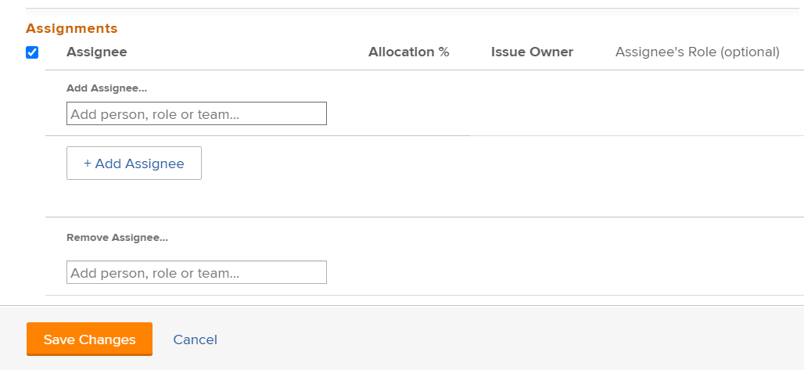

# Modify user assignments for multiple issues in a list

<!--

(NOTE: similar article exists for tasks)

-->

You can simultaneously modify user assignments to multiple issues.&nbsp;For information about editing issues or assigning them one at a time, also see the following articles:

* [Edit issues](../../../manage-work/issues/manage-issues/edit-issues.md) 
* [Assign issues](../../../manage-work/issues/manage-issues/assign-issues.md)

For general information about assigning issues, see [Overview of modifying issue assignments](../../../manage-work/issues/manage-issues/modify-issue-assignments-overview.md).

>[!NOTE]
>
>You must have at least Contribute permissions to an issue be able to make assignments to the issue.

## Access requirements

You must have the following access to perform the steps in this article:

<table style="table-layout:auto"> 
 <col> 
 <col> 
 <tbody> 
  <tr> 
   <td role="rowheader">Adobe Workfront plan*</td> 
   <td> 
Any 
 </td> 
  </tr> 
  <tr> 
   <td role="rowheader">Adobe Workfront licenses*</td> 
   <td> 
Request or higher
 </td> 
  </tr> 
  <tr> 
   <td role="rowheader">Access level configurations*</td> 
   <td> 
Edit access to Issues
 
Note: If you still don't have access, ask your Workfront administrator if they set additional restrictions in your access level. For information on how a Workfront administrator can modify your access level, see <a href="../../../administration-and-setup/add-users/configure-and-grant-access/create-modify-access-levels.md" class="MCXref xref">Create or modify custom access levels</a>.
 </td> 
  </tr> 
  <tr> 
   <td role="rowheader">Object permissions</td> 
   <td> 
Manage permissions to the issue
 
For information on requesting additional access, see <a href="../../../workfront-basics/grant-and-request-access-to-objects/request-access.md" class="MCXref xref">Request access to objects </a>.
 </td> 
  </tr> 
 </tbody> 
</table>

&#42;To find out what plan, license type, or access you have, contact your Workfront administrator.

<!--

<h2>When to modify user assignments on issues</h2>

(NOTE:&nbsp;drafted and moved to the overview article: Modify issue assignments overview)

You might want to modify the user assignments for multiple issues for a variety of&nbsp;reasons, including the following:

<ul>
<li>Users join or leave&nbsp;your team</li>
<li>A user takes a vacation that extends beyond the issue&nbsp;due dates</li>
<li>A specific role or user is set as the assignee for multiple issues and you want to quickly modify all items to be assigned to a different user or role</li>
</ul>

-->

## Modify assignments for multiple issues

1. Go to the issue list that contains the&nbsp;issues whose assignments you want to modify. 
1. (Optional) Create a filter to display only issues assigned to the assignee that you want to modify.

   For example, you can create a filter to display only issues with a specific role as the assignee.&nbsp;Then, you can&nbsp;replace the role with a specific user. Do the following:

   1. Click the **Filter**&nbsp;drop-down list, then click **New Filter**.

      The New Filter dialog box displays. 
   
   1. Click **Add a Filter Rule.**
   1. To filter for a specific role, expand **Assignment Roles,**&nbsp;then click **ID.**

      Or

      To filter for a specific user, expand **Assignment Users,**&nbsp;then click **ID.**

      >[!TIP]
      >
      >Do not use **Assigned to**&nbsp;because this field refers only to the Issue Owner and not to all assignees.

   1. In the drop-down list, select **Equal** as the filter qualifier.
   1. Begin typing the name of the user or role that you want to filter for, then click the name when it appears in the drop-down list.
   1. Click **Save Filter.**

1. Select the issues for which you want to modify assignments, then click the **Edit** icon .

   The **Edit Issues** displays. The items that are edited display in the upper-left corner of the page.

1. Go to the **Assignments** section, then select **Assignee**.

   

1. Do one of the following:

   1. To add a new assignee:

      1. Start typing the name of a user, role, or team, then select it when it displays in the list. The assignment is added and does not replace the current assignments on the selected issues.

         >[!TIP]
         >
         >You can assign multiple users, job roles, or teams. You can assign only active users, job roles, and teams.
         >
         >If a user, job role, or a team was assigned before they were deactivated, they remain assigned to the work item. In this case, we recommend the following:
         >
         >* Reassign the work item to active resources.
         >* Associate the users in a deactivated team with an active team and reassign the work item to the active team.
 
         Information that is common across all issues selected displays. For example, if the same user is assigned to all issues, that user displays in the **Assignee**&nbsp;column. If information is not common across the issues selected, no information displays.

   1. To remove individual assignees:

      1. Click the **X icon** next to the name of the assignee that you want to remove if the assignee displays in the Assignments list.

         Or

         (Conditional) If the assignee that you want to remove does not display in the Assignments section because the assignee is assigned to only some of the issues that you have selected, click **Remove Assignee** and start typing the name of the assignee that you want to remove, then click the name when it appears in the drop-down list.
      
      1. Click&nbsp;**Remove Assignee** again to add another assignee to remove.

   1. To remove all existing assignees:

      1. Click **Remove All Existing Assignees**, then click **Yes, Delete All Assignees**.

         This removes not only common assignees (assignees that are displayed in the edit&nbsp;dialog box), but also all assignees on all the selected issues.

1. (Optional) Modify any of the following options for the assignees you selected to associate with the issues:

   * **Issue Owner:**&nbsp;Select the radio button to indicate which assignee is designated as the Issues Owner. If left unselected, Adobe Workfront designates the first assignee as the Issue Owner. This is not available for team assignments. 
   * **Assignee's Role**: Select a role from the drop-down list. If left unselected, Workfront automatically selects the Primary Role of the user.

1. Click **Save Changes**.
