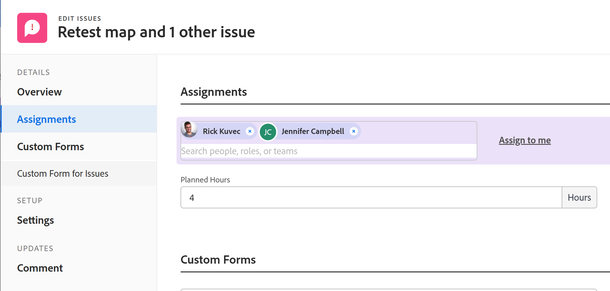

# Modify user assignments for multiple issues in a list

<!--Audited: 07/2024-->
<!--

(NOTE: similar article exists for tasks)

-->

 

The highlighted information on this page refers to functionality not yet generally available. It is available only in the Preview environment for all customers. The same features will also be available in the Production environment for all customers starting with a week from the Preview release.      

For more information, see [Interface modernization](/help/quicksilver/product-announcements/product-releases/interface-modernization/interface-modernization.md).  

 

You can simultaneously modify user assignments to multiple issues. For information about editing issues or assigning them one at a time, also see the following articles:

* [Edit issues](../../../manage-work/issues/manage-issues/edit-issues.md) 
* [Assign issues](../../../manage-work/issues/manage-issues/assign-issues.md)

For general information about assigning issues, see [Overview of modifying issue assignments](../../../manage-work/issues/manage-issues/modify-issue-assignments-overview.md).

>[!NOTE]
>
>You must have at least Contribute permissions to an issue be able to make assignments to the issue.

## Access requirements

+++ Expand to view access requirements for the functionality in this article. 

<table style="table-layout:auto"> 
 <col> 
 <col> 
 <tbody> 
  <tr> 
   <td>Adobe Workfront package</td> 
   <td> 
Any
 </td> 
  </tr> 
  <tr> 
   <td>Adobe Workfront license</td> 
   <td> 
Standard

   
Request or higher
 </td> 
  </tr> 
  <tr> 
   <td>Access level configurations</td> 
   <td> 
Edit access to Issues
 
View or higher access to Projects and Tasks to assign one issue
 </td> 
  </tr> 
  <tr> 
   <td>Object permissions</td> 
   <td> 
Manage permissions to the issue
 
Contribute permissions or higher to the project or task where the issue is located, when assigning multiple issues.
  </td> 
  </tr> 
 </tbody> 
</table>

For information, see [Access requirements in Workfront documentation](/help/quicksilver/administration-and-setup/add-users/access-levels-and-object-permissions/access-level-requirements-in-documentation.md).

+++

<!--

<h2>When to modify user assignments on issues</h2>

(NOTE:  drafted and moved to the overview article: Modify issue assignments overview)

You might want to modify the user assignments for multiple issues for a variety of  reasons, including the following:

<ul>
<li>Users join or leave  your team</li>
<li>A user takes a vacation that extends beyond the issue  due dates</li>
<li>A specific role or user is set as the assignee for multiple issues and you want to quickly modify all items to be assigned to a different user or role</li>
</ul>

-->

## Modify assignments for multiple issues

1. Go to the issue list that contains the  issues whose assignments you want to modify. 
1. (Optional) Create a filter to display only issues assigned to the assignee that you want to modify.

   For example, you can create a filter to display only issues with a specific role as the assignee.  Then, you can  replace the role with a specific user. Do the following:

   1. Click the **Filters**  drop-down list, then click **New filter**.
   
   1. In the first field, start typing **Assignment Roles** and choose **Assignment Roles: Name** from the list.
   1. Select **Is any of** from the modifier drop-down menu, then start typing the name of a role and select it when it displays in the list. You can type multiple roles. 

      >[!TIP]
      >
      >Do not use **Assigned to** because this field refers only to the Issue Owner and not to all assignees.

      The list of issues automatically filters for your filter criteria. 
   1. (Optional) Click **Save as new**, then **Save**.

1. Select the issues for which you want to modify assignments, then click the **Edit** icon .

   The **Edit Issues** displays. The number of items selected displays in the upper-left corner of the page.

1. (Conditional) In the Production environment, do the following: 

   1. Go to the **Assignments** section, then select **Assignee**.

      

   1. Do one of the following:

      1. To add a new assignee:

         1. Start typing the name of a user, role, or team, then select it when it displays in the list. The assignment is added and does not replace the current assignments on the selected issues.

         >[!TIP]
         >
         >You can assign multiple users, job roles, or teams. You can assign only active users, job roles, and teams.
         >
         >If a user, job role, or a team was assigned before they were deactivated, they remain assigned to the work item. In this case, we recommend the following:
         >
         >* Reassign the work item to active resources.
         >* Associate the users in a deactivated team with an active team and reassign the work item to the active team.
 
         Information that is common across all issues selected displays. For example, if the same user is assigned to all issues, that user displays in the **Assignee**  column. If information is not common across the issues selected, no information displays.

      1. To remove individual assignees:

         1. Click the **X icon** next to the name of the assignee that you want to remove if the assignee displays in the Assignments list.

            Or

            If the assignee that you want to remove does not display in the Assignments section because the assignee is assigned to only some of the issues that you have selected, click **Remove Assignee** and start typing the name of the assignee that you want to remove, then click the name when it appears in the drop-down list.
      
         1. Click  **Remove Assignee** again to add another assignee to remove.

      1. To remove all existing assignees:

         1. Click **Remove All Existing Assignees**, then click **Yes, Delete All Assignees**.

            This removes not only common assignees (assignees that are displayed in the edit  dialog box), but also all assignees on all the selected issues.

         1. (Optional) Modify any of the following options for the assignees you selected to associate with the issues:

            * **Issue Owner:**  Select the radio button to indicate which assignee is designated as the Issues Owner. If left unselected, Adobe Workfront designates the first assignee as the Issue Owner. This is not available for team assignments. 
            * **Assignee's Role**: Select a role from the drop-down list. If left unselected, Workfront automatically selects the Primary Role of the user.

      1. Click **Save Changes**.

1. In the Preview environment, do the following:

   1. Click **Assignments** in the left panel, then click the **x** icon next to the assignee you want to remove. 

      >[!TIP]
      >
      >Only assignees that are assigned to all the selected issues display in the **Assignments** area. 

      

   1. Start typing the name of a user, role, or team to add assignees to all the selected issues. 

         >[!TIP]
         >
         >You can assign multiple users, job roles, or teams. You can assign only active users, job roles, and teams.
         >
         >If a user, job role, or a team was assigned before they were deactivated, they remain assigned to the work item. In this case, we recommend the following:
         >
         >* Reassign the work item to active resources.
         >* Associate the users in a deactivated team with an active team and reassign the work item to the active team.

      The added assignees are added to the existing ones. They do not replace the existing ones for each selected issue. 
   1. (Optional) Click **Assign to me** to assign all issues to yourself.
   1. Click **Save**. 

