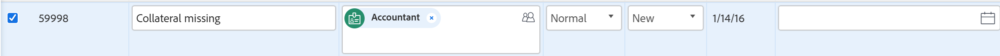

# Edit issues in a list

<!--Audited: 10/2025-->

 

The highlighted information on this page refers to functionality not yet generally available. It is available only in the Preview environment for all customers. The same features will also be available in the Production environment for all customers starting with  a week from the Preview release.      

For more information, see [Interface modernization](/help/quicksilver/product-announcements/product-releases/interface-modernization/interface-modernization.md).  

 
 
You can edit an individual issue or you can edit issues in an issue list or report. This article describes how to edit issues in lists.

For information about editing an individual issue, see [Edit issues](../../../manage-work/issues/manage-issues/edit-issues.md).

## Access requirements

+++ Expand to view access requirements for the functionality in this article.

<table style="table-layout:auto"> 
 <col> 
 <col> 
 <tbody> 
  <tr> 
   <td role="rowheader">Adobe Workfront package</td> 
   <td> 
Any
 </td> 
  </tr> 
  <tr> 
   <td role="rowheader">Adobe Workfront license</td> 
   <td> 
   
   <ul><li>
Contributor or higher
 </li>
   <li>
Light or higher license to edit an issue in the Issues section of a project
</li></ul> 
    Or
   <ul><li>
Requestor or higher
 </li>
   <li>
Reviewer or higher license to edit an issue in the Issues section of a project
</li></ul> 
   </td> 
  </tr> 
  <tr> 
   <td role="rowheader">Access level configurations*</td> 
   <td> 
Edit access to Issues
 
If you still don't have access, ask your Workfront administrator if they set additional restrictions in your access level. For information on how a Workfront administrator can modify your access level, see <a href="../../../administration-and-setup/add-users/configure-and-grant-access/create-modify-access-levels.md" class="MCXref xref">Create or modify custom access levels</a>.
 </td> 
  </tr> 
  <tr> 
   <td role="rowheader">Object permissions</td> 
   <td> 
Contribute or higher permissions to the issue
 
 For information about granting permissions to issues, see <a href="../../../workfront-basics/grant-and-request-access-to-objects/share-an-issue.md" class="MCXref xref">Share an issue </a>
 
For information on requesting additional permissions, see <a href="../../../workfront-basics/grant-and-request-access-to-objects/request-access.md" class="MCXref xref">Request access to objects </a>.
 </td> 
  </tr> 
 </tbody> 
</table>

For more detail about the information in this table, see [Access requirements in Workfront documentation](/help/quicksilver/administration-and-setup/add-users/access-levels-and-object-permissions/access-level-requirements-in-documentation.md).

+++

<!--Old:

<table style="table-layout:auto"> 
 <col> 
 <col> 
 <tbody> 
  <tr> 
   <td role="rowheader">Adobe Workfront plan*</td> 
   <td> 
Any
 </td> 
  </tr> 
  <tr> 
   <td role="rowheader">Adobe Workfront license*</td> 
   <td> 
Request or higher
 
Review or higher license to edit issues in the Issues section of a project.
 </td> 
  </tr> 
  <tr> 
   <td role="rowheader">Access level configurations*</td> 
   <td> 
Edit access to Issues
 
If you still don't have access, ask your Workfront administrator if they set additional restrictions in your access level. For information on how a Workfront administrator can modify your access level, see <a href="../../../administration-and-setup/add-users/configure-and-grant-access/create-modify-access-levels.md" class="MCXref xref">Create or modify custom access levels</a>.
 </td> 
  </tr> 
  <tr> 
   <td role="rowheader">Object permissions</td> 
   <td> 
Contribute or higher permissions to the issue
 
 For information about granting permissions to issues, see <a href="../../../workfront-basics/grant-and-request-access-to-objects/share-an-issue.md" class="MCXref xref">Share an issue </a>
 
For information on requesting additional permissions, see <a href="../../../workfront-basics/grant-and-request-access-to-objects/request-access.md" class="MCXref xref">Request access to objects </a>.
 </td> 
  </tr> 
 </tbody> 
</table>-->

## Inline edit issues

You can edit issue information in a list of issues, by inline editing fields displayed in the view of the list.

Consider the following when editing issues in a list:

* You can edit any issue field that displays in the list and that you have permissions to update.
* You can edit an issue in the following lists:

   * The Issues section of a project or of a task
   * An issue report

To inline edit an issue:

1. Go to a list of issues in a project or task. 
1. Click inside any field that you have permissions to update manually. The field becomes editable and you can make your changes.

   

1. Press enter when you want to accept your changes. Changes are saved immediately.

   For information about inline editing objects, see [Inline edit items in a list in Adobe Workfront](../../../workfront-basics/navigate-workfront/use-lists/inline-edit-objects.md).

## Edit issues from a list

1. Go to a list of issues in a project or task. 
1. Do one of the following

   * Select the issue in the list, then click **Edit** icon  in the toolbar. 
   * Click the name of the issue, then click **Edit**.

     Any of these actions opens the **Edit Issue** box.

     For information about editing issues in the **Edit Issue** box, see [Edit issues](../../../manage-work/issues/manage-issues/edit-issues.md).

## Edit issues using the Summary

You can edit an issue in a list using the Summary panel.

1. Go to the project whose issues you want to edit.
1. Click **Issues** in the left panel.

   The list of issues on the project displays. 

1. Select an issue that you want to edit, then click the **Open summary** icon  in the upper-right corner of the issue list.

   The **Summary** opens.

1. (Optional) Start typing an update for the issue in the **Updates** area. 
1. Click any of the following icons or areas to go to the issue and edit information at the issue level:

   | Icon  |Action |
   |---|---|
   | Documents  |Click **Click here to add** to add documents to the issue. |
   | Details  |Click to update information about the issue. |
   | Hours   |Click to log hours. |
   | Approvals   |Click to add issue approvals.  |

1. (Optional) Click the **Open Summary** icon again, or the **X icon** in the upper-right of the Summary to close the panel and edit the issue inline.

## Edit issues in bulk

You can edit issues in bulk and update all their information at the same time.

To edit issues in bulk:

1. Go to the **Main Menu**. 
1. Click **Projects**.  
1. Click a project name to access the project.
1. Click **Issues** in the left panel.  
1. Select several issues in the list. 
1. Click the **Edit** icon .

   The **Edit Issues** dialog box opens.

1. Specify the information on all selected issues.

   Editing the information on all issues is identical to editing information on one issue when editing the following areas:

   

   * Overview
   * Assignments
   * Custom Forms 
   * Settings
   * Comment

   

      
   For more information about editing an issue, see [Edit issues](../../../manage-work/issues/manage-issues/edit-issues.md).

   >[!NOTE]
   >
   >The information you are changing on all the issues selected will override the existing information on individual issues, except for the **Assignments** field. Adding a new assignee in bulk edit will add that assignee to all the selected issues. If other assignees are assigned to the selected issues, they will remain assigned in addition to the one added through bulk edit.

1. Click **Custom Forms** to edit the custom forms attached to all the issues selected.

   If the issues selected do not have any common custom forms, no forms are listed in this section.

   You can edit only the fields on the forms that are attached to all issues selected and which you have permissions to edit.

1. (Optional and conditional) Depending what environment you use to edit the issues, do one of the following to recalculate custom expressions for all issues:

   1. In the Production environment, in the **Custom Forms** area, select the **Recalculate Custom Expressions** option to ensure that all Calculated Custom Fields that are on the Custom Forms attached to the issues selected are up to date.
 
   1. In the Preview environment, with all the issues selected in the list, click the **More** menu  at the top of the issue list, then click **Recalculate Expressions**.    

   >[!IMPORTANT]
   >
   >We recommend not to select more than 500 issues at a time when you recalculate custom expressions.

1. Click **Save Changes**.

   All changes you made are now visible on all the selected issues.
