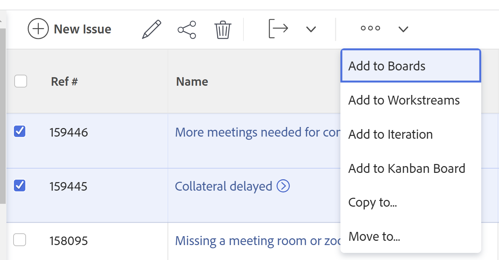
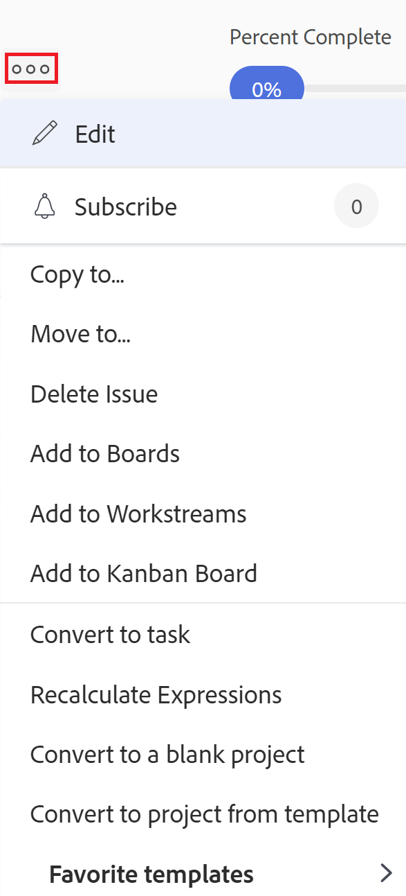
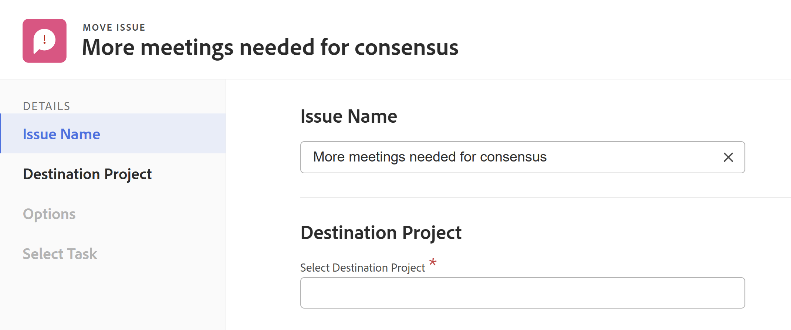
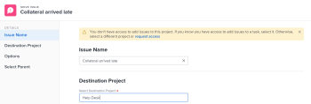

# Move issues

<!--Audited: 12/2024-->

<!--The highlighted information on this page refers to functionality not yet generally available. It is available only in the Preview environment for all customers. After the monthly releases to Production, the same features are also available in the Production environment for customers who enabled fast releases.    

For information about fast releases, see [Enable or disable fast releases for your organization](/help/quicksilver/administration-and-setup/set-up-workfront/configure-system-defaults/enable-fast-release-process.md). -->

You can move issues between the following objects:

* From a project to another project
* From a task to another task in the same project or in another project
* From a task to the project or to another project
* From a project to a task in the same project or a task in another project

## Access requirements

+++ Expand to view access requirements for the functionality in this article. 

You must have the following access to perform the steps in this article:

<table style="table-layout:auto"> 
 <col> 
 <col> 
 <tbody> 
  <tr> 
   <td role="rowheader">Adobe Workfront plan</td> 
   <td> 
Any
 </td> 
  </tr> 
  <tr> 
   <td role="rowheader">Adobe Workfront license*</td> 
   <td> 
New:
 
   <ul><li>Contributor or higher</li>
   <li>Light or higher to move issues in the Issues section of a project</li></ul>
   
Current:

   <ul>
   <li>
Request or higher
</li>
   <li>
Review or higher license to move issues in the Issues section of a project.
</li></ul>   
     </td> 
  </tr> 
  <tr> 
   <td role="rowheader">Access level configurations</td> 
   <td> 
Edit access to Issues
 
View or higher access to Projects and Tasks
 </td> 
  </tr> 
  <tr> 
   <td role="rowheader">Object permissions</td> 
   <td> 
Manage permissions to the issue
 
Contribute permissions to the item where you are moving the issue with the ability to Add Issues.</td> 
  </tr> 
 </tbody> 
</table>

*For information, see [Access requirements in Workfront documentation](/help/quicksilver/administration-and-setup/add-users/access-levels-and-object-permissions/access-level-requirements-in-documentation.md). 

+++

## Considerations about moving issues

Consider the following when moving issues that contain documents or are associated with a request queue:

* Your system or group administrator can prevent you from moving issues that have logged hours, depending on how they configure the Allow users to move tasks and issues with logged hours preference in the Setup area. For information, see [Configure system-wide task and issue preferences](/help/quicksilver/administration-and-setup/set-up-workfront/configure-system-defaults/set-task-issue-preferences.md). 

* **When an issue is associated with a requests queue:** When you move an issue to another object and the issue is associated with a request queue, the moved issue is no longer associated with the original queue the first issue originated from.
* **When a document is attached to the issue:** When you move an issue to another object and the issue has a document attached to it, the document, its versions and proofs also move to the new issue. Any approvals associated with the document do not move.
* **When an issue is linked to a document or a folder:** When you move an issue which has documents or folders linked to a a third party service like Google Drive, the links to the documents move with the issue. 

## Move issues in a list

You can move one or multiple issues from a list of issues or from an issue report.

1. Go to the project that contains the issue or issues that you want to move.

   Or

   Go to an issue report. 

1. If you selected to go to a project, click **Issues** in the left panel. 
1. Select the issue or issues that you want to move and click the **More menu** at the top of the issue list, then click **Move to**.

   

1. Continue with moving the issues, as described in the section [Move a single issue](#move-a-single-issue) starting with Step 2. 

## Move a single issue {#move-a-single-issue}

You can move one issue when viewing it.

### Move a single issue

1. Go to an issue that you want to move, click the **More** menu  to the right of the issue name, then click **Move to**.

   

   The **Move Issue** box displays.

   

1. In the **Select Destination Project** section, specify the name of the project where you want to move the issues. The name of the current project displays by default.

   >[!TIP]
   >
   >Only 100 projects display in the list.

1. (Conditional) Click **request access** if you do not have access to move issues to the project. 
1. (Conditional) Continue to move the issue on the selected destination project without requesting access if you have access to add issues to one of the tasks on the destination project.

   

   >[!TIP]
   >
   >Similar messages display if the project selected is in pending approval, completed, or dead, when the Workfront administrator prevents adding issues to these projects. For more information, see [Configure system-wide project preferences](../../../administration-and-setup/set-up-workfront/configure-system-defaults/set-project-preferences.md).

1. (Optional) In the **Options** section, deselect any of the items listed in the table below to remove them from the moved issue. All options are selected by default.

   >[!IMPORTANT]
   >
   >Deselecting items in the Options list results in loss of data. Information from the existing issue will be removed and cannot be recovered.

   <table style="table-layout:auto"> 
    <col> 
    <col> 
    <tbody> 
     <tr> 
      <td role="rowheader">Select all</td> 
      <td>Deselect this option to remove all information from the issue when moving it to its new location. </td> 
     </tr> 
     <tr> 
      <td role="rowheader">Assignments</td> 
      <td>Removes users, job roles, or teams that are assigned to the issue.</td> 
     </tr> 
     <tr> 
      <td role="rowheader">Progress</td> 
      <td>Removes the percent complete, if any, of the issue. </td> 
     </tr> 
     <tr> 
      <td role="rowheader">
Documents
</td> 
      <td> 
Removes everything in the documents tab, including document versions, linked documents, and folders.
      
      <b>NOTE</b>
     
     If you opt to not have the documents moved with the issue, the documents will be deleted and placed in the Recycle Bin for 30 days. An administrator can restore them and they will be restored on the moved issue. 
     
     If the issue is deleted after it's moved, the restored documents will be placed in the Documents area of the user page of the administrator who restores them.
        
 </td> 
     </tr> 
     <tr> 
      <td role="rowheader">Permissions</td> 
      <td>Removes the entities that the issue is shared with. </td> 
     </tr> 
     <tr> 
      <td role="rowheader">Updates</td> 
      <td>Removes comments from the Updates section of the issue.</td> 
     </tr> 
    </tbody> 
   </table>

1. (Optional) In the **Select Task** section, select the task where you want to move the issue. 
1. Click **Move issue** or **Move issues**, if you selected multiple issues in a list.

   The moved issues are added to the specified project.

