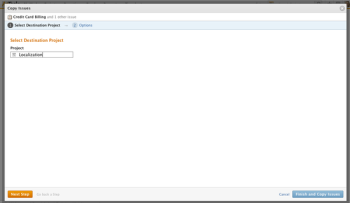
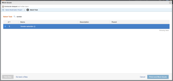
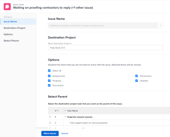

# Move issues

The highlighted information on this page refers to functionality not yet generally available. It is available only in the Preview Sandbox environment.

You can move issues between the following objects:

* From a project to another project
* From a task to another task in the same project or in another project
* From a task to the project or to another project
* From a project to a task in the same project or a task in another project

## Access requirements

You must have the following access to perform the steps in this article:

<table cellspacing="0"> 
 <col> 
 <col> 
 <tbody> 
  <tr> 
   <td role="rowheader">Adobe Workfront plan*</td> 
   <td> <p>Any</p> </td> 
  </tr> 
  <tr> 
   <td role="rowheader">Adobe Workfront license*</td> 
   <td> <p>Request or higher</p> <p>Review or higher license to move issues in the Issues section of a project.</p> </td> 
  </tr> 
  <tr> 
   <td role="rowheader">Access level configurations*</td> 
   <td> <p>Edit access to Issues</p> <p>View or higher access to Projects and Tasks</p> <p>Note: If you still don't have access, ask your Workfront administrator if they set additional restrictions in your access level. For information about access to issues in your Access Level, see <a href="../../../administration-and-setup/add-users/configure-and-grant-access/grant-access-issues.md" class="MCXref xref">Grant access to issues</a>. For information on how a Workfront administrator can change your access level, see <a href="../../../administration-and-setup/add-users/configure-and-grant-access/create-modify-access-levels.md" class="MCXref xref">Create or modify custom access levels</a>. </p> </td> 
  </tr> 
  <tr> 
   <td role="rowheader">Object permissions</td> 
   <td> <p>Manage permissions to the issue</p> <p>Contribute permissions to the item where you are moving the issue with the ability to&nbsp;Add Issues.</p> <p> For information about granting permissions to issues, see <a href="../../../workfront-basics/grant-and-request-access-to-objects/share-an-issue.md" class="MCXref xref">Share an issue in Adobe Workfront</a></p> <p>For information on requesting additional permissions, see <a href="../../../workfront-basics/grant-and-request-access-to-objects/request-access.md" class="MCXref xref">Request access to objects in Adobe Workfront</a>.</p> </td> 
  </tr> 
 </tbody> 
</table>

&#42;To find out what plan, license type, or access you have, contact your Workfront administrator.

## Considerations about moving issues

Consider the following when moving&nbsp;issues that contain documents or are associated with a request queue:

* **When an issue is associated with a requests queue:** When you move&nbsp;an issue to another object&nbsp;and the issue&nbsp;is associated with a request queue, the moved&nbsp;issue is no longer associated with the original queue&nbsp;the first issue originated from.
* **When a document is attached to the issue:**&nbsp;When you move&nbsp;an issue to another object&nbsp;and the issue has a document attached to it, the document, its versions and proofs also move to the new&nbsp;issue. Any approvals associated with the document do&nbsp;not move.
* **When an issue is linked to a document or a folder:**&nbsp;When you move&nbsp;an issue which has documents or folders linked to a a third party service like Google Drive, the&nbsp;links to the documents move with the issue.&nbsp;

##

## Move issues in a list

You can move one or multiple issues from a list of issues or from an issue report.

Moving issues differs depending on what environment you use.

* [Move issues in a list in the Production environment](#copy2) 
* [Move issues in a list in the Preview environment](#copy3)

### Move issues in a list in the Production&nbsp;environment

1. Go to a project whose issues you want to move.

   Or

   Go to an issue report.

1. If you selected a project, click the **Issues** section, then select the issue or issues you want to move in the list of issues.

   

1. Click the **More**&nbsp;drop-down menu  at the top of the issue list, then click **Move** **to**.

   

1. The **Move Issue** or **Move Issues** box displays. 

1. Specify&nbsp;the name of the project where you want to move the issues in the **Select Destination Project** section.

   >[!TIP]
   >
   >Only 50 projects display in the list.

   

1. Continue moving the issue as described in the section [Move a single issue](#copy5) in this article, starting with Step 3.

### Move issues in a list in the Preview environment

1. Go to the project that contains the issue or issues that you want to move.

   Or

   Go to an issue report. 

1. If you selected to go to a project, click **Issues** in the left panel. 
1. Select the issue or issues that you want to move and click the **More menu** at the top of the issue list, then click **Move to**.

   

1. Continue with moving the issue, as described in the section [Move a single issue in the Preview environment](#copy6) starting with Step 2.

## Move a single issue

You can move one issue when viewing it.

Moving issues differs depending on what environment you use.

* [Move a single issue in the Production environment](#copy4) 
* [Move a single issue in the Preview environment](#copy6)

### Move a single issue in the Production&nbsp;environment

1. Go to an issue that you want to move, then click the **More** menu  to the right of the issue name, then **Move** ```to```.

   

   The **Move Issue** box displays. 

1. Specify&nbsp;the name of the project where you want to move the issues in the **Select Destination Project** section. The name of the current project displays by default.

   >[!TIP]
   >
   >Only 50 projects display in the list.

1. (Optional) Click **Next Step.**

   Or

   Select **Task** to select a task to move the issue to.

   

1. (Optional)&nbsp;Click **Go back a Step** to go back to the previous screen in the Move Issue box. 
1. Click **Finish and Move Issue**.

   Or

   Click**Finish and Move Issues** when you copy multiple issues in a list.

   The copied issue is added to the specified project.&nbsp;

### Move a single issue in the Preview environment

1. Go to an issue that you want to copy, click the **More** menu to the right of the issue name, then select **Move** ```to```.

   

   The **Move Issue** box displays.

   

1. In the **Select Destination Project** section, specify&nbsp;the name of the project where you want to move the issues. The name of the current project displays by default.

   >[!TIP]
   >
   >Only 100 projects display in the list.

1. (Conditional) Click&nbsp;**request access** if you do not have access to move issues to the project. 
1. (Conditional) Continue to move the issue on the selected destination project without requesting access if you have access to add issues to one of the tasks on the destination project.

   

   >[!TIP]
   >
   >Similar messages display if the project selected is in pending approval, completed, or dead, when the Workfront administrator prevents adding issues to these projects.&nbsp;For more information, see [Configure system-wide project preferences](../../../administration-and-setup/set-up-workfront/configure-system-defaults/set-project-preferences.md).

1. (Optional) In the **Options** section, deselect any of the items listed in the table below to remove&nbsp;them&nbsp;from&nbsp;the moved issue. All options are selected by default.

   >[!IMPORTANT]
   >
   >Deselecting items in the Options list results in loss of data. Information from the existing issue will be removed and cannot be recovered.

   <table cellspacing="0"> 
    <col> 
    <col> 
    <tbody> 
     <tr> 
      <td role="rowheader">Select all</td> 
      <td>Deselect this option to remove all information from the issue when moving it to its new location. </td> 
     </tr> 
     <tr> 
      <td role="rowheader">Assignments</td> 
      <td>Removes users, job roles, or teams that are assigned to the issue.</td> 
     </tr> 
     <tr> 
      <td role="rowheader">Progress</td> 
      <td>Removes the percent complete, if any, of the issue. </td> 
     </tr> 
     <tr> 
      <td role="rowheader">Documents</td> 
      <td> <p><span style="line-height: 1.5;">Removes everything in the documents tab, including document versions, linked documents, and folders.</span> <br> </p> </td> 
     </tr> 
     <tr> 
      <td role="rowheader">Permissions</td> 
      <td>Removes the entities that the issue is shared with. </td> 
     </tr> 
     <tr> 
      <td role="rowheader">Updates</td> 
      <td>Removes comments from the Updates section of the issue.</td> 
     </tr> 
    </tbody> 
   </table>

1. (Optional) In the **Select Parent** section, select the task where you want to move the issue. 
1. Click **Move issue** or **Move issues**, if you selected multiple issues in a list.

   The moved issues are added to the specified project.&nbsp;

