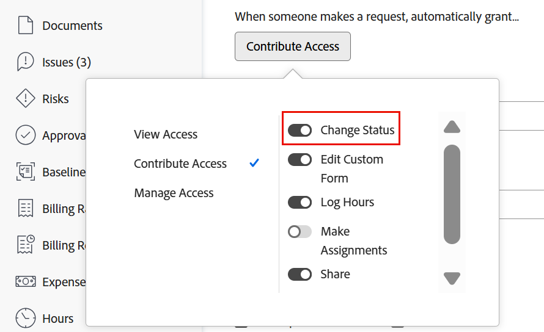

# Automatically update issue statuses from Awaiting Feedback to In Progress

When the Primary Contact of an issue makes an update to the issue by either updating a field (including a custom field) or adding a comment, the issue status updates to In Progress automatically.

In order for this automatic status change to occur, the following is required:

* The issue must be entered through a request queue.

  For information about creating request queues, see the [Create and manage Request Queues](../../../manage-work/requests/create-and-manage-request-queues/create-manage-request-queues.md) section. For information about creating requests, see [Create and submit Adobe Workfront requests](../../../manage-work/requests/create-requests/create-submit-requests.md).

* The Queue Details in the request queue must have these settings:  
  * **When someone makes a request, automatically grant** is set to **Contribute Access** 
  * **Change Status** is selected under Advanced Settings

  

  >[!IMPORTANT]
  >
  >  When setting up a request queue, you can define the access primary contacts have to the issues they submit. 
  >
  >When you deselect the Change Status setting when setting up the request queue, remember that system administrators always have access to change the status of issues, even if the Change Status option is deselected in the request queue settings. 

  For more information about Queue Details, see [Create a Request Queue](../../../manage-work/requests/create-and-manage-request-queues/create-request-queue.md).

* The issue must be in Awaiting Feedback status.
* There must be an Awaiting Feedback (AWF) status available for issues at the system level.

  For more information about system-level statuses, see [Create or edit a status](../../../administration-and-setup/customize-workfront/creating-custom-status-and-priority-labels/create-or-edit-a-status.md).
