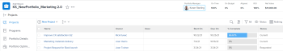

# Add projects to a portfolio

We recommend that you add projects&nbsp;to portfolios when you initiate them. However, you can add them to a portfolio at any time during their lifetime.

Consider the following when adding projects to portfolios:&nbsp;

* Although a portfolio may contain an unlimited number of projects, you can associate only one portfolio with a project. 
* A project remains in a portfolio until it is removed or associated&nbsp;with another portfolio.

## Access requirements

You must have the following access to perform the steps in this article:

<table cellspacing="0"> 
 <col> 
 <col> 
 <tbody> 
  <tr> 
   <td role="rowheader">Adobe Workfront plan*</td> 
   <td> 
Business or higher
 </td> 
  </tr> 
  <tr> 
   <td role="rowheader">Adobe Workfront license*</td> 
   <td> 
Plan 
 </td> 
  </tr> 
  <tr> 
   <td role="rowheader">Access level configurations*</td> 
   <td> 
View access to Portfolios or higher
 
Edit access to Projects
 
Note: If you still don't have access, ask your Workfront administrator if they set additional restrictions in your access level. For information on how a Workfront administrator can change your access level, see <a href="../../../administration-and-setup/add-users/configure-and-grant-access/create-modify-access-levels.md" class="MCXref xref">Create or modify custom access levels</a>.
 </td> 
  </tr> 
  <tr> 
   <td role="rowheader">Object permissions</td> 
   <td> 
View permissions to the portfolio
 
Manage permissions to the projects
 
For information on requesting additional access, see <a href="../../../workfront-basics/grant-and-request-access-to-objects/request-access.md" class="MCXref xref">Request access to objects in Adobe Workfront</a>.
 </td> 
  </tr> 
 </tbody> 
</table>

&#42;To find out what plan, license type, or access you have, contact your Workfront administrator.

## Add a project to a portfolio

1. <![CDATA[ ]]>Go to a portfolio, then click **Projects** in the left panel.

   

1. Click **New Project** and select a method for adding a project.

   >[!TIP]
   >
   >You cannot add project when you view the list of projects in the Milestone view.

   Select from the following options:

   <table cellspacing="0"> 
    <col> 
    <col> 
    <tbody> 
     <tr> 
      <td role="rowheader">Existing Project</td> 
      <td> 
Add a project that has already been created.
 </td> 
     </tr> 
     <tr> 
      <td role="rowheader">New Project</td> 
      <td> 
Add a new project. 
 
For more information about creating a new project, see <a href="../../../manage-work/projects/create-projects/create-project.md" class="MCXref xref">Create a project</a>.&nbsp;
 </td> 
     </tr> 
     <tr> 
      <td role="rowheader">Import a Project from&nbsp;MS&nbsp;Project </td> 
      <td> 
Add a project that you previously exported from MS&nbsp;Project and have saved on your computer. 
 
For more information about creating a new project by importing it from Microsoft Project, see <a href="../../../manage-work/projects/create-projects/import-project-from-ms-project.md" class="MCXref xref">Import a project from Microsoft Project</a>.
 </td> 
     </tr> 
     <tr> 
      <td role="rowheader">Request Project</td> 
      <td> 
Request that a project is approved.
 
For information about requesting projects, see <a href="../../../manage-work/projects/create-projects/request-project.md">Requesting a Project</a>. 
 </td> 
     </tr> 
     <tr> 
      <td role="rowheader">New from&nbsp;Template</td> 
      <td> 
Add a new project using an existing template. 
 
For more information about creating a project from a template, see <a href="../../../manage-work/projects/create-projects/create-project-from-template.md" class="MCXref xref">Create a project using a template</a>.
 </td> 
     </tr> 
    </tbody> 
   </table>

1. (Conditional) If you selected to add an existing project, start typing the name of a project in the **Add Projects** box, then click them when they appear in the list. You may add several projects at a time. 
1. Click **Add Projects**.

   The project or projects you selected are now associated with the portfolio.&nbsp;

