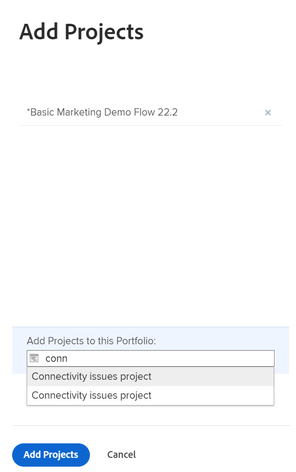

# Add projects to a portfolio

We recommend that you add projects to portfolios when you initiate them. However, you can add them to a portfolio at any time during their lifetime.

Consider the following when adding projects to portfolios: 

* Although a portfolio may contain an unlimited number of projects, you can associate only one portfolio with a project.
* A project remains in a portfolio until it is removed or associated with another portfolio.

## Access requirements

You must have the following access to perform the steps in this article:

<table style="table-layout:auto"> 
 <col> 
 <col> 
 <tbody> 
  <tr> 
   <td role="rowheader">[!DNL Adobe Workfront] plan*</td> 
   <td> 
[!UICONTROL Business] or higher
 </td> 
  </tr> 
  <tr> 
   <td role="rowheader">[!DNL Adobe Workfront] license*</td> 
   <td> 
[!UICONTROL Plan] 
 </td> 
  </tr> 
  <tr> 
   <td role="rowheader">Access level configurations*</td> 
   <td> 
[!UICONTROL View] access to Portfolios or higher
 
[!UICONTROL Edit] access to Projects
 
Note: If you still don't have access, ask your [!DNL Workfront] administrator if they set additional restrictions in your access level. For information on how a [!DNL Workfront] administrator can change your access level, see <a href="../../../administration-and-setup/add-users/configure-and-grant-access/create-modify-access-levels.md" class="MCXref xref">Create or modify custom access levels</a>.
 </td> 
  </tr> 
  <tr> 
   <td role="rowheader">Object permissions</td> 
   <td> 
[!UICONTROL View] permissions to the portfolio
 
[!UICONTROL Manage] permissions to the projects
 
For information on requesting additional access, see <a href="../../../workfront-basics/grant-and-request-access-to-objects/request-access.md" class="MCXref xref">Request access to objects </a>.
 </td> 
  </tr> 
 </tbody> 
</table>

&#42;To find out what plan, license type, or access you have, contact your [!DNL Workfront] administrator.

## Add a project to a portfolio

1. Go to a portfolio, then click **[!UICONTROL Projects]** in the left panel.

   

1. Click **[!UICONTROL New Project]** and select a method for adding a project.

   >[!TIP]
   >
   >You cannot add project when you view the list of projects in the [!UICONTROL Milestone] view.

   Select from the following options:

   <table style="table-layout:auto"> 
    <col> 
    <col> 
    <tbody> 
     <tr> 
      <td role="rowheader">[!UICONTROL Existing Project]</td> 
      <td> 
Add a project that has already been created.
 </td> 
     </tr> 
     <tr> 
      <td role="rowheader">[!UICONTROL New Project]</td> 
      <td> 
Add a new project. 
 
For more information about creating a new project, see <a href="../../../manage-work/projects/create-projects/create-project.md" class="MCXref xref">Create a project</a>. 
 </td> 
     </tr> 
     <tr> 
      <td role="rowheader">[!UICONTROL Import a Project from [!DNL MS Project]] </td> 
      <td> 
Add a project that you previously exported from [!DNL MS Project] and have saved on your computer. 
 
For more information about creating a new project by importing it from [!DNL Microsoft Project], see <a href="../../../manage-work/projects/create-projects/import-project-from-ms-project.md" class="MCXref xref">Import a project from [!DNL Microsoft Project]</a>.
 </td> 
     </tr> 
     <tr> 
      <td role="rowheader">[!UICONTROL Request Project]</td> 
      <td> 
Request that a project is approved.
 
For information about requesting projects, see <a href="../../../manage-work/projects/create-projects/request-project.md">Requesting a Project</a>. 
 </td> 
     </tr> 
     <tr> 
      <td role="rowheader">[!UICONTROL New from Template]</td> 
      <td> 
Add a new project using an existing template. 
 
For more information about creating a project from a template, see <a href="../../../manage-work/projects/create-projects/create-project-from-template.md" class="MCXref xref">Create a project using a template</a>.
 </td> 
     </tr> 
    </tbody> 
   </table>

   

1. (Conditional) If you selected to add an existing project, start typing the name of a project in the **[!UICONTROL Add Projects]** box, then click them when they appear in the list. You may add several projects at a time.

   

1. Click **[!UICONTROL Add Projects]**.

   The project or projects you selected are now associated with the portfolio. 
