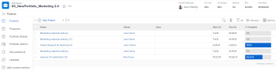

# Add projects to a portfolio

<!--Audited: 08/2025-->

<!--
The highlighted information on this page refers to functionality not yet generally available. It is available only in the Preview environment for all customers. The same features will also be available in the Production environment for all customers after a week from the Preview release.    

For more information, see [Interface modernization](/help/quicksilver/product-announcements/product-releases/interface-modernization/interface-modernization.md). 
-->

We recommend that you add projects to portfolios when you initiate them. However, you can add them to a portfolio at any time during their lifetime.

Consider the following when adding projects to portfolios: 

* You can associate only one portfolio with a project.
* A project remains in a portfolio until it is removed or associated with another portfolio.
* A portfolio may contain an unlimited number of projects.

>[!CAUTION]
>
>Inherited permissions may not be applied correctly when used across a large number of child objects. 
>   
>To help avoid inherited permissions issues, we recommend the following:
>
>* Limit the number of child objects (projects) under a single parent (portfolio or program). We recommend no more than 10,000 projects per portfolio or program.
>
>* Reduce inheritance depth by applying permissions at a lower-level object.  
>
>  For example, apply permissions directly at the project level rather than rely on the permissions inherited from the portfolio to the program, and then to the project.
>
>* Split programs to contain fewer projects, which reduces permission complexity.
>

## Access requirements

+++ Expand to view access requirements for the functionality in this article. 

<table style="table-layout:auto"> 
 <col> 
 <col> 
 <tbody> 
  <tr> 
   <td role="rowheader">[!DNL Adobe Workfront] package</td> 
   <td> 
Any

   </td> 
  </tr> 
  <tr> 
   <td role="rowheader">[!DNL Adobe Workfront] license</td> 
   <td>
Standard
 
   
[!UICONTROL Plan] 
 </td> 
  </tr> 
  <tr> 
   <td role="rowheader">Access level configuration</td> 
   <td> 
[!UICONTROL Edit] access Portfolios
 
[!UICONTROL Edit] access to Projects
 </td> 
  </tr> 
  <tr> 
   <td role="rowheader">Object permissions</td> 
   <td> 
[!UICONTROL Manage] permissions to the portfolio
 
[!UICONTROL Manage] permissions to the projects
  </td> 
  </tr> 
 </tbody> 
</table>

*For information, see [Access requirements in Workfront documentation](/help/quicksilver/administration-and-setup/add-users/access-levels-and-object-permissions/access-level-requirements-in-documentation.md).

+++

<!--
Old:

<table style="table-layout:auto"> 
 <col> 
 <col> 
 <tbody> 
  <tr> 
   <td role="rowheader">[!DNL Adobe Workfront] plan</td> 
   <td> 
Any

   </td> 
  </tr> 
  <tr> 
   <td role="rowheader">[!DNL Adobe Workfront] license*</td> 
   <td>
New: Standard
 
   
Current: [!UICONTROL Plan] 
 </td> 
  </tr> 
  <tr> 
   <td role="rowheader">Access level</td> 
   <td> 
[!UICONTROL Edit] access Portfolios
 
[!UICONTROL Edit] access to Projects
 </td> 
  </tr> 
  <tr> 
   <td role="rowheader">Object permissions</td> 
   <td> 
[!UICONTROL Manage] permissions to the portfolio
 
[!UICONTROL Manage] permissions to the projects
  </td> 
  </tr> 
 </tbody> 
</table>
-->

## Add a project to a portfolio

1. Go to a portfolio, then click **[!UICONTROL Projects]** in the left panel.

   

1. Click **[!UICONTROL New Project]** and select a method for adding a project.

   >[!TIP]
   >
   >You cannot add a project when you view the list of projects in the [!UICONTROL Milestone] view.

   Select from the following options:

   <table style="table-layout:auto"> 
    <col> 
    <col> 
    <tbody> 
      
     <tr> 
      <td role="rowheader">[!UICONTROL New Project]</td> 
      <td> 
Add a new project. 
 
For more information about creating a project, see <a href="../../../manage-work/projects/create-projects/create-project.md" class="MCXref xref">Create a project</a>. 
 </td> 
     </tr> 
     <tr> 
      <td role="rowheader">[!UICONTROL New Project (Legacy storage)]</td> 
      <td> 
Add a new Workfront storage project. 

      
The option displays only when your organization uses both Workfront and Adobe cloud document storage. Your Workfront instance might not have both types of storage.

       
For more information about creating a project, see <a href="../../../manage-work/projects/create-projects/create-project.md" class="MCXref xref">Create a project</a>. 
 </td> 
     </tr> 
     <tr> 
      <td role="rowheader">[!UICONTROL New Project from Template]</td> 
      <td> 
Add a new project using an existing template. 
 
For more information about creating a project from a template, see <a href="../../../manage-work/projects/create-projects/create-project-from-template.md" class="MCXref xref">Create a project using a template</a>.
 </td> 
     </tr> 
     <tr> 
      <td role="rowheader">[!UICONTROL Import [!DNL MS Project]] </td> 
      <td> 
Add a project that you previously exported from [!DNL MS Project] and have saved on your computer. 
 
For more information about creating a new project by importing it from [!DNL Microsoft Project], see <a href="../../../manage-work/projects/create-projects/import-project-from-ms-project.md" class="MCXref xref">Import a project from [!DNL Microsoft Project]</a>.
 </td> 
     </tr> 
     <tr> 
      <td role="rowheader">[!UICONTROL Request Project]</td> 
      <td> 
Request that a project is approved.
 
For information about requesting projects, see <a href="../../../manage-work/projects/create-projects/request-project.md">Requesting a Project</a>. 
 </td> 
     </tr> 
          <tr> 
      <td role="rowheader">[!UICONTROL Existing Project]</td> 
      <td> 
Add a project that has already been created.
 </td> 
     </tr>
    </tbody> 
   </table>

   <!-- update screen shot for both kinds of storages??-->

   

1. (Conditional) If you selected to add an existing project, the **Add projects** box opens. <!--check this after UI changes-->

    <!--check this after UI changes-->

1. Start typing the name of a project in the **[!UICONTROL Add projects to this portfolio]** field, then click them when they appear in the list.  <!--check this after UI changes-->

   You can add more than one project. 

   >[!NOTE]
   >
   >When your organization uses both legacy Workfront and Adobe cloud storage for documents, the following scenarios exist: 
   >
   >
   >* You cannot add a Legacy storage project to an Adobe cloud storage portfolio, or an Adobe cloud storage project to a Legacy storage portfolio. 
   >* You cannot create a project from an Adobe cloud storage template in a Legacy storage portfolio. 
   >* You can create a project from a Legacy storage template in an Adobe cloud storage portfolio, but the documents and folders on the template are not added to the new project. The project receives Adobe cloud storage.
   >
   >For more information, see [Document management overview for projects and related objects](/help/quicksilver/manage-work/projects/manage-projects/manage-documents-on-projects.md).
   >
   >Not all Workfront instances have both types of document storages.

1. (Optional) Click the **X** icon to the right of the project name to remove it from the list, if you decide not to add it to the portfolio.

   <!--replace last step with this, for unshim: 1. (Optional) Click the **Delete** icon  next to the name of a project if you decide not to add it to the portfolio.-->

1. Click **[!UICONTROL Add projects]**. <!--check this after UI changes-->

   The project or projects you selected are now associated with the portfolio. 
