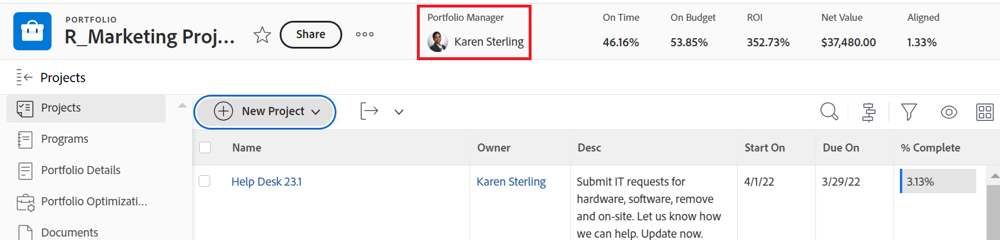

# Create a portfolio

<!--Audited: 7/2024-->

A Portfolio is a collection of projects competing for the same resources, budget, and schedule. The projects in a Portfolio are similar enough that they would use the same Resource Pool and be measured against the same scorecard.

You can use Portfolios to group projects that belong to the same product lines, divisions, departments, companies, or other business units.

## Access requirements

+++ Expand to view access requirements for the functionality in this article. 

<table style="table-layout:auto"> 
 <col> 
 <col> 
 <tbody> 
  <tr> 
   <td role="rowheader">[!DNL Adobe Workfront] plan*</td> 
   <td> 
New: Any

   
Current:[!UICONTROL Business] or higher
 </td> 
  </tr> 
  <tr> 
   <td role="rowheader">[!DNL Adobe Workfront] license*</td> 
   <td> 
New: [!UICONTROL Standard]

   
Current:[!UICONTROL Plan] 
 </td> 
  </tr> 
  <tr> 
   <td role="rowheader">Access level configurations</td> 
   <td> 
[!UICONTROL Edit] access to Portfolios
  </td> 
  </tr> 
  <tr> 
   <td role="rowheader">Object permissions</td> 
   <td> 
After you create a portfolio, you have Manage permissions to it, by default
  </td> 
  </tr> 
 </tbody> 
</table>

*For information, see [Access requirements in Workfront documentation](/help/quicksilver/administration-and-setup/add-users/access-levels-and-object-permissions/access-level-requirements-in-documentation.md). 

+++

## Create a portfolio

{{step1-click-main-menu}}

1. Click **[!UICONTROL Portfolios]**.
1. Click **[!UICONTROL New Portfolio]**.
1. Replace **[!UICONTROL Untitled Portfolio]** with the name you want for the portfolio.

   The name can contain up to 255 characters.

1. (Optional) Click the name under **[!UICONTROL Portfolio Manager]** in the header at the top of the page to assign a different manager for the portfolio.

   

   As the creator of the portfolio, you are assigned as the portfolio manager by default.

1. Click **[!UICONTROL Portfolio Details]** in the left panel.
1. In the **[!UICONTROL Overview]** area, change any of the following information:

   <table style="table-layout:auto"> 
    <col> 
    <col> 
    <tbody> 
     <tr> 
      <td role="rowheader">[!UICONTROL Description]</td> 
      <td> 
Type a description for the Portfolio to indicate what is unique about it. 
 </td> 
     </tr> 
     <tr> 
      <td role="rowheader">[!UICONTROL Portfolio Manager]</td> 
      <td> 
Start typing the name of a user that you want to indicate as the portfolio manager, then select it when it appears in the list. This is the same as the [!UICONTROL Portfolio Owner]. This is the person who can oversee the work defined in the projects of the portfolio and can approve the Business Case.
 
Important: When you designate someone as the [!UICONTROL Portfolio Manager], they automatically gain [!UICONTROL Manage] permissions to the portfolio, the programs and the projects in the portfolio. 
 
Tip: You can also update the [!UICONTROL Portfolio Manager] in the header at the top of the page.
 </td> 
     </tr> 
     <tr data-mc-conditions=""> 
      <td role="rowheader">Group </td> 
      <td> 
Add the name of a single group if the group owns the portfolio or has responsibility for completing it. 
 
You can make sure you are selecting the right group by hovering over it and clicking the [!UICONTROL information] icon  that displays next to it. This displays a tooltip listing information about the group, such as the hierarchy of groups above it and its administrators.
 
  
 </td> 
     </tr> 
    </tbody> 
   </table>

1. (Optional) Click inside the **[!UICONTROL Add custom form]** box in the upper-right corner of the [!UICONTROL Portfolio Details] page to select a custom form for the portfolio and update the custom fields.

   >[!TIP]
   >
   >You must have portfolio custom forms already created before you can attach them to portfolios.

1. Click **[!UICONTROL Save Changes]**.
1. (Optional) Click **[!UICONTROL Programs]** in the left panel, then **[!UICONTROL Add Programs]** to add programs to the portfolio.

   For more information about creating Programs, see [Create a program](../../../manage-work/portfolios/create-and-manage-programs/create-program.md).

1. (Optional) Click **[!UICONTROL Projects]** in the left panel, then **[!UICONTROL Add Projects]** to add projects to the portfolio.

   For more information about adding projects to a Portfolio, see [Add projects to a portfolio](../../../manage-work/portfolios/create-and-manage-portfolios/add-projects-to-portfolios.md).

<!--

<h2>Deactivate a portfolio</h2>

(NOTE: drafted this and moved it to their own article: delete-deactivate-portfolios)

When you deactivate a portfolio, you can still access it from the Portfolios area, but it no longer displays in the list of portfolios when users try to add it to a project.

<ol>
<li value="1">Click the <strong>Main Menu</strong> icon  in the upper-right corner of Adobe Workfront.</li>
<li value="2">Click <strong>Portfolios</strong> .</li>
<li value="3"> 
Click the name of the portfolio.
 </li>
<li value="4" data-mc-conditions="QuicksilverOrClassic.Quicksilver">Click the More menu  to the right of the portfolio name, then click <strong>Deactivate Portfolio</strong>.</li>
</ol>
<h2>Delete a portfolio</h2>
<ol>
<li value="1">Click the <strong>Main Menu</strong> icon  in the upper-right corner of Adobe Workfront.</li>
<li value="2"> 
Click <strong>Portfolios</strong> .
 </li>
<li value="3"> 
Select the portfolio, then click the Delete icon .
 </li>
<li value="4"> 
In the box that appears, click <strong>Yes, Delete It</strong> to confirm.
 </li>
</ol>

-->
