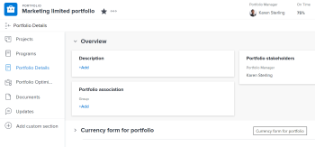
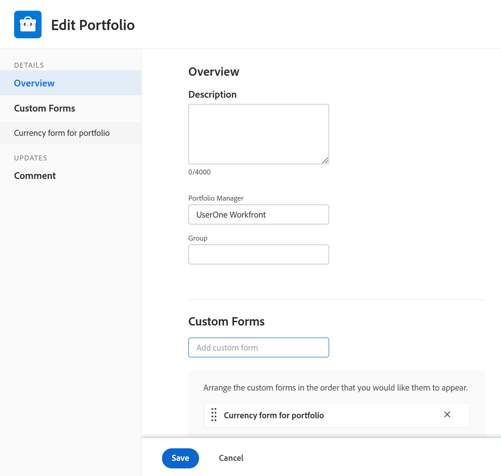
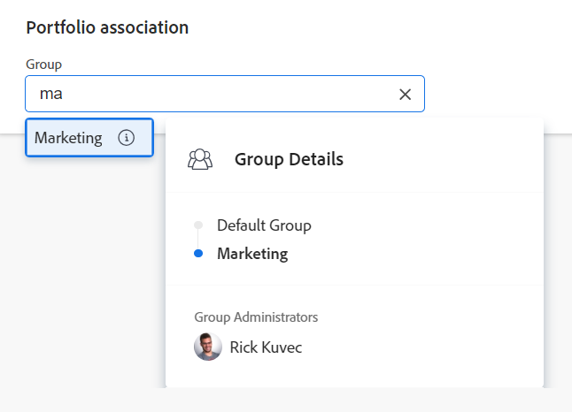
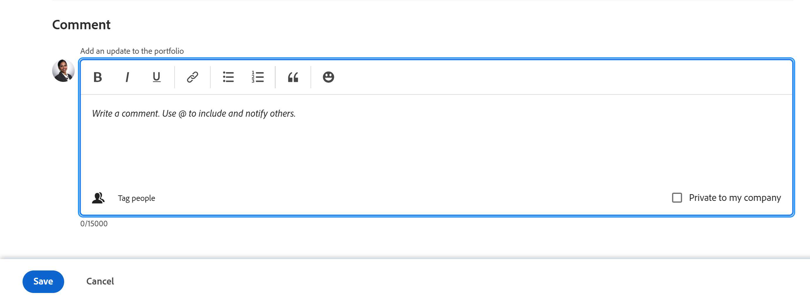

# Edit portfolios

You can edit information on portfolios that you have created, or that other users have created if they shared them with you.

You can edit a [!UICONTROL portfolio] in the portfolio page or you can edit portfolios in a list.

## Access requirements

+++ Expand to view access requirements for the functionality in this article. 

<table style="table-layout:auto"> 
 <col> 
 <col> 
 <tbody> 
  <tr> 
   <td role="rowheader">[!DNL Adobe Workfront] plan*</td> 
   <td> 
New: Any

   
Current:[!UICONTROL Business] or higher
 </td> 
  </tr> 
  <tr> 
   <td role="rowheader">Adobe [!DNL Workfront] licenses*</td> 
   <td> 
New: Standard

   
Current: [!UICONTROL Plan] 
 </td> 
  </tr> 
  <tr> 
   <td role="rowheader">Access level</td> 
   <td> 
[!UICONTROL Edit] access to Portfolios
  </td> 
  </tr> 
  <tr> 
   <td role="rowheader">Object permissions</td> 
   <td> 
[!UICONTROL Manage] permissions to a portfolio

   
 Manage permissions to the projects in the portfolio to add or remove them from the portfolio
  </td> 
  </tr> 
 </tbody> 
</table>

*For information, see [Access requirements in Workfront documentation](/help/quicksilver/administration-and-setup/add-users/access-levels-and-object-permissions/access-level-requirements-in-documentation.md).

+++ 

## Edit portfolios

{{step1-to-portfolios}}

1. Click the name of a portfolio to open it.
1. (Optional) To edit limited information about the portfolio, click **[!UICONTROL Portfolio Details]** in the left panel.

   

   <!--
   
(NOTE: the note below will also be true for Edit Portfolio box)

   -->

   >[!NOTE]
   >
   >Depending on how your [!DNL Workfront] administrator or Group administrator modified your Layout Template, the fields in the [!UICONTROL Portfolio Details] area might be rearranged or not display. For information, see [Customize the [!UICONTROL Details] view using a layout template](../../../administration-and-setup/customize-workfront/use-layout-templates/customize-details-view-layout-template.md).

   To edit information in the [!UICONTROL Details] section, do the following:

   1. (Optional) Click the **[!UICONTROL Collapse All]** icon in the upper-right corner to collapse all areas.
   1. (Optional and conditional) When an area is collapsed, click the **right-pointing arrow**  next to each area to expand the area you want to edit.
   1. For information about the fields visible in the [!UICONTROL Portfolio Details] section, continue with editing the portfolio in the [!UICONTROL Edit Portfolio] box as described below.
   1. (Optional) If there are no custom forms attached to the portfolio, start typing the name of a form in the **[!UICONTROL Add custom form]** field, select it when it displays in the list, then click **[!UICONTROL Save Changes]**.
   1. (Optional) Click the **[!UICONTROL Export]** icon  to export the [!UICONTROL Overview] and custom forms information to a PDF file, then click **[!UICONTROL Export]**. Select from the following:

      * Select all (displays only when there is at least one custom form attached)
      * Overview
      * The name of one or multiple custom forms

      The PDF file downloads to your computer.

      

      For more information, see [Export custom forms and object details](../../../workfront-basics/work-with-custom-forms/export-custom-forms-details.md).

1. To edit all information about one or more portfolios do one of the following:

   <!--
   
(NOTE: this might have to be split in two sections if the single edit and the bulk edit won't come at the same time for portfolios)

   -->

   * Click the **[!UICONTROL More]** menu next to the portfolio name, then **[!UICONTROL Edit].**

      <!--   
     
(NOTE: this will change in NWE with a new Edit Portfolio UI)
   
     -->

   * Go to a list of portfolios and select one or more portfolio that you want to edit, then click the **[!UICONTROL Edit]** icon  at the top of the list.

      <!--   
     
(NOTE: this will need to split into another section when they release the new [!UICONTROL Edit Portfolio] UI)
   
     -->
   The **[!UICONTROL Edit Portfolio]** dialog box displays.

   

   All portfolio fields are available in the [!UICONTROL Edit Portfolio] box and are grouped by the areas listed in the left panel.

1. Consider specifying information in any of the following sections:

   * [[!UICONTROL Overview]](#overview)
   * [Custom Forms](#Custom%C2%A0F)
   * [Comment](#comment)

### [!UICONTROL Overview] {#overview}

1. Begin editing a portfolio as described above.
1. Click **[!UICONTROL Overview]** and specify the following fields:

   <!--
   
(NOTE: note below is drafted: drafted till they release new Edit Portfolio boxes)

   -->

   <!--
   <note type="note">
   Depending on how your Workfront administrator or Group administrator sets up our Layout Template, the fields in the Edit Portfolio box might be rearranged or not display. For information, see
   <a href="../../../administration-and-setup/customize-workfront/use-layout-templates/customize-details-view-layout-template.md" class="MCXref xref">Customize the Details view using a layout template</a>.
   </note>
   -->

   <table style="table-layout:auto"> 
    <col> 
    <col> 
    <tbody> 
     <tr> 
      <td role="rowheader">[!UICONTROL Name]</td> 
      <td> 
Update the name of the portfolio. 
 
Tip: This is not available when you selected more than one portfolio. 
 </td> 
     </tr> 
     <tr> 
      <td role="rowheader">[!UICONTROL Description]</td> 
      <td> 
Type a description for the Portfolio to indicate what is unique about it. 
 </td> 
     </tr> 
     <tr> 
      <td role="rowheader">[!UICONTROL Portfolio Manager]</td> 
      <td> 
Start typing the name of a user that you want to indicate as the portfolio manager, then select it when it appears in the list. This is the same as the [!UICONTROL Portfolio Owner]. This is the person who can oversee the work defined in the projects of the portfolio and can approve the Business Case.
 
Important: When you designate someone as the Portfolio Manager, they automatically gain [!UICONTROL Manage] permissions to the portfolio, the programs and the projects in the portfolio. 
 
Tip: You can quickly update the portfolio manager in the portfolio header. 
 </td> 
     </tr> 
     <tr> 
      <td role="rowheader">[!UICONTROL Group]</td> 
      <td> 
Add the name of a single group if the group is associated with the portfolio or has responsibility for completing it. 
 
Tip:  
When accessing the [!UICONTROL Group] field from the [!UICONTROL Portfolio Details] page, do the following: 
 
You can make sure you are selecting the right group by hovering over it and clicking the [!UICONTROL information] icon  that displays next to it. This displays a tooltip listing information about the group, such as the hierarchy of groups above it and its administrators.
 
  
 
This option is not available in the [!UICONTROL Edit Portfolio] box. 
 
 </td> 
     </tr> 
     <tr> 
      <td role="rowheader"> 
[!UICONTROL Alignment Scorecard]
 </td> 
      <td> 
Select the alignment scorecard that you want to use from the drop-down list. A scorecard is used to measure how well a project aligns with the established criteria of a Portfolio often reflecting an organization's mission, values, and strategic goals. For more information, see <a href="../../../manage-work/projects/define-a-business-case/apply-scorecard-to-project-to-generate-alignment-score.md" class="MCXref xref">Apply a scorecard to a project and generate an Alignment Score</a> and <a href="../../../administration-and-setup/set-up-workfront/configure-system-defaults/create-scorecard.md" class="MCXref xref">Create a scorecard</a>.
 </td> 
     </tr> 
     <tr> 
      <td role="rowheader">[!UICONTROL Is Active]</td> 
      <td> 
 Select this checkbox if you want the portfolio to be active. Other users can find active portfolios and attach them to projects when creating or editing projects. Inactive portfolios cannot be attached to projects. This is enabled by default.
 </td> 
     </tr> 
    </tbody> 
   </table>

1. Click **[!UICONTROL Save Changes]** or continue editing the following sections.

### Custom Forms

1. Begin editing the portfolio as described above.
1. Click the **[!UICONTROL Add Forms]** drop-down menu to select a custom forms and add it to the portfolio.

   You must create portfolio custom forms before they are available to add.

   >[!NOTE]
   >
   >Depending on how your [!DNL Workfront] administrator set the permissions for the sections in your custom form, not everyone can view or edit the same fields on a given custom form. The permissions to edit fields within a section of a custom form depend on the permissions you have on the portfolio itself. For information about setting permissions on sections of a custom form, see [Design a form with the form designer](/help/quicksilver/administration-and-setup/customize-workfront/create-manage-custom-forms/form-designer/design-a-form/design-a-form.md).

1. Update any fields in the custom forms, then click **[!UICONTROL Save Changes]** or continue with the following section.

### Comment {#comment}

1. Begin editing a portfolio as described above.
1. Click **[!UICONTROL Comment]**.

   

1. Add a comment in the **[!UICONTROL Post an update to the portfolio]** field.
1. (Optional) Click the **[!UICONTROL People]** icon to add a user or a team to the comment.
1. (Optional) Click the **[!UICONTROL Lock]** icon to lock the comment and make it private to only users in your company.
1. Click **[!UICONTROL Save Changes]**.
