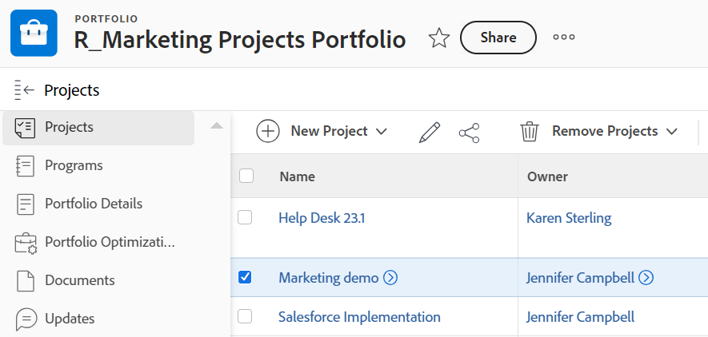

# Remove a project from a portfolio

<!--Audited: 7/2024-->

You can remove a project from a portfolio and associate it with a different portfolio or you can completely remove the association between a project and a portfolio.

You can also delete projects from a portfolio which also removes them from [!DNL Adobe Workfront].

## Access requirements

+++ Expand to view access requirements for the functionality in this article. 

<table style="table-layout:auto"> 
 <col> 
 <col> 
 <tbody> 
  <tr> 
   <td role="rowheader">[!DNL Adobe Workfront] plan*</td> 
   <td> 
New: Any

   
Current: [!UICONTROL Business] or higher
 </td> 
  </tr> 
  <tr> 
   <td role="rowheader">[!DNL Adobe Workfront] license*</td> 
   <td> 
New: Standard

   
Current: [!UICONTROL Plan] 
 </td> 
  </tr> 
  <tr> 
   <td role="rowheader">Access level</td> 
   <td> 
[!UICONTROL Edit] access to Projects
 
[!UICONTROL Edit] access to Portfolios
  </td> 
  </tr> 
  <tr> 
   <td role="rowheader">Object permissions</td> 
   <td> 
[!UICONTROL Manage] permissions on the portfolio and the projects to remove projects

   
[!UICONTROL Manage] permissions with [!UICONTROL Delete] access to the projects to delete them from the portfolio
 </td> 
  </tr> 
 </tbody> 
</table>

*For information, see [Access requirements in Workfront documentation](/help/quicksilver/administration-and-setup/add-users/access-levels-and-object-permissions/access-level-requirements-in-documentation.md). 

+++

## Remove a project from a portfolio

1. Go to a Portfolio and click **[!UICONTROL Projects]** in the left panel.
1. Select the project to be removed.&nbsp;

   

1. Click&nbsp;**[!UICONTROL Remove Projects]**.
1. Click either **[!UICONTROL Delete]** to delete the project from [!DNL Workfront], or **[!UICONTROL Remove]** **[!UICONTROL from Portfolio]** to remove it from the selected Portfolio.

1. (Optional and conditional) Find the project you removed from the portfolio and associate it with another portfolio. For information about associating projects with portfolios see [Add projects to a portfolio](../../../manage-work/portfolios/create-and-manage-portfolios/add-projects-to-portfolios.md).
