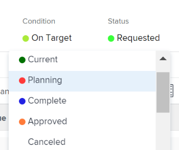

# Review Requested Projects

When multiple project requests are submitted for review, the project management office or portfolio committee can meet to review submitted requests and determine project request approvals. Project requests display as projects with a status of [!UICONTROL Requested] in [!DNL Adobe Workfront].

You can submit a project request for review by doing one of the following:

* Change the project status to **[!UICONTROL Requested]**.
* Complete the [!UICONTROL Business Case] of the project and submit it for approval.\
   For more information about completing a Business Case for a project, see [Create a Business Case for a project](../../../manage-work/projects/define-a-business-case/create-business-case.md).

You can review requested projects in the following areas of [!DNL Adobe Workfront]:

* In a project report
* Within a portfolio

## Access requirements

+++ Expand to view access requirements for the functionality in this article. 

<table style="table-layout:auto"> 
 <col> 
 <col> 
 <tbody> 
  <tr> 
   <td role="rowheader">[!DNL Adobe Workfront] package</td> 
   <td>
Any
 </td> 
  </tr> 
  <tr> 
   <td role="rowheader">[!DNL Adobe Workfront] license</td> 
   <td> 
[!UICONTROL Standard] 
 
   
[!UICONTROL Plan]
 </td> 
  </tr> 
  <tr> 
   <td role="rowheader">Access level configurations</td> 
   <td> 
[!UICONTROL View] access or higher to Portfolios
 
[!UICONTROL Edit] access to Projects
  </td> 
  </tr> 
  <tr> 
   <td role="rowheader">Object permissions</td> 
   <td> 
[!UICONTROL View] permissions or higher on the portfolio
 
[!UICONTROL Manage] permissions on the projects to update their status
  </td> 
  </tr> 
 </tbody> 
</table>

*For information, see [Access requirements in Workfront documentation](/help/quicksilver/administration-and-setup/add-users/access-levels-and-object-permissions/access-level-requirements-in-documentation.md). 

+++

<!--Old:

<table style="table-layout:auto"> 
 <col> 
 <col> 
 <tbody> 
  <tr> 
   <td role="rowheader">[!DNL Adobe Workfront] plan</td> 
   <td>
Any
 </td> 
  </tr> 
  <tr> 
   <td role="rowheader">[!DNL Adobe Workfront] license*</td> 
   <td> 
[!UICONTROL Plan] 
 </td> 
  </tr> 
  <tr> 
   <td role="rowheader">Access level configurations</td> 
   <td> 
[!UICONTROL View] access or higher to Portfolios
 
[!UICONTROL Edit] access to Projects
  </td> 
  </tr> 
  <tr> 
   <td role="rowheader">Object permissions</td> 
   <td> 
[!UICONTROL View] permissions or higher on the portfolio
 
[!UICONTROL Manage] permissions on the projects to update their status
  </td> 
  </tr> 
 </tbody> 
</table>-->

## Review Requested Projects in a project report

You can build a report for projects to see what projects have a status of [!UICONTROL Requested].

For more information about approving project requests by building a project report, see the [[!UICONTROL Approving the Business Case by Building a Project Report]](../../../manage-work/projects/define-a-business-case/approve-business-case.md#build-a-report) section in [Approve a Business Case](../../../manage-work/projects/define-a-business-case/approve-business-case.md).&nbsp;

## Review Requested Projects within a portfolio

1. Go to the portfolio whose requested projects you want to review.
1. Click&#x200B;**[!UICONTROL Projects]** in the left panel
1. From the **[!UICONTROL Filter]** drop-down menu, select **[!UICONTROL Requested]**.

   Only projects with a status of **[!UICONTROL Requested]** display in the list.

   >[!TIP]
   >
   >&nbsp;In addition to having a Status of **[!UICONTROL Requested]**, projects must be associated with the selected Portfolio to&nbsp;display in this list.

1. Click the name of a project in the list to open it.
1. Click **[!UICONTROL Project Details]** in the left panel.
1. Do either one of the following:

   * Click&nbsp;**[!UICONTROL Business Case]**, then click&nbsp;**[!UICONTROL Approve]** or&nbsp;**[!UICONTROL Reject]** in the [!UICONTROL Business Case Summary] area to approve or reject the Business Case.

      

      The project status is changed to **[!UICONTROL Approved]** if the Business Case is approved.

      The project status is changed to **[!UICONTROL Rejected]** if the Business case is rejected.

      >[!NOTE]
      >
      >There are no notifications that alert the user who submitted the approval of the business case whether their project request was approved or rejected.&nbsp;

      Or

   * Change the status of the project to any other status in the **[!UICONTROL Status]** drop-down menu.

      
   &nbsp;

&nbsp;
