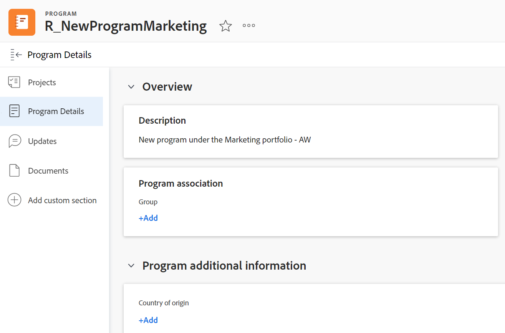
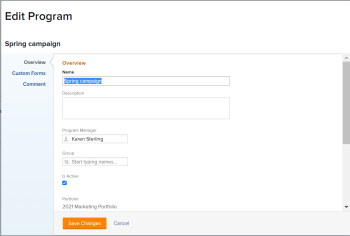

# Edit programs

You can edit information on programs that you have created, or that other users have created if they shared them with you.

You can edit a program in the program page or you can edit programs in a list.

## Access requirements

You must have the following access to perform the steps in this article:

<table style="table-layout:auto"> 
 <col> 
 <col> 
 <tbody> 
  <tr> 
   <td role="rowheader">[!DNL Adobe Workfront] plan*</td> 
   <td> 
Any
 </td> 
  </tr> 
  <tr> 
   <td role="rowheader">[!DNL Adobe Workfront] license*</td> 
   <td> 
[!UICONTROL Plan] 
 </td> 
  </tr> 
  <tr> 
   <td role="rowheader">Access level*</td> 
   <td> 
[!UICONTROL Edit] access to Programs
 
Note: If you still don't have access, ask your [!DNL Workfront] administrator if they set additional restrictions in your access level. For information about access to programs in your Access Level, see <a href="../../../administration-and-setup/add-users/configure-and-grant-access/grant-access-programs.md" class="MCXref xref">Grant access to programs</a>. For information on how a [!DNL Workfront] administrator can change your access level, see <a href="../../../administration-and-setup/add-users/configure-and-grant-access/create-modify-access-levels.md" class="MCXref xref">Create or modify custom access levels</a>. 
 </td> 
  </tr> 
  <tr> 
   <td role="rowheader">Object permissions</td> 
   <td> 
[!UICONTROL Manage] permissions to a program
 
 For information about granting permissions to programs, see <a href="../../../workfront-basics/grant-and-request-access-to-objects/share-a-program.md" class="MCXref xref">Share a program </a>. 
 
For information on requesting additional permissions, see <a href="../../../workfront-basics/grant-and-request-access-to-objects/request-access.md" class="MCXref xref">Request access to objects </a>.
 </td> 
  </tr> 
 </tbody> 
</table>

&#42;To find out what plan, license type, or access you have, contact your [!DNL Workfront] administrator.

## Edit programs

1. Go to the **[!UICONTROL Main Menu]**.
1. Click **[!UICONTROL Programs]**, then click the name of a program to open it.

   >[!TIP]
   >
   >You can access a program from the portfolio that it is associated with by going to the portfolio first, then clicking **[!UICONTROL Programs]** in the left panel. For more information, see [Create a program](../../../manage-work/portfolios/create-and-manage-programs/create-program.md).

1. (Optional) To edit limited information about the program, click **[!UICONTROL Program Details]** in the left panel.

   >[!TIP]
   >
   >If you want to edit all information about the program, go to step 4.   

   

   >[!NOTE]
   >
   >Depending on how your [!DNL Workfront] administrator or Group administrator modified your Layout Template, the fields in the [!UICONTROL Program Details] area might be rearranged or not display. For information, see [Customize the [!UICONTROL Details] view using a layout template](../../../administration-and-setup/customize-workfront/use-layout-templates/customize-details-view-layout-template.md).

   <!--
   
(NOTE: the above note will also come to the Edit Program box)

   -->

   To edit information in the [!UICONTROL Details] section, do the following:

   1. (Optional) Click the **[!UICONTROL Collapse All]** icon in the upper-right corner to collapse all areas.
   1. (Optional and conditional) When an area is collapsed, click the **right-pointing arrow**  next to each area to expand the area you want to edit.
   1. For information about the fields visible in the [!UICONTROL Program Details] section, continue with editing the program in the [!UICONTROL Edit Program] box as described below.
   1. (Optional) If there are no custom forms attached to the program, start typing the name of a form in the **[!UICONTROL Add custom form]** field, select it when it displays in the list, then click&nbsp;**[!UICONTROL Save Changes]**.
   1. (Optional) Click the **[!UICONTROL Export]** icon  to export the [!UICONTROL Overview] and custom forms information to a PDF file, then click **[!UICONTROL Export]**. Select from the following:

      * Select all (displays only when there is at least one custom form attached)
      * [!UICONTROL Overview]
      * The name of one or multiple custom forms

      The PDF file downloads to your computer.

      

      For more information, see [Export custom forms and object details](../../../workfront-basics/work-with-custom-forms/export-custom-forms-details.md).

1. To edit all information about one or more programs do one of the following:

   * Click the **[!UICONTROL More]** menu  next to the program name, then&#x200B;**[!UICONTROL Edit].**
   * Go to a list of programs and select one or more program that you want to edit, then click the **[!UICONTROL Edit]** icon  at the top of the list.

   The **[!UICONTROL Edit Program]** dialog box displays.

   

   All program fields are available in the [!UICONTROL Edit Program] box and are grouped by the areas listed in the left panel.

1. Consider specifying information in any of the following sections:

   * [[!UICONTROL Overview]](#overview)
   * [[!UICONTROL Custom Forms]](#Custom%C2%A0F)
   * [[!UICONTROL Comment]](#comment)

### [!UICONTROL Overview] {#overview}

1. Begin editing a program as described above.
1. Click **[!UICONTROL Overview]** and specify the following fields:

   <!--
   
(NOTE:&nbsp;note below drafted for now)

   -->

   <!--
   <note type="note">
   Depending on how your Workfront administrator or Group administrator sets up our Layout Template, the fields in the Edit Program box might be rearranged or not display. For information, see
   <a href="../../../administration-and-setup/customize-workfront/use-layout-templates/customize-details-view-layout-template.md" class="MCXref xref">Customize the Details view using a layout template</a>.
   </note>
   -->

   <table style="table-layout:auto"> 
    <col> 
    <col> 
    <tbody> 
     <tr> 
      <td role="rowheader">[!UICONTROL Name]</td> 
      <td> 
Update the name of the program. 
 
Tip: This is not available when you selected more than one program. 
 </td> 
     </tr> 
     <tr> 
      <td role="rowheader">[!UICONTROL Description]</td> 
      <td> 
Type a description for the Portfolio to indicate what is unique about it. 
 </td> 
     </tr> 
     <tr> 
      <td role="rowheader">[!UICONTROL Program Manager]</td> 
      <td> 
Start typing the name of a user that you want to indicate as the program manager, then select it when it appears in the list. This is the person who can oversee the work defined in the projects of the program. 
 
Important: When you designate someone as the Program Manager, they automatically gain [!UICONTROL Manage] permissions to the program and the projects in the program. 
 
Tip: You can quickly update the program manager in the program header. 
 </td> 
     </tr> 
     <tr> 
      <td role="rowheader">[!UICONTROL Group]</td> 
      <td> 
Add the name of a single group if the group is associated with the program or has responsibility for completing it. 
 
Tip:  
When accessing the [!UICONTROL Group] field from the [!UICONTROL Program Details] page, do the following: 
 
You can make sure you are selecting the right group by hovering over it and clicking the [!UICONTROL information] icon  that displays next to it. This displays a tooltip listing information about the group, such as the hierarchy of groups above it and its administrators.
 
  
 
This option is not available in the [!UICONTROL Edit Program] box. 
 
 </td> 
     </tr> 
     <tr> 
      <td role="rowheader">[!UICONTROL Is Active]</td> 
      <td> 
 Select this checkbox if you want the program to be active. Other users can find active programs and attach them to projects or add them to portfolios. Inactive programs cannot be attached to projects or portfolios. This is enabled by default.
 </td> 
     </tr> 
    </tbody> 
   </table>

1. Click **[!UICONTROL Save Changes]** or continue editing the following sections.

### [!UICONTROL Custom Forms]

1. Begin editing the program as described above.
1. Click the **[!UICONTROL Add Forms]** drop-down menu to select a custom forms and add it to the program.

   You must create program custom forms before they are available to add.

   >[!NOTE]
   >
   >Depending on how your [!DNL Workfront] administrator set the permissions for the sections in your custom form, not everyone can view or edit the same fields on a given custom form. The permissions to edit fields within a section of a custom form depend on the permissions you have on the program itself. For information about setting permissions on sections of a custom form, see [Design a form with the form designer](/help/quicksilver/administration-and-setup/customize-workfront/create-manage-custom-forms/form-designer/design-a-form/design-a-form.md).

1. Update any fields in the custom forms, then click **[!UICONTROL Save Changes]** or continue with the following section.

### [!UICONTROL Comment] {#comment}

1. Begin editing a program as described above.
1. Click&nbsp;**[!UICONTROL Comment]**.

   

1. Add a comment in the **[!UICONTROL Post an update to the program]** field.
1. (Optional) Click the **[!UICONTROL People]** icon to add a user or a team to the comment.
1. (Optional)&nbsp;Click the **[!UICONTROL Lock]** icon to lock the comment and make it private to only users in your company.

   After you save your changes, the comment you add displays in the program's [!UICONTROL Updates] tab and sends an email to the users included in it.
