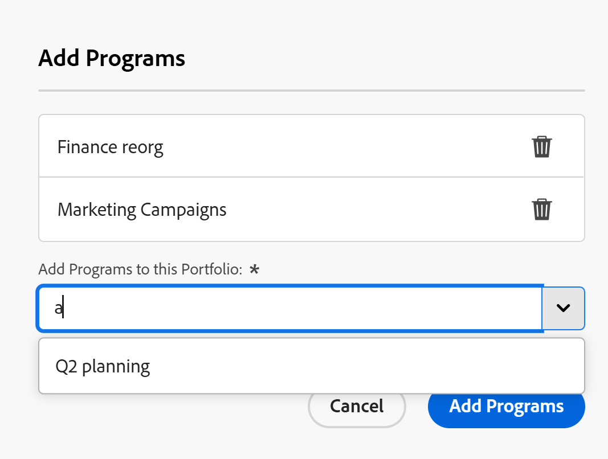

# Add an existing program to a portfolio

<!--Audited: 5/2025-->

<!--The highlighted information on this page refers to functionality not yet generally available. It is available only in the Preview environment for all customers. The same features will also be available in the Production environment for all customers after a week from the Preview release.    

For more information, see [Interface modernization](/help/quicksilver/product-announcements/product-releases/interface-modernization/interface-modernization.md). -->

You can add existing programs to a portfolio. Because programs cannot exist in two different portfolios, adding an existing program permanently moves it from one portfolio to another. 

## Access requirements

+++ Expand to view access requirements for the functionality in this article.

You must have the following access to perform the steps in this article:

<table style="table-layout:auto"> 
 <col> 
 <col> 
 <tbody> 
  <tr> 
   <td role="rowheader">[!DNL Adobe Workfront] plan</td> 
   <td> 
Any
 </td> 
  </tr> 
  <tr> 
   <td role="rowheader">[!DNL Adobe Workfront] license*</td> 
   <td> 
New: [!UICONTROL Standard] 

Or 

Current: [!UICONTROL Plan] 
 </td> 
  </tr> 
  <tr> 
   <td role="rowheader">Access level configurations</td> 
   <td> 
[!UICONTROL Edit] access to Portfolios and Programs 
 </td> 
  </tr> 
  <tr> 
   <td role="rowheader">Object permissions</td> 
   <td> 
[!UICONTROL Manage] permissions to the portfolio and the program
 </td> 
  </tr> 
 </tbody> 
</table>

*For information, see [Access requirements in Workfront documentation](/help/quicksilver/administration-and-setup/add-users/access-levels-and-object-permissions/access-level-requirements-in-documentation.md). 

+++

## Add an existing program to a portfolio

1. Go to a portfolio, then click **[!UICONTROL Programs]** in the left panel.
1. Click **[!UICONTROL New Program]**.
1. Click **[!UICONTROL Existing Program]**.

   The **Add Programs** box opens. <!--check screen shot - I logged changes for this casing-->

   

   >[!IMPORTANT]
   >
   >Adding an existing program carries all projects associated with that program to the portfolio. Be careful not to unintentionally move projects this way.

1. In the **[!UICONTROL Add Programs to this Portfolio]** field, type the name of a program, then select it when it displays in the list. <!--see the name of this field, I suggested changes here-->

   You can add more than one program.

1. (Optional) Click the **Delete** icon  next to the name of a program if you decide not to add it to the portfolio.

1. Click **[!UICONTROL Add Programs]**. <!--check this button in the UI after they implemented the changes??-->

   The program displays in the **[!UICONTROL Programs]** tab on the portfolio you selected.
