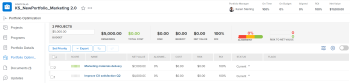

# Locate the [!UICONTROL Portfolio Optimizer]

You can find the [!UICONTROL Portfolio Optimizer] when you access a portfolio.

## Access requirements

+++ Expand to view access requirements for the functionality in this article. 

You must have the following access to perform the steps in this article:

<table style="table-layout:auto"> 
 <col> 
 <col> 
 <tbody> 
  <tr> 
   <td role="rowheader">[!DNL Adobe Workfront] plan</td> 
   <td> 
Any
 </td> 
  </tr> 
  <tr> 
   <td role="rowheader">[!DNL Adobe Workfront] license*</td> 
   <td> 
New: Standard

   
Current: [!UICONTROL Plan] 
 </td> 
  </tr> 
  <tr> 
   <td role="rowheader">Access level configurations*</td> 
   <td> 
[!UICONTROL Edit] access to Portfolios and Projects
  </td>
</tr> 
  <tr> 
   <td role="rowheader">Object permissions</td> 
   <td> 
[!UICONTROL Manage] permissions to the portfolio
  </td> 
  </tr> 
 </tbody> 
</table>

*For information, see [Access requirements in Workfront documentation](/help/quicksilver/administration-and-setup/add-users/access-levels-and-object-permissions/access-level-requirements-in-documentation.md). 

+++

## Locate the [!UICONTROL Portfolio Optimizer]

1. From the **[!UICONTROL Main Menu]**, click **[!UICONTROL Portfolios]**.

   The portfolios you own display by default.

1. (Optional) From the **[!UICONTROL Filter]** drop-down menu, select to view a different set of portfolios.
1. Click the name of a portfolio to access it.
1. Click **[!UICONTROL Portfolio Optimization]** in the left panel.

   The [!UICONTROL Portfolio Optimizer] displays.

   
