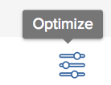

# Optimize projects in the [!UICONTROL Portfolio Optimizer]

You can use the [!UICONTROL Portfolio Optimizer] to prioritize your projects based on their scores and other values. The [!UICONTROL Optimizer] takes into account important project information like the cost, alignment, risk and ROI to prioritize the projects according to what is more important to you.

## Access requirements

+++ Expand to view access requirements for the functionality in this article. 

You must have the following access to perform the steps in this article:

<table style="table-layout:auto"> 
 <col> 
 <col> 
 <tbody> 
  <tr> 
   <td role="rowheader">[!DNL Adobe Workfront] plan</td> 
   <td> Any</td> 
  </tr> 
  <tr> 
   <td role="rowheader">Adobe Workfront licenses*</td> 
   <td> 
New: [!UICONTROL Standard] 

   
Current: [!UICONTROL Plan] 
 </td> 
  </tr> 
  <tr> 
   <td role="rowheader">Access level configurations*</td> 
   <td> 
[!UICONTROL Edit] access to Projects and Portfolios
 </td> 
  </tr> 
  <tr> 
   <td role="rowheader">Object permissions</td> 
   <td> 
[!UICONTROL Manage] permissions to the portfolio
 
Contribute or higher permissions to the projects
 
   
You must have Manage permissions to all the projects in the list to be able to use <b>Set project priority</b>.

    </td> 
  </tr> 
 </tbody> 
</table>

*For information, see [Access requirements for Workfront documentation](/help/quicksilver/administration-and-setup/add-users/access-levels-and-object-permissions/access-level-requirements-in-documentation.md). 

+++

## Optimize projects in the Portfolio Optimizer

1. Open a Portfolio, then click **[!UICONTROL Portfolio Optimization]** in the left panel.

   The [!UICONTROL Portfolio Optimizer] displays.

1. Click the **[!UICONTROL Optimize]** icon .

   
   
   The categories by which a project can be scored display to the left of the [!UICONTROL Optimize] icon.

1. Using the sliding circle, modify the optimization of any of the following categories:

   * **[!UICONTROL Low Cost]**: Move the slider to the right to view projects with the lowest [!UICONTROL Planned Cost].
   * **[!UICONTROL High Alignment]**: Move the slider to the right to view projects with the highest alignment based on the [!UICONTROL Scorecard].
   * **[!UICONTROL High Value]**: Move the slider to the right to view projects with a higher [!UICONTROL Net Value] score.
   * **[!UICONTROL Low Risk to Benefit]**: Move the slider to the right to view projects with the lowest risk to benefit ratio.
   * **[!UICONTROL High ROI]**: Move the slider to the right to view projects with a higher return on investment (ROI).

1. Click the **x icon** to close the optimization categories.

   This updates the [!UICONTROL Score] values for each project in the **[!UICONTROL Score]** column.

   For information about the [!UICONTROL Portfolio Optimizer] Score, see [Overview of the [!UICONTROL Portfolio Optimizer] Score](../../../manage-work/portfolios/portfolio-optimizer/portfolio-optimizer-score.md).

1. After the correct weights have been set for the **[!UICONTROL Score]** column, click the header of the **[!UICONTROL Score]** column to sort by this column. The project with the highest score is displayed at the top of the list.

1. (Optional) Drag and drop projects in the order of your priority.
   This will change the order of the projects in the [!UICONTROL Portfolio Optimizer].
1. (Optional) Click **[!UICONTROL Set Priority]** to save the new priority of the projects.

      >[!NOTE]
      >
      >   You must have Manage permissions to all the projects in the list to be able to use **Set project priority**.

   For more information about prioritizing projects in the [!UICONTROL Portfolio Optimizer], see the article [Prioritize projects in the [!UICONTROL Portfolio Optimizer]](../../../manage-work/portfolios/portfolio-optimizer/prioritize-projects-in-portfolio-optimizer.md). 

1. Click **[!UICONTROL Save]** to save your [!UICONTROL Portfolio Optimizer].
