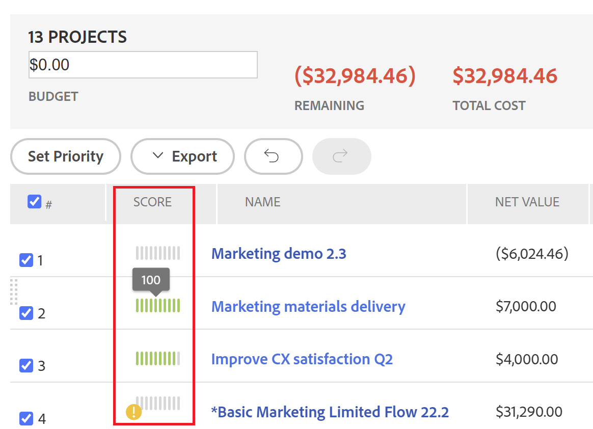

# Overview of the [!UICONTROL Portfolio Optimizer] score

<!--Audited: 01/2025-->

You can find the [!UICONTROL Portfolio Optimizer] score in the [!UICONTROL Portfolio Optimizer]. It displays in the **[!UICONTROL Score]** column for every project. This represents a score for every project in the portfolio.

For information about locating the [!UICONTROL Portfolio Optimizer], see the article [[!UICONTROL Portfolio Optimizer] overview](../../../manage-work/portfolios/portfolio-optimizer/portfolio-optimizer-overview.md).

For information about how [!DNL Adobe Workfront] uses the project Score and other project information to optimize projects in the [!UICONTROL Portfolio Optimizer], see [Optimize projects in the Portfolio Optimizer](../../../manage-work/portfolios/portfolio-optimizer/optimize-projects-in-portfolio-optimizer.md).

## Difference between the [!UICONTROL Alignment Score] and the [!UICONTROL Portfolio Optimizer Score]

There is a difference between the alignment score and the portfolio optimizer score of a project.

The alignment score of a project is calculated based on the points obtained after completing the scorecard. This score is then used to determine the portfolio alignment score. The alignment score is displayed as a percentage.

The alignment score of a project displays in the **[!UICONTROL Alignment]** column of the [!UICONTROL Portfolio Optimizer] or in the [!UICONTROL Alignment] field of the [!UICONTROL Business Case Summary].


For more information about generating the alignment score of a project, see the article [Apply a scorecard to a project and generate an Alignment Score](../../../manage-work/projects/define-a-business-case/apply-scorecard-to-project-to-generate-alignment-score.md).

The [!UICONTROL portfolio optimizer] score is a ranking automatically calculated in the [!UICONTROL Portfolio Optimizer] by which projects can be prioritized. The portfolio optimizer score is displayed as an indicator icon accompanied by a number and it displays in the **[!UICONTROL Score]** column of the [!UICONTROL Portfolio Optimizer].

>[!NOTE]
>
>A project can be scored in the [!UICONTROL Portfolio Optimizer] only if its Business Case has been completed. For more information about completing a Business Case, see the article [[!UICONTROL Create a Business Case] for a project](../../../manage-work/projects/define-a-business-case/create-business-case.md).



The score for each project is calculated based on the importance of the following categories:

* [!UICONTROL Cost]
* [!UICONTROL Alignment]
* [!UICONTROL Net Value]
* [!UICONTROL Risk to Benefit]
* [!UICONTROL ROI]

## Calculate the [!UICONTROL Portfolio Optimizer] Score

<!--
<p data-mc-conditions="QuicksilverOrClassic.Draft mode">(NOTE: This was edited based on this issue, per Anna: https://hub.workfront.com/issue/603d0c58000095ea0bc00ce5e2110693/overview)</p>
-->

[!DNL Workfront] produces a score using the [!UICONTROL Portfolio Optimizer] which is a ranking to assist in the prioritization of projects. The values in the portfolio are based on values entered into the business cases of the projects and are used to calculate a score for the project. Projects with a higher score could be considered of greater importance and they could be prioritized to be completed first.

To find out the ranking of a project, do the following:

1. Go to the [!UICONTROL Portfolio Optimizer].
1. Hover over the ranking icon to see the portfolio optimizer score for a project.


The algorithm for calculating the scores takes in to consideration the values outlined in the Business Cases of the projects and the weights they carry. It gives every project in the optimizer a score and normalizes that score so there is always a project with a score of 100. This gives a high score to the best project.

>[!BEGINSHADEBOX]

**EXAMPLE**

For example, if you make [!UICONTROL higher alignment] the only factor to consider, the project with the highest alignment gets the score of 100.

>[!ENDSHADEBOX]

The following are criteria that you can score a project by:

* [!UICONTROL Cost]
* [!UICONTROL Alignment]
* [!UICONTROL Value]
* [!UICONTROL Risk to Benefit]
* [!UICONTROL ROI]


For information about how to optimize projects in the portfolio, see [Optimize projects in the [!UICONTROL Portfolio Optimizer]](../../../manage-work/portfolios/portfolio-optimizer/optimize-projects-in-portfolio-optimizer.md).

Each criteria on the configuration panel ([!UICONTROL Cost], [!UICONTROL Alignment], [!UICONTROL ROI], [!UICONTROL Net Value], [!UICONTROL Risk to Benefit]) are given their weights in the range 0-100 based on what you selected.

For each project with a complete business case a score per criteria is generated using the following formula: 

```
Score Per Criteria = (Project Value For The Criteria - AVG(all the project values for this criteria)) / Standard Deviation of that value for that project
```

**Example:** For the [!UICONTROL Alignment Score] for the Project A, you will have the following:

```
Alignment Score = (Project A Alignment Score - AVG (of all the project Alignments)) / Standard Deviation of alignment score for that project
```

Once you have all the [!UICONTROL Score Per Criteria] calculated, you can add them taking into account their weights to get the full score per project. The score of the project is calculated using the following formula:

```
Score = Cost Score * Cost Weight + Alignment Score * Alignment Weight + ROI Score * ROI Weight + Net Value Score * Net Value Weight + Risk Score * Risk Weight
```

For the project cost and [!UICONTROL risk] the logic works in reverse from the way the other criteria work: if you want the [!UICONTROL Low Cost] to be important to you, it's not going to increase but decrease the overall score of the project by `Cost Score * Cost Weight`.

After you have scores calculated for each project, the [!UICONTROL Optimization Score] is defined for the projects the following way:

1. [!UICONTROL Minimum] and [!UICONTROL Maximum] scores are defined.
1. The range between those values is calculated.
1. For each project the [!UICONTROL Optimization Score] is calculated using the following formula:

   ```
   Optimization Score = Rounded ((Score - Minimum / Range)*100)
   ```
