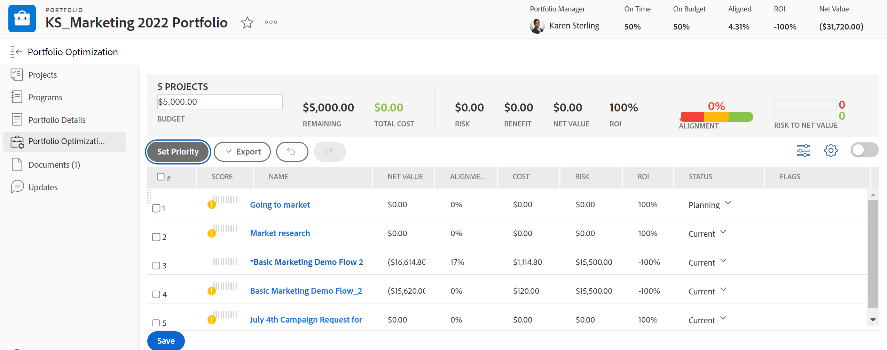

# Navigate within a portfolio

<!--Audited: 08/2025-->

<!--

(NOTE: This article will need to be further revised and maybe merged into Understanding Portfolios?! (other?!).)

-->

In [!DNL Adobe Workfront], a portfolio represents a collection of projects that compete for the same resources, budget, schedule, and priority. The primary purpose of the portfolio is to assist executives and project managers in selecting to work on projects that provide the most benefit to an organization.

For more information about portfolios, see [Understand portfolio methodology](../../../manage-work/portfolios/portfolios-overview/portfolio-overview.md).

## Access requirements

+++ Expand to view access requirements for the functionality in this article. 

<table style="table-layout:auto"> 
 <col> 
 <col> 
 <tbody> 
  <tr> 
   <td role="rowheader">[!DNL Adobe Workfront] package</td> 
   <td> 
Any
 </td> 
  </tr> 
  <tr> 
   <td role="rowheader">[!DNL Adobe Workfront] license</td> 
   <td> 
[!UICONTROL Standard] 

   
[!UICONTROL Plan] 
 </td> 
  </tr> 
  <tr> 
   <td role="rowheader">Access level configurations</td> 
   <td> 
[!UICONTROL Edit] access to [!UICONTROL Projects] and [!UICONTROL Portfolios]
  </td> 
  </tr> 
  <tr> 
   <td role="rowheader">Object permissions</td> 
   <td> 
[!UICONTROL Manage] permissions to the portfolio
 
View or higher permissions to the projects
  </td> 
  </tr> 
 </tbody> 
</table>

*For information, see [Access requirements in Workfront documentation](/help/quicksilver/administration-and-setup/add-users/access-levels-and-object-permissions/access-level-requirements-in-documentation.md).

+++

<!--Old:

<table style="table-layout:auto"> 
 <col> 
 <col> 
 <tbody> 
  <tr> 
   <td role="rowheader">[!DNL Adobe Workfront] plan</td> 
   <td> 
Any 
 </td> 
  </tr> 
  <tr> 
   <td role="rowheader">[!DNL Adobe Workfront] license*</td> 
   <td> 
New: [!UICONTROL Standard] 

   
Current: [!UICONTROL Plan] 
 </td> 
  </tr> 
  <tr> 
   <td role="rowheader">Access level configurations</td> 
   <td> 
[!UICONTROL Edit] access to Projects and Portfolios
  </td> 
  </tr> 
  <tr> 
   <td role="rowheader">Object permissions</td> 
   <td> 
[!UICONTROL Manage] permissions to the portfolio
 
View or higher permissions to the projects
  </td> 
  </tr> 
 </tbody> 
</table>

*For information, see [Access requirements in Workfront documentation](/help/quicksilver/administration-and-setup/add-users/access-levels-and-object-permissions/access-level-requirements-in-documentation.md).-->

## Navigate within a portfolio

1. Click the **[!UICONTROL Main Menu]** icon  in the upper-right corner of [!DNL Adobe Workfront].

1. Click [!UICONTROL Portfolios].
1. From the **[!UICONTROL Filter]** drop-down menu, select the following:

   * **[!UICONTROL Portfolios I Own]**: Includes a list of portfolios for which you are designated as the [!UICONTROL Portfolio Manager].
   * **[!UICONTROL All]**: Includes all portfolios for which you have at least access to View.

      For more information about access to Portfolios, see [Access levels overview](../../../administration-and-setup/add-users/access-levels-and-object-permissions/access-levels-overview.md).
      For more information about permissions to Portfolios, see  [Share a portfolio](../../../workfront-basics/grant-and-request-access-to-objects/share-a-portfolio.md).

      To add new portfolios, see [Create a portfolio](../../../manage-work/portfolios/create-and-manage-portfolios/create-portfolios.md).

1. Click the name of a portfolio to access it.
   The following portfolio performance metrics are displayed in the [!UICONTROL Portfolio Details] area inside a portfolio:

   * Whether the portfolio is [!UICONTROL On Time]
   * Whether the portfolio is [!UICONTROL On Budget]
   * The [!UICONTROL Return on Investment] (ROI)
   * The portfolio [!UICONTROL Alignment]
   * The portfolio [!UICONTROL Net Value]

1. (Optional)   Click **[!UICONTROL Projects]** in the left panel to view projects associated with the selected portfolio, then select any of the following filters from the **[!UICONTROL Filter]** drop-down menu: 

   * **[!UICONTROL Active]**: Includes all projects associated with the selected portfolio which are in the following statuses:

      * [!UICONTROL Planning]
      * [!UICONTROL Approved]
      * [!UICONTROL Current]
   * **[!UICONTROL Requested]**: Includes projects associated with the selected portfolio with a status of **[!UICONTROL Requested]**.

      For information about reviewing Requested projects, see [Review Requested Projects](../../../manage-work/portfolios/create-and-manage-portfolios/review-requested-projects.md).

   * **[!UICONTROL All]**: Includes all projects associated with the selected portfolio.

      >[!NOTE]
      >
      >To see only specific projects, consider creating a project filter in the **[!UICONTROL Filter]** drop-down menu at the top of the list of projects to decrease the number of projects displayed.

      For more information about creating filters, see [Filters overview](../../../reports-and-dashboards/reports/reporting-elements/filters-overview.md).

1. Click **[!UICONTROL Programs]** in the left panel to create Programs within the portfolio or manage existing ones.
   For information about programs, see the [Create and manage programs](../../../manage-work/portfolios/create-and-manage-programs/create-and-manage-programs.md) section.

1. (Optional) Expand the **[!UICONTROL Portfolio Details]** area in the left panel, then click **[!UICONTROL Overview]** or **[!UICONTROL Custom Forms]** to edit information about the portfolio.

1. (Optional) Click **[!UICONTROL Portfolio Optimization]** in the left panel to optimize the performance of the portfolio.

   

   >[!IMPORTANT]
   >
   >Your company must have the following packages to have access to the [!UICONTROL Portfolio Optimizer]:
   >
   >[!UICONTROL Prime] or higher [!DNL Workfront]  
   >[!UICONTROL Business] or higher [!DNL Workfront] 

   For information about using the Portfolio Optimizer, see the [Manage projects in the Portfolio Optimizer](../../../manage-work/portfolios/portfolio-optimizer/manage-projects-in-portfolio-optimizer.md) section. 

1. (Optional) Click **Documents** in the left panel to attach documents to the portfolio.
1. (Optional)  Click **[!UICONTROL Updates]** in the left panel to add comments to the update stream of the portfolio. For information, see [Update work](../../../workfront-basics/updating-work-items-and-viewing-updates/update-work.md). 
1. (Optional) Click the **[!UICONTROL More] menu**  to do one of the following:

   * Deactivate the portfolio. When a portfolio is deactivated, you can no longer associate it with projects at the project level.
   * Delete the portfolio.

      >[!IMPORTANT]
      >
      >This does not delete the projects associated with the portfolio. This removes the name of the portfolio from the projects currently associated with it. 

   * Share the portfolio with other users.

1. (Optional) Click the **Star** icon  to the right of the portfolio name to add the portfolio to your list of favorites.
