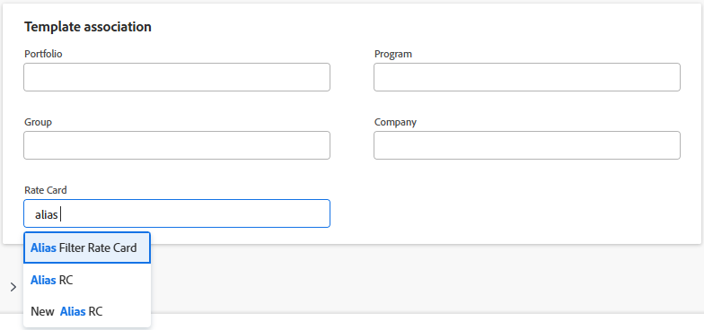

# Attach a rate card to a template

{{highlighted-preview-article-level}}

When you assign a rate card to a template, the rate card is then attached to all projects created from the template. The rate card becomes the default on the project, but it can be overridden if needed.

For information about rate cards, see [Manage rate cards](/help/quicksilver/administration-and-setup/manage-enterprise-operations/manage-rate-cards.md).

For information about project templates, see [Project template overview](/help/quicksilver/manage-work/projects/create-and-manage-templates/project-template-overview.md).

## Access requirements

+++ Expand to view access requirements for the functionality in this article.

<table style="table-layout:auto"> 
 <col> 
 <col> 
 <tbody> 
  <tr> 
   <td>Adobe Workfront package</td> 
   <td>Workflow Ultimate</td> 
  </tr> 
  <tr> 
   <td>Adobe Workfront license</td> 
   <td>Standard</td> 
  </tr> 
  <tr> 
   <td>Access level configurations</td> 
   <td>Edit access to Templates</td> 
  </tr> 
  <tr> 
   <td>Object permissions</td> 
   <td>Manage permissions to the rate card with permissions to Edit Billing Rates</td> 
  </tr> 
 </tbody> 
</table>

For information, see [Access requirements in Workfront documentation](/help/quicksilver/administration-and-setup/add-users/access-levels-and-object-permissions/access-level-requirements-in-documentation.md).

+++

## Prerequisites

The rate card you want to assign to the template must be created in Workfront. For more information, see [Manage rate cards](/help/quicksilver/administration-and-setup/manage-enterprise-operations/manage-rate-cards.md).

The **Rate Card** field must be enabled for Templates on your layout template.

1. In the layout template, click the down arrow under **Customize what users see**, then click **Template**.
1. In the **Details** section, select the **Rate Card** field in the **Overview** area.

   For more information, see [Customize the Details view using a layout template](/help/quicksilver/administration-and-setup/customize-workfront/use-layout-templates/customize-details-view-layout-template.md).

## Attach a rate card to a template

{{step1-to-templates}}

1. Create a new template or edit an existing template.
1. In the Template Details > Overview > Template association section, select a rate card in the **Rate Card** field.

   Only rate cards that you have permissions to are available to choose from.
   You can begin typing the name of a rate card to narrow the list of results.

   

1. Save the template when you are finished editing it.

   For more information about creating a template, see [Create a project template](/help/quicksilver/manage-work/projects/create-and-manage-templates/create-template.md).

   For more information about editing a template, see [Edit project templates](/help/quicksilver/manage-work/projects/create-and-manage-templates/edit-templates.md).

## Apply the template to a project

1. Create a project using the template.

   There are multiple ways to create a project from a template. For information, see these articles:

   * [Create a project using a template](/help/quicksilver/manage-work/projects/create-projects/create-project-from-template.md)
   * [Convert a task to a project](/help/quicksilver/manage-work/tasks/manage-tasks/convert-task-to-project.md)
   * [Convert an issue to a project](/help/quicksilver/manage-work/issues/convert-issues/convert-issue-to-project.md)

   The rate card is saved on the project automatically. In the Overview > Project association section of the New Project box, you can remove the rate card or select a different rate card in the **Rate Card** field.

   

   The rate card and its associated rates appear in the project Rates area.
   
   You can also remove the rate card from the project or attach a different rate card in the Rates area. For more information, see [Attach a rate card to a project](/help/quicksilver/manage-work/projects/project-finances/attach-rate-card-to-project.md).

   

   >[!NOTE]
   >
   >If an individual rate is on the template and a rate card is also attached to the template, when you create a project from the template, both the individual rate and the rate card will appear in the list of rates.

1. (Optional) To apply the rate card to an existing project, attach the template to the project.

   When you use the **Customize and attach** option on the template preview, you can select the **Rate Card** item in the Attach Template > Options section to add the rate card to the project. Clear the check box to exclude the rate card from transferring to the project.

   For more information, see [Attach a template to a project](/help/quicksilver/manage-work/projects/create-and-manage-templates/attach-template-to-project.md).

1. (Optional) To save the rate card from a specific project onto a template, save the project as a template.
   
   In the Options section on the Save as Template box, you can select the **Rate Card** item to add the rate card to the template. Clear the check box to exclude the rate card from transferring to the template.

   For more information, see [Save a project as a template](/help/quicksilver/manage-work/projects/manage-projects/save-project-as-template.md)

