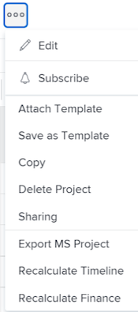
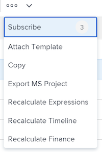
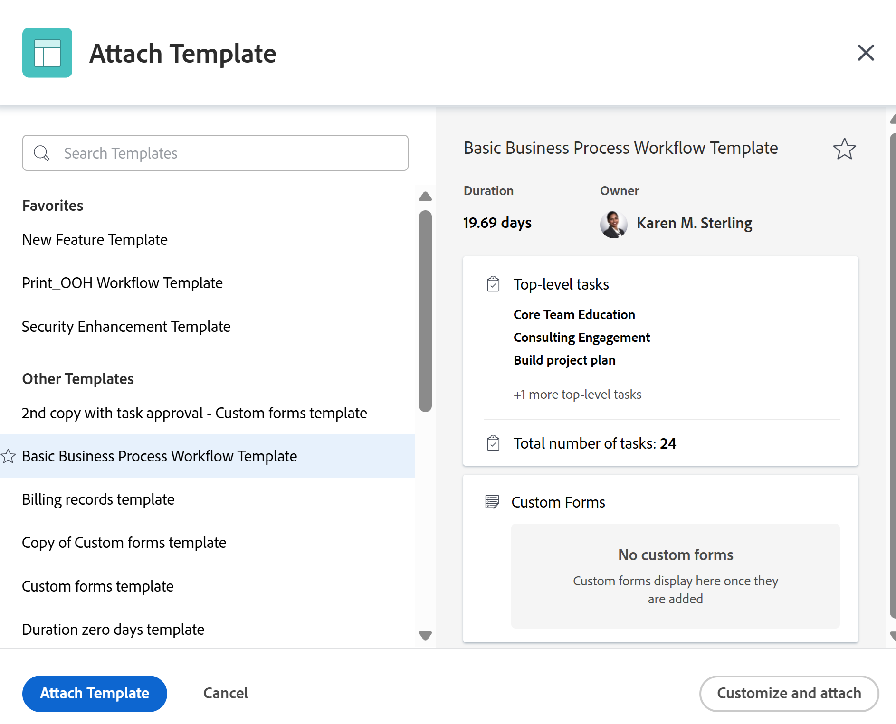
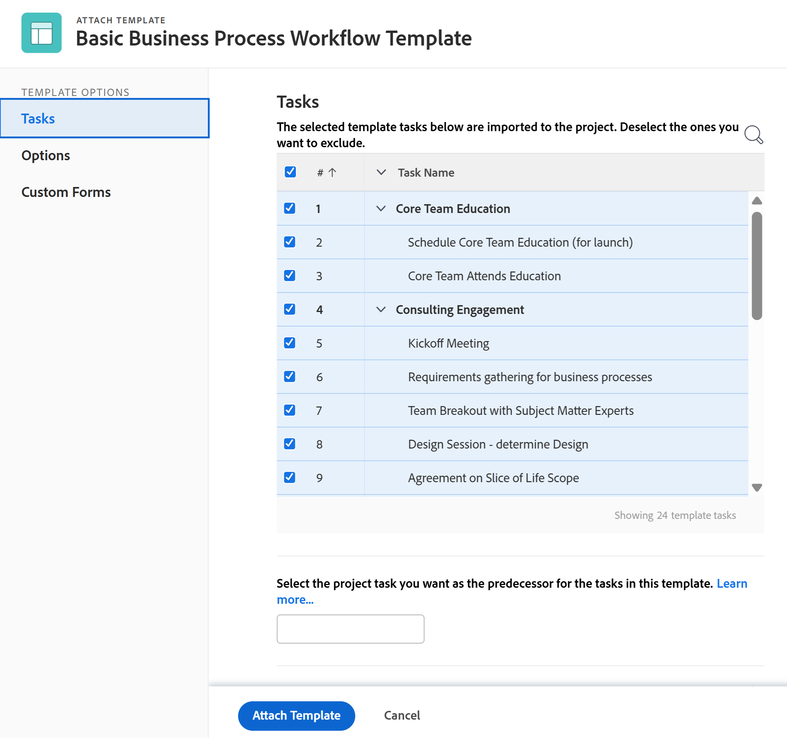
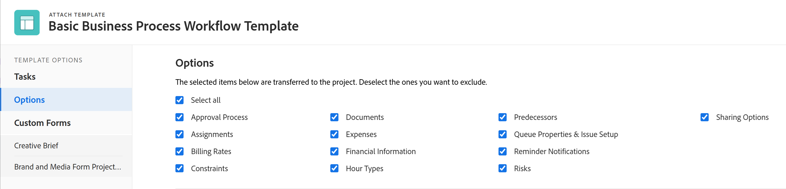
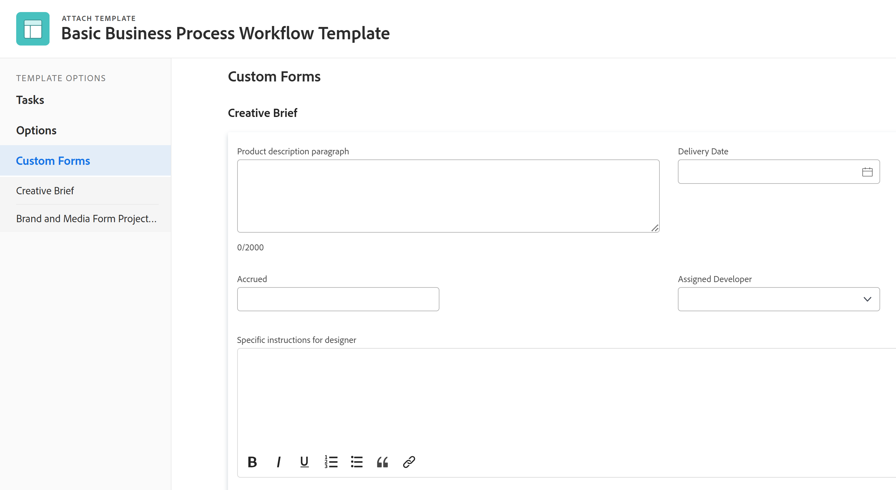
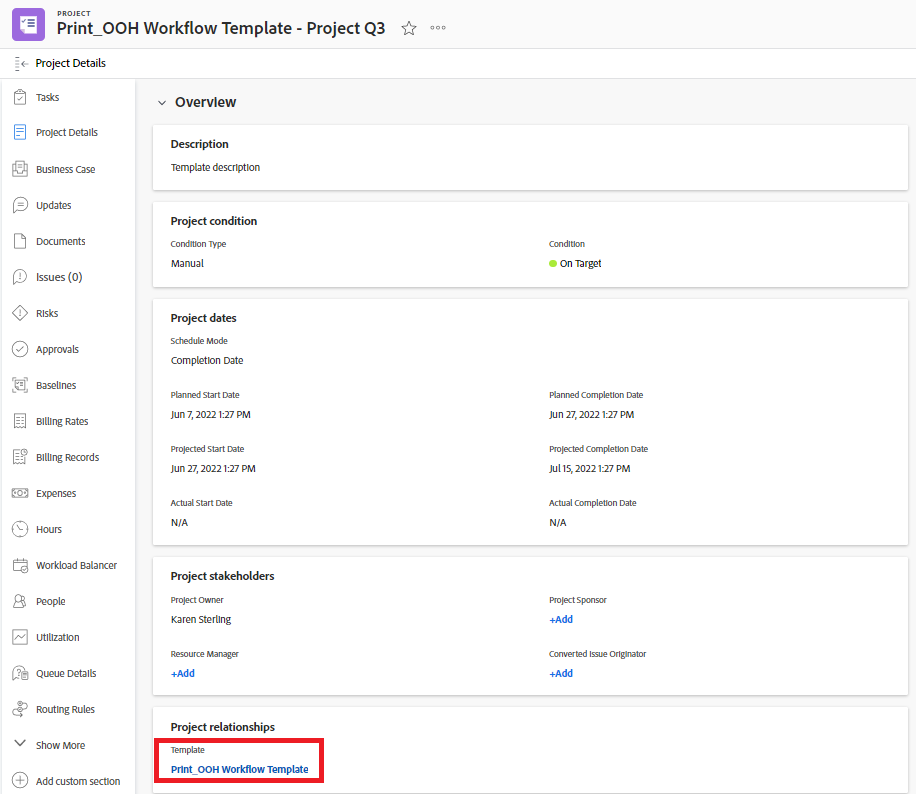

# Attach a template to a project

<!-- Audited: 10/2025 -->

You can attach a template to a project either during the initial creation phase of the project or after it's been created.

For more information about creating a project using a template, see [Create a project using a template](../../../manage-work/projects/create-projects/create-project-from-template.md).

## Access requirements

+++ Expand to view access requirements for the functionality in this article.

<table style="table-layout:auto"> 
 <col> 
 <col> 
 <tbody> 
  <tr> 
   <td role="rowheader">Adobe Workfront package</td> 
   <td> 
Any
 </td> 
  </tr> 
  <tr> 
   <td role="rowheader">Adobe Workfront license</td> 
   <td> 
Standard

    
Plan

    
 </td> 
  </tr> 
  <tr> 
   <td role="rowheader">Access level configurations</td> 
   <td> 
Edit access to Projects 
 
View access to Templates
</td> 
  </tr> 
  <tr> 
   <td role="rowheader">Object permissions</td> 
   <td> 
Manage permissions to the project
 
View permissions or higher to the template
 </td> 
  </tr> 
 </tbody> 
</table>

For more detail about the information in this table, see [Access requirements in Workfront documentation](/help/quicksilver/administration-and-setup/add-users/access-levels-and-object-permissions/access-level-requirements-in-documentation.md).

 +++

 <!--Old:
 
 <table style="table-layout:auto"> 
 <col> 
 <col> 
 <tbody> 
  <tr> 
   <td role="rowheader">Adobe Workfront plan</td> 
   <td> 
Any 
 </td> 
  </tr> 
  <tr> 
   <td role="rowheader">Adobe Workfront license</td> 
   <td> 
New: Standard

   
Or

   
Current: Plan

    
 </td> 
  </tr> 
  <tr> 
   <td role="rowheader">Access level configurations</td> 
   <td> 
Edit access to Projects 
 
For information about project access, see <a href="../../../administration-and-setup/add-users/configure-and-grant-access/grant-access-projects.md" class="MCXref xref">Grant access to projects</a>.
 
View access to&nbsp;Templates
 
For information about template permissions, see <a href="../../../workfront-basics/grant-and-request-access-to-objects/share-a-template.md" class="MCXref xref">Share a template</a>. 
 
For information about template access, see <a href="../../../administration-and-setup/add-users/configure-and-grant-access/grant-access-templates.md" class="MCXref xref">Grant access to templates</a>.
 
Note: If you still don't have access, ask your Workfront administrator if they set additional restrictions in your access level. For information on how a Workfront administrator can modify your access level, see <a href="../../../administration-and-setup/add-users/configure-and-grant-access/create-modify-access-levels.md" class="MCXref xref">Create and modify custom access levels</a>.
 </td> 
  </tr> 
  <tr> 
   <td role="rowheader">Object permissions</td> 
   <td> 
Manage permissions to the project
 
For information about project permissions, see <a href="../../../workfront-basics/grant-and-request-access-to-objects/share-a-project.md" class="MCXref xref">Share a project in Adobe Workfront</a>. 
 
View permissions or higher to the template
 
For information on requesting additional access, see <a href="../../../workfront-basics/grant-and-request-access-to-objects/request-access.md" class="MCXref xref">Request access to objects </a>.
 </td> 
  </tr> 
 </tbody> 
</table>-->

<!--

<h2>Considerations when adding templates to projects</h2>

(NOTE: moved this to an Overview article of its own) 

Consider the following when adding templates to projects:

<ul>
<li> 
You can attach only active templates to projects. 
 </li>
<li> 
You can attach a template to a project when the project is in a status of Complete, Dead, or in Pending Approval, only when your Adobe Workfront administrator or a group administrator has enabled this functionality in the Project&nbsp;Preferences area. For information about setting project preferences, see <a href="../../../administration-and-setup/set-up-workfront/configure-system-defaults/set-project-preferences.md" class="MCXref xref">Configure system-wide project preferences</a>. 
 </li>
<li> 
Unless you exclude specific template tasks from being added in the attachment process, all template tasks are added to the existing project. 
 </li>
<li> 
Most template settings are added to the project. 
 </li>
<li> 
Some settings from the template automatically transfer to the project, unless you specifically mark them to be excluded. 

Example: </b>">
<b>Example: </b>

For example, these settings are added to the project:

<ul>
<li>Start&nbsp;From field</li>
<li>Custom forms and the information on them</li>
<li>Queue Details </li>
<li>Financial settings </li>
</ul>

 </li>
</ul>

-->

## Attach a template to an existing project {#attach-a-template-to-an-existing-project}

You can attach a template to a project from the project page or from a project list or report.

{{step1-to-projects}}

1. On the **Projects** page, select the project you want to attach a template to.

1. Click the **More** icon  to the right of the project name.

   

   Or

   Go to a project list or report and select a project, then click the **More** icon  at the top of the list.

   
   
1. Click **Attach Template**. The **Attach Template** box displays.

1. Begin typing the name of the template that you want to attach in the **Search Templates** field, then click it when it displays in the list.

   Or

   Click the name of a template in the **Other Templates** area.

   A preview of the template displays to the right that contains the following information about the template:

   * Duration
   * Owner
   * The number of top-level tasks (includes a list of the first 3 top-level tasks)
   * Total number of tasks 
   * Names of attached custom forms

   

1. (Optional) Click the **Favorites** icon  to the right of the template name to mark it as a favorite and move it to the **Favorites** list.

1. (Optional)&nbsp;Click the **Favorites** icon  again to remove it from the **Favorites** list. 
1. Click **Customize and attach**. The **Attach Template** side panel opens.

1. (Optional) Update information in the following sections:

   <table style="table-layout:auto"> 
    <col> 
    <col> 
    <tbody> 
     <tr> 
      <td role="rowheader" colspan="2"> 
Tasks section
 
  
 </td> 
     </tr> 
     <tr> 
      <td role="rowheader">The selected template tasks below are imported to the project.&nbsp;Deselect the ones you want to exclude. </td> 
      <td>Deselect any tasks that you want to exclude from the template before attaching it to the project.</td> 
     </tr> 
     <tr> 
      <td role="rowheader">Select the project task you want as the predecessor for the tasks in this template.</td> 
      <td> 
Click the field to display a list of project tasks, then select which task must finish before the template tasks can start. Alternatively, you can skip this step and set up relationships within the project after the template is attached. 
 
 Select the <strong>Dependency Type</strong>, <strong>Lag Time</strong> information, and if you want the predecessor to be enforced by checking the <strong>Enforce Predecessor</strong> checkbox. 
 </td> 
     </tr> 
     <tr> 
      <td role="rowheader">Select the project task that you want as the parent of the tasks in this template.</td> 
      <td> Select which project task you want to designate as the parent task for all of the template tasks. If you don't make a selection, all the template tasks appear at the end of your current project tasks. You can skip this step and move tasks around in the project after the template is attached.</td> 
     </tr> 
     <tr> 
      <td role="rowheader" colspan="2"> 
Options section
 
  
 </td> 
     </tr> 
     <tr> 
      <td role="rowheader">The selected items below are transferred to the project. Deselect the ones you want to exclude.</td> 
      <td> 
Deselect the checkboxes for any information you want to exclude from the template before attaching it to the project. For more information on each field, see <a href="../../../manage-work/projects/create-and-manage-templates/attach-template-to-project-overview.md" class="MCXref xref">Overview of attaching a template to a project</a>. 
 
Important: If you check the <strong>Queue Properties &amp; Issues Setup</strong> box, the Queue Details of the template overwrite those of the project. In this case, the Routing Rules, Queue Topics, and Topic Groups of the template are added to those of the project.  If the project is set up as a request queue and the template you attach to the project isn't set up as a request queue, the project's queue information is removed if you leave the <strong>Queue Properties and Issues Setup</strong> box checked.  If you deselect the <strong>Queue Properties and Issue Setup</strong> box, all of the project's Queue Setup settings are preserved and no Queue Setup settings from the template are attached. 
 </td> 
     </tr> 
     <tr> 
      <td role="rowheader" colspan="2"> 
Custom Forms section
 
  
 </td> 
     </tr> 
     <tr> 
      <td role="rowheader">Custom&nbsp;Forms</td> 
      <td> 
When custom forms are attached to the template, their names display in the left panel. 
 </td> 
     </tr> 
    </tbody> 
   </table>

1. (Optional) Update information in the custom forms. This information transfers to the project.

   >[!TIP]
   >
   >* This step is mandatory when the custom forms on the template contain required fields that are empty. 
   >* If the fields from the template custom forms already exist on the project and contain information, they preserve the information already on the project. You can't edit them while attaching the template. 

1. Click **Attach Template.**
1. Click&nbsp;**Cancel attachment** to stop attaching the template.

   Or

   Allow the attachment to finish to add the template to the project.

   After attaching the template, you can edit the project and adjust any tasks, information, or settings as needed.

1. (Optional) In the left panel, click&nbsp;**Project Details**, then **Overview** to view the name of the template you attached in the **Project relationships** area.

   >[!TIP]
   >
   >If you attach more than one template to the project, only the template you attached first will display in this field. For information, see the [Attach multiple templates to an existing project and view template information](#attach-multiple-templates-to-an-existing-project-and-view-template-information) section in this article.

1. (Optional)&nbsp;Remove template information from the project where you attached the template. For information, see [Remove template information from a project](../../../manage-work/projects/create-and-manage-templates/remove-template-from-project.md).

## Attach multiple templates to an existing project and view template information {#attach-multiple-templates-to-an-existing-project-and-view-template-information}

You can attach multiple templates (one at a time) to the same project following the steps described in the section [Attach a template to an existing project](#attach-a-template-to-an-existing-project) in this article. This adds the tasks and other information from each template to the project.

>[!TIP]
>
>When you attach several templates to a project, only the template you attached first will display in the Project Details area.

To view which template is applied to a project:

{{step1-to-projects}}

1. On the **Projects** page, select the project that has an attached template.

1. Click **Project Details** in the left panel.

1. Locate the name of the template attached to the project in the **Template** field at the bottom of the **Overview** section under **Project relationships**.

   

