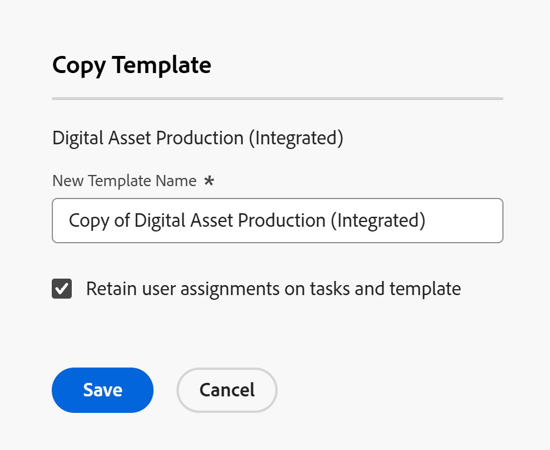

# Copy a project template

<!--Audited: 5/2025-->

In addition to creating a project template from scratch, you can also copy an existing one and modify it in Adobe Workfront. 

## Access requirements

+++ Expand to view access requirements for the functionality in this article. 

You must have the following access.

<table style="table-layout:auto"> 
 <col> 
 <col> 
 <tbody> 
  <tr> 
   <td role="rowheader">Adobe Workfront package</td> 
   <td> 
Any 
 </td> 
  </tr> 
  <tr> 
   <td role="rowheader">Adobe Workfront license</td> 
   <td>
Standard
 
   
Plan
 </td> 
  </tr> 
  <tr> 
   <td role="rowheader">Access level configurations</td> 
   <td> 
Edit access to Templates
 </td> 
  </tr> 
  <tr> 
   <td role="rowheader">Object permissions</td> 
   <td> 
View or higher permissions to a template
  </td> 
  </tr> 
 </tbody> 
</table>

*For information, see [Access requirements in Workfront documentation](/help/quicksilver/administration-and-setup/add-users/access-levels-and-object-permissions/access-level-requirements-in-documentation.md). 

+++

<!--Old:

 <col> 
 <col> 
 <tbody> 
  <tr> 
   <td role="rowheader">Adobe Workfront plan</td> 
   <td> 
Any 
 </td> 
  </tr> 
  <tr> 
   <td role="rowheader">Adobe Workfront license*</td> 
   <td>
New: Standard
 
   
Current: Plan 
 </td> 
  </tr> 
  <tr> 
   <td role="rowheader">Access level configurations</td> 
   <td> 
Edit access to Templates
 </td> 
  </tr> 
  <tr> 
   <td role="rowheader">Object permissions</td> 
   <td> 
View or higher permissions to a template
  </td> 
  </tr> 
 </tbody> 
</table>-->

## Considerations about copying templates

The following items are always copied from an existing template to a new one:

* Template Tasks
* Template Task Default information (Task Default Approval Process, Task Default Custom Forms)
* Custom forms
* Risks
* Queue Setup information
* Portfolio and Program
* Approvals
* Documents
* The days of the original template tasks transfer to the new template. You must change the Start or Completion day of the template (depending on its Schedule Mode) to update the days on the template tasks, if needed. 

The following items are never copied from an existing template to a new one:   

* Billing Rates
* User comments  

## Copy a template

<!--ensure steps and casing on the fields and buttons is accurate with unshim-->

1. Go to the template that you want to copy.
1. Click the **More** menu  to the right of the template name in the header, then click **Copy**.

   The **Copy Template** box opens.

   

1. Specify a name for the template in the **New Template Name** field.

   By default, Workfront sets the new name following this format: `Copy of Original template name`.

1. Select the **Retain user assignments on tasks and template** option, if you want to carry all task and template assignments from the original template to the new template. Template task assignments, and the Template Owner and Sponsor are transferred to the copied template. 
1. Click **Save** to create a copy of the template.

   The new template displays in the template list in the Template area of Workfront. 
