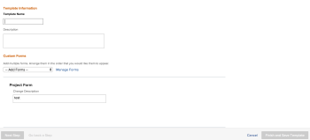
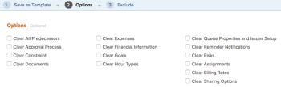

# Create template from project

<!--

(Note: Keep this article in the Creating and Managing Templates area with the detailed information that this contains. Since this is an article about creating TEMPLATES, this needs to be detailed under Templates; there is a similar article with almost the same title in Managing projects that points to this one - since this functionality is in the UI under Projects, this article must have a presence in that areas as well. Keep both, but make this one the only editable one (iterative))

-->

You can create templates when you save an existing project as a template.

After you save an existing project as a template, you can use the new template to create new projects. This simplifies and expedites the project creation process.

>[!NOTE]
>
>When saving a project as a template, the actual dates of the tasks and of the project do not save for the template. 
>
>A template and its tasks do not have actual dates, but rather an indication of which day (from when the future project might start) a task might start and on which day the task might need to complete. When using templates to create the future projects, the projects will receive actual dates. For information, see [Create a project](../create-projects/create-project.md).

## Access requirements

You must have the following access to perform the steps in this article:

<table style="table-layout:auto"> 
 <col> 
 <col> 
 <tbody> 
  <tr> 
   <td role="rowheader">Adobe Workfront plan*</td> 
   <td> 
Any 
 </td> 
  </tr> 
  <tr> 
   <td role="rowheader">Adobe Workfront license*</td> 
   <td> 
Plan 
 </td> 
  </tr> 
  <tr> 
   <td role="rowheader">Access level configurations*</td> 
   <td> 
Edit access to Templates
 
Note: If you still don't have access, ask your Workfront administrator if they set additional restrictions in your access level. For information on how a Workfront administrator can modify your access level, see <a href="../../../administration-and-setup/add-users/configure-and-grant-access/create-modify-access-levels.md" class="MCXref xref">Create or modify custom access levels</a>.
 </td> 
  </tr> 
  <tr> 
   <td role="rowheader">Object permissions</td> 
   <td> 
View or higher permissions to a project 
 
You obtain Manage permissions to the template after you create it
 
For information on requesting additional access, see <a href="../../../workfront-basics/grant-and-request-access-to-objects/request-access.md" class="MCXref xref">Request access to objects </a>.
 </td> 
  </tr> 
 </tbody> 
</table>

&#42;To find out what plan, license type, or access you have, contact your Workfront administrator.

## Create template from project

1. Go to the project that you want to save as a template. 
1. Click the **More** menu , then **Save as Template**. 
1. Specify the following information for the template:

   <table style="table-layout:auto"> 
    <col> 
    <col> 
    <tbody> 
     <tr> 
      <td role="rowheader">Name</td> 
      <td>Specify a name for the template.</td> 
     </tr> 
     <tr> 
      <td role="rowheader">Description</td> 
      <td>Provide a description for the template.</td> 
     </tr> 
     <tr> 
      <td role="rowheader">Is Active</td> 
      <td> 
Select from the following options:
 
       <ul> 
        <li> 
<strong>Yes</strong>: Other users can find the template and attach it to projects.
 </li> 
        <li><strong>No</strong>: Other users cannot find the template and cannot attach it to projects.</li> 
       </ul> </td> 
     </tr> 
     <tr> 
      <td role="rowheader">Custom Forms</td> 
      <td>Use the drop-down list to select any custom forms to attach to the template. If any custom forms have already been associated with the project, all of the data fields from those custom forms are displayed. You can include up to 10 custom forms on a single template.</td> 
     </tr> 
    </tbody> 
   </table>

1. Click **Manage Forms** to remove or reorder the forms. For information about how to remove and reorder custom forms on the template, see [Custom forms](../../../administration-and-setup/customize-workfront/create-manage-custom-forms/create-and-manage-custom-forms.md).

   

1. Click **Next Step.**
1. In the**Options** section, select the checkbox beside any information you want to clear from the template.

   

1. Click **Next Step.**
1. In the **Exclude** section, select any tasks that you want to exclude from the project.

   

1. Click **Finish and Save Template.**

   Your template now appears in the list of available templates and can either be attached to an existing project or used to create a new one.

&nbsp;
